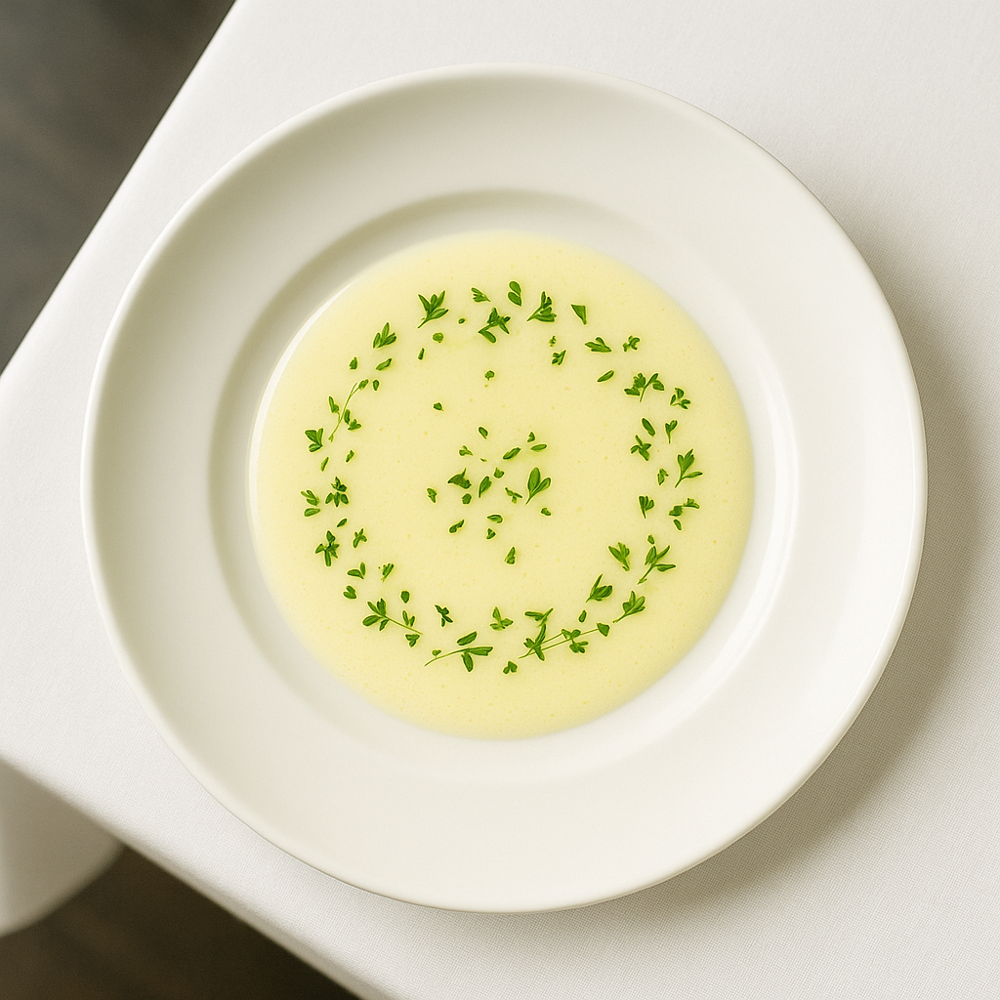

# Beurre Blanc — L'Émulsion Chaude Fragile

---

## Page 1 : Présentation + Science

**BEURRE BLANC — L'ÉMULSION CHAUDE FRAGILE**

🔬 **LA SCIENCE**

Le beurre blanc est une **émulsion chaude huile-dans-eau** (O/W) d'une fragilité remarquable. Contrairement aux sauces hollandaise ou béarnaise stabilisées par les lécithines du jaune d'œuf, le beurre blanc ne compte que sur les **protéines naturelles du beurre** (caséine 0,8-1,2% et lécithine 0,3-0,5%) pour maintenir la dispersion de gouttelettes grasses (2-20 μm) dans la phase aqueuse. Cette émulsion résulte d'une **inversion physique** : le beurre, naturellement eau-dans-huile (W/O à 80% graisses), se transforme en huile-dans-eau (O/W à 50% graisses) sous l'action du fouettage vigoureux et de l'ajout progressif dans une réduction acide tiède. La fenêtre de stabilité thermique est **critique : 49-60°C**. Au-delà de 65°C, la dénaturation de la caséine provoque l'agrégation des protéines, la perte des films protecteurs interfaciaux, et la coalescence rapide des gouttelettes grasses — la sauce « casse » irrémédiablement. Le pH acide (4,0-5,0) de la réduction vinaigre/vin blanc joue également un rôle clé : il maintient la caséine proche de son point isoélectrique (pH 4,6), optimisant la stabilité électrostatique des micelles protéiques qui enrobent les gouttelettes de matière grasse.

🌿 **ASSOCIATIONS CLÉS**

- **Échalote** + **Vin blanc sec** → Composés soufrés (allicine, disulfures) + Esters (acétate d'éthyle) → Fond aromatique umami
- **Vinaigre vin blanc** + **Beurre** → Acide acétique + Diacétyle (2,3-butanedione) → Acidité lactique équilibrée
- **Beurre doux** (à froid) + **Réduction chaude** → Acides gras libres + Composés Maillard légers → Rondeur beurrée
- **Poivre blanc** + **Sel** → Pipérine + Chlorure de sodium → Exhausteurs sensoriels

⏱️ **INFOS PRATIQUES**

Préparation : 10 min | Cuisson : 15 min | Difficulté : ●●●○ (Expert) | Pour 4 personnes

---

## Page 2 : Recette + Variantes

🧑‍🍳 **INGRÉDIENTS**

**Réduction aromatique** :
- 3 échalotes grises moyennes (80g net épluché)
- 150 ml vin blanc sec (Muscadet ou Gros Plant, 11-12°)
- 30 ml vinaigre vin blanc 6° (acide acétique 6g/100ml)
- 5 grains poivre blanc entiers
- 1 pincée sel fin

**Émulsion** :
- 250g beurre doux 82% MG **très froid** (température frigo 4-6°C)
- Sel fin (ajustement final)
- Poivre blanc fraîchement moulu (finition)

**Équipement critique** :
- Thermomètre cuisson digital (précision ±1°C) ou infrarouge
- Casserole inox fond épais 18-20 cm (éviter fonte/aluminium)
- Fouet manuel qualité (fils souples nombreux)
- Chinois étamine ou passoire fine

🔥 **PRÉPARATION**

**Étape 1 — Réduction aromatique (8-10 min)**

Ciseler finement les échalotes (brunoise 2-3 mm). Dans la casserole, verser vin blanc, vinaigre, échalotes, poivre blanc et pincée de sel. Porter à ébullition vive, puis réduire feu moyen-doux. Laisser mijoter **sans couvercle** jusqu'à obtenir 80-100 ml de réduction sirupeuse (environ 2/3 du volume évaporé). Observer : le liquide doit napper légèrement la cuillère, pas être sec. **Point critique** : retirer du feu, laisser refroidir 2-3 minutes jusqu'à **50-55°C** (vérifier au thermomètre). Si réduction trop chaude (>60°C), patienter — ne jamais démarrer l'émulsion au-dessus de 60°C.

**Étape 2 — Préparation beurre (2 min)**

Pendant le refroidissement de la réduction, découper le beurre **très froid** (sortie frigo) en cubes de 2-3 cm (environ 15-18 cubes). Conserver dans un bol réfrigéré ou près d'un bac à glaçons. Le beurre doit rester solide/semi-solide (4-8°C) jusqu'à incorporation. **Erreur fatale** : laisser le beurre ramollir à température ambiante = fusion trop rapide = température émulsion monte >60°C = rupture certaine.

**Étape 3 — Émulsification progressive (3-4 min)**

Réduction à 50-55°C : **hors feu**, ajouter 2-3 cubes de beurre froid (20-30g). Fouetter **vigoureusement** et **constamment** en mouvements circulaires énergiques (≥2 rotations/seconde), en raclant bien le fond. Le beurre doit fondre progressivement en 20-30 secondes, l'émulsion commence à blanchir. **Signal visuel** : sauce devient laiteuse, opaque (= création interfaces huile/eau). 

Dès que ces premiers cubes sont incorporés (texture homogène), ajouter 2-3 nouveaux cubes. Répéter l'opération : ajouter 20-30g → fouetter 20-30 sec → ajouter nouveau lot. **Surveillance température** : mesurer toutes les 30 secondes. Objectif : maintenir 52-58°C. 

**Si température monte 58-60°C** : retrait feu immédiat, continuer fouettage hors feu (chaleur résiduelle suffit). Attendre 1-2 min (température redescend naturellement 1-2°C). 

**Si température <52°C** : retour sur feu très doux 15-20 secondes, puis retrait. Jamais de feu continu — alternance feu/hors feu selon thermomètre.

**Rythme global** : incorporer 250g beurre sur 3-4 minutes. Fouettage **sans interruption** tout le processus (fatigue bras = normal = qualité émulsion). Si besoin, alterner mains ou fouet électrique vitesse 2-3 (pas vitesse maximale = incorporation air = mousse indésirable).

**Étape 4 — Finition & filtrage (1 min)**

Derniers cubes incorporés, sauce doit être **homogène**, **brillante**, **ivoire pâle** (pas jaune huileux). Retrait définitif du feu. Filtrer au chinois étamine ou passoire très fine dans une saucière préchauffée (eau chaude 50°C, séchée). Éliminer échalotes et grains poivre (arômes extraits, texture indésirable). **Rectification assaisonnement** : goûter, ajuster sel fin si nécessaire (généralement 1-2 pincées), 2-3 tours moulin poivre blanc fraîchement moulu.

**Étape 5 — Service immédiat (recommandé)**

Le beurre blanc se déguste **immédiatement** après préparation (stabilité maximale 5-10 minutes à température ambiante). Napper généreusement : poissons pochés ou grillés (bar, turbot, sole), crustacés (homard, langoustines), légumes vapeur (asperges blanches, poireaux). Volume : 60-80 ml/personne.

**Étape 6 — Conservation bain-marie (si nécessaire, 30-45 min max)**

Si service différé inévitable : placer saucière dans bain-marie **peu profond** (5-8 cm eau), température eau **45-50°C** (contrôle thermomètre). **Jamais** au-dessus de 50°C. Agiter doucement à la cuillère toutes les 5-10 minutes (éviter séparation phases). Au-delà de 45 minutes, risque rupture émulsion croît exponentiellement. Ne jamais réfrigérer puis réchauffer (séparation irréversible).

**Étape 7 — Troubleshooting : Rattrapage sauce cassée**

**Si sauce casse (séparation phase grasse visible, aspect huileux, grains)** :

**Méthode A — Glaçons (rupture légère, <1 min après)** : Retrait feu immédiat + ajout 2-3 glaçons + fouettage vigoureux 30 secondes. Glaçons refroidissent rapidement émulsion sous seuil dénaturation (< 60°C), permettant réincorporation graisses. Retirer glaçons dès émulsion reconstituée.

**Méthode B — Rebasing (rupture modérée)** : Dans nouvelle casserole propre, créer nouvelle émulsion base : 1 cs réduction réservée (ou eau tiède 50°C) + 30g beurre froid → fouetter 30 sec = émulsion blanche stable. Puis incorporer **progressivement** (filet fin) la sauce cassée sous fouettage constant. Technique professionnelle, taux succès 80-85%.

**Méthode C — Crème fraîche (rupture sévère)** : Ajouter 2 cs crème fraîche épaisse 30% MG **froide** + fouet immersion 20 secondes (vitesse moyenne). Crème apporte caséine fraîche + émulsifiants additionnels. Transforme légèrement texture (plus onctueuse), mais sauve la sauce. Alternative d'urgence acceptable.

**Méthode D — Jaune d'œuf (dernier recours)** : Fouetter 1 jaune d'œuf dans bol + 1 cs sauce cassée → émulsion jaune = nouvelle base. Incorporer reste sauce cassée progressivement. **Attention** : transforme beurre blanc en sauce hollandaise légère (changement nature sauce). Goût et texture modifiés, mais récupération garantie.

🔄 **VARIANTES**

**Version Classique Nantaise (tradition)** : Ajouter 1 cs crème fraîche liquide 30% MG (15g) dans réduction refroidie avant émulsification beurre. Crème apporte émulsifiants additionnels (caséine + lactose), stabilité thermique légèrement supérieure (jusqu'à 62-65°C). Texture plus onctueuse, goût adouci. Puristes Nantes utilisent beurre Échiré AOP (terroir Loire, saveur noisette marquée).

**Version Stabilisée Moderne (tolérance température)** : Dissoudre 0,2% xanthan gum (0,5g pour 250ml sauce finale) dans réduction froide avant chauffage (fouet disperse gomme). Ou ajouter 1 cs petit-lait (whey) en poudre (protéines sériques thermostables >80°C). Résultat : émulsion stable jusqu'à 70-75°C, conservation bain-marie 1-2h possible. Texture légèrement plus visqueuse (xanthan) ou lactée (whey). Utilisé en restauration collective/service continu.

**Version Végétale (sans lactose)** : Remplacer beurre par **beurre végétal qualité pâtisserie** (type Flora Plant, Planta Fin) 80% MG + lécithine tournesol ajoutée (1% poids beurre = 2,5g). Ou **purée amandes blanches** (200g) + **huile coco désodorisée** (50g) émulsionnées. Réduction identique. Texture moins stable (absence caséine), service immédiat impératif. Goût : profil végétal marqué (amande/coco) vs beurre laitier. Alternative intolérances lactose/végans.

💡 **ASTUCE SCIENCE**

**Le secret : beurre FROID vs réduction TIÈDE**. Le contraste thermique est la clé de l'émulsification réussie. Beurre sortie frigo (4-6°C) contient graisses solides/semi-solides qui fondent **lentement** au contact réduction 50-55°C. Cette fusion graduelle permet au fouettage mécanique de fragmenter phase grasse en gouttelettes 2-20 μm **avant** que température globale n'excède 60°C. Si beurre tempéré (15-20°C) incorporé dans réduction chaude (≥60°C), fusion quasi-instantanée = pas de contrôle température = émulsion monte >65°C = dénaturation caséine = rupture immédiate. **Analogie physique** : fabriquer glace pilée (grains fins contrôlés) vs verser eau sur bloc glace fondu (eau froide non structurée). Le fouettage vigoureux (50-100W énergie mécanique) crée cisaillement nécessaire fragmentation, mais température limite supérieure (60°C) reste non-négociable : au-delà, thermodynamique moléculaire (dénaturation protéines) l'emporte sur action mécanique. **Équipement professionnel** : thermomètre infrarouge sans contact permet mesurer température sans interrompre fouettage = précision maximale = contrôle optimal fenêtre 49-60°C.

---

## 🔬 Notes Scientifiques Complémentaires

### Stabilité Émulsion & Temps de Demi-Vie

Énergie activation coalescence émulsion O/W faible (beurre blanc) : Ea ≈ 45-55 kJ/mol.

**Temps demi-vie émulsion** (durée avant séparation 50% phase grasse) :
- 45°C : ~2h (conservation bain-marie acceptable)
- 55°C : ~45 min (limite service restaurant)
- 65°C : ~5 min (zone dangereuse)
- 75°C : <1 min (rupture quasi-immédiate)

**Loi d'Arrhenius** appliquée : doublement vitesse coalescence tous +10°C. D'où importance stricte contrôle température.

### Composition Finale Sauce (analyse)

**Beurre blanc standard** (250g beurre + 100ml réduction → ~280ml sauce finale) :
- **Graisses** : 50-55% (200-220g lipides)
- **Eau** : 40-45% (phase aqueuse réduction + eau beurre)
- **Protéines** : 0,4-0,6% (caséine + whey résiduelles)
- **Glucides** : 1-2% (lactose + sucres réduction échalotes)
- **Acidité** : pH 4,2-4,8 (acide acétique 0,5-0,8%)
- **Sodium** : 0,8-1,2% (sel ajouté + sodium naturel beurre)

**Profil lipidique** :
- Acides gras saturés : 63% (palmitique 28%, myristique 11%, stéarique 13%)
- Acides gras monoinsaturés : 30% (oléique 23%)
- Acides gras polyinsaturés : 4% (linoléique 2,5%)
- Cholestérol : ~600 mg/100g sauce

**Apport calorique** : 550-600 kcal/100ml sauce (portion 60ml = 330-360 kcal)

### Comparaison Sauces Émulsionnées Chaudes

| Sauce | Type émulsion | Émulsifiants | Température stable | Difficulté |
|-------|---------------|--------------|-------------------|------------|
| **Beurre Blanc** | O/W faible | Caséine + lécithine beurre (1,5%) | 49-60°C | ●●●○ Expert |
| **Hollandaise** | O/W stable | Lécithine jaune œuf (8-10%) | 65-85°C | ●●○○ Intermédiaire |
| **Béarnaise** | O/W stable | Lécithine jaune œuf (8-10%) | 65-85°C | ●●○○ Intermédiaire |
| **Beurre Monté** | O/W moyenne | Caséine + lécithine (ratio eau élevé) | 70-88°C | ●●○○ Intermédiaire |

**Conclusion** : Beurre blanc = émulsion la plus fragile (absence œufs), mais pureté aromatique maximale (goût beurre non masqué).

---

## 📚 Sources Scientifiques Clés

1. McGee, Harold. *On Food and Cooking: The Science and Lore of the Kitchen* (2004). Chapitre Sauces Émulsionnées, p.628-642.
2. Hervé This. *Casseroles et éprouvettes* (1999). Beurre blanc et inversion émulsion, p.112-118.
3. PMC/NCBI. "Influence of Emulsifiers and Dairy Ingredients on Manufacturing" (2021). Stabilisation émulsions par protéines lait.
4. ACS Publications. "Casein-Phospholipid Combinations as Emulsifier" (2014). Synergie moléculaire caséine-lécithine.
5. Agriculture Institute. "Butter Product Technology" (2024). Composition beurre, température dénaturation.
6. The Culinary Pro. "Emulsion Sauces" (2024). Fenêtres température sauces chaudes.
7. ChefSteps. "Science of Emulsions" (2025). Mécanisme inversion W/O → O/W.
8. J. Kenji López-Alt. *The Food Lab* (2015). Émulsions chaudes, techniques contrôle température, p.572-578.

---

**Recette développée par** : Rédacteur-Scientifique IA  
**Date** : 17 novembre 2025  
**Sprint** : Sprint 2 - Semaine 2  
**Issue** : #27 - Beurre Blanc (Émulsion Chaude)  
**Validation** : À soumettre Chef Projet + Reviewer-Qualité