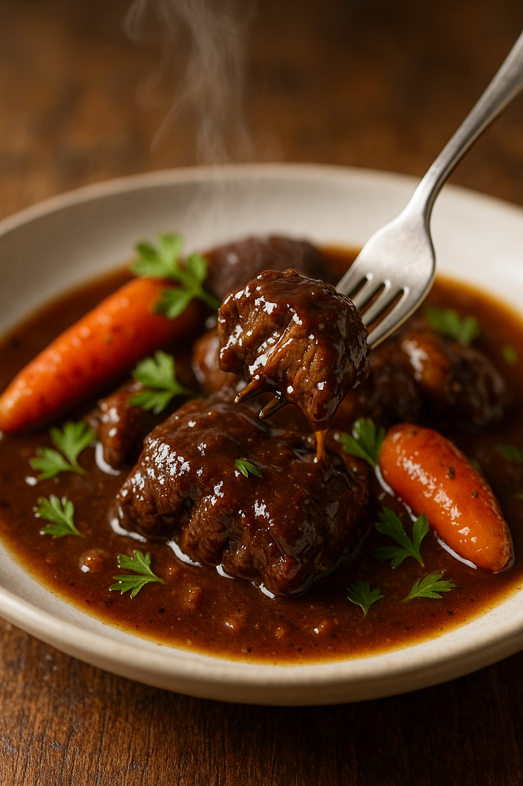

# Bœuf Bourguignon (Collageúne)

---

## Page 1 : Présentation + Science

**BŒUF BOURGUIGNON (COLLAGEÚNE)**

🔬 **LA SCIENCE**
Le secret du bourguignon moelleux réside dans la **transformation lente du collageúne en gélatine**. Le collageúne, abondant dans les morceaux gélatineux (macreuse, paleron…), commence à se dissoudre à partir de 68°C et devient gélatine fondante passé 82°C après plusieurs heures. Cette gélification explique la texture fondante typique des grands ragoûts. Les cuissons longues (3h à 150°C ou 5h à 90°C) optimisent la conversion et le fondant. La réaction de Maillard initiale (140-180°C lors de la saisie) crée plus de 1000 composés aromatiques qui enrichissent le bouillon pendant la cuisson longue, tandis que le collageúne se transforme lentement en gélatine onctueuse entre 68°C et 82°C, donnant cette texture soyeuse incomparable.

🌿 **ASSOCIATIONS CLÉS**
- Bœuf + Vin (tanins) → Alcools aromatiques, esters (puissance bouquet)
- Lardons + Carotte → Pyrroles, pyrazines (douceur, notes grillées)
- Bouquet garni (thym, laurier, persil) → Terpéniques, phénols (profondeur)

⏱️ **INFOS PRATIQUES**
Préparation : 40 min | Cuisson : 3h30 | Difficulté : ●●○ | Pour 6 personnes

---

## Page 2 : Recette + Variantes

🧑‍🍳 **INGRÉDIENTS**
- 1,2 kg bœuf à braiser (paleron, macreuse)
- 180 g lardons fumés
- 3 carottes
- 2 oignons
- 2 gousses d'ail
- 1 bouquet garni (thym, laurier, persil)
- 75 cl vin rouge tannique
- 50 cl bouillon de bœuf
- 25 g farine
- 30 g beurre
- 2 càs huile neutre
- Sel, poivre

🔥 **PRÉPARATION**
1. **Marinade** (optionnel) : La veille, mélangez le bœuf en morceaux, vin rouge, carottes coupées, oignons émincés, ail écrasé, bouquet garni. Placez au réfrigérateur durant 12h.
2. **Saisir viande & lardons** : Égouttez et épongez la viande. Dans une cocotte épaisse chauffée à **180-200°C** (surface fumante), faites revenir bœuf et lardons dans huile chaude pour développer la réaction de Maillard (croûte dorée et aromatique).
3. **Arômes & fondant** : Ajoutez les légumes, mélangez, saupoudrez de farine (singer). Déglacez avec la marinade (ou le vin), ramenez à ébullition. Ajoutez le bouillon, sel, poivre, bouquet garni.
4. **Cuisson longue** : Four préchauffé 150°C. Versez tout dans une cocotte fermée et enfournez 3h (ou 90°C 5h pour fondant ultime). Pendant ce temps-là, le collageúne du bœuf se dissout peu à peu en gélatine.
5. **Finition** : À la sortie du four, ôtez le bouquet garni, rectifiez l'assaisonnement. Laissez reposer 10 min avant de servir.
6. **Service** : Servez bien chaud, accompagné de pommes de terre vapeur, ou tagliatelles fraîches.

🔄 **VARIANTES**
- **Version rapide** : Cuisson cocotte-minute 1h15 à 120°C (texture moins fondante, mais sauce plus liée)
- **Version chasse** : Remplacez 1/3 du bœuf par sanglier ou cerf, pour notes gibier (mêmes temps, bien surveiller tendreté)
- **Fruits** : Ajoutez pruneaux ou zestes d'orange pour notes sucrées/fraîches

💡 **ASTUCE SCIENCE**
Pour fractionner le collageúne rapidement en début de cuisson, ajoutez 1 càc de vinaigre ou de jus de citron : l'acidité catalyse la rupture des fibres, accélérant partiellement la gélification.

