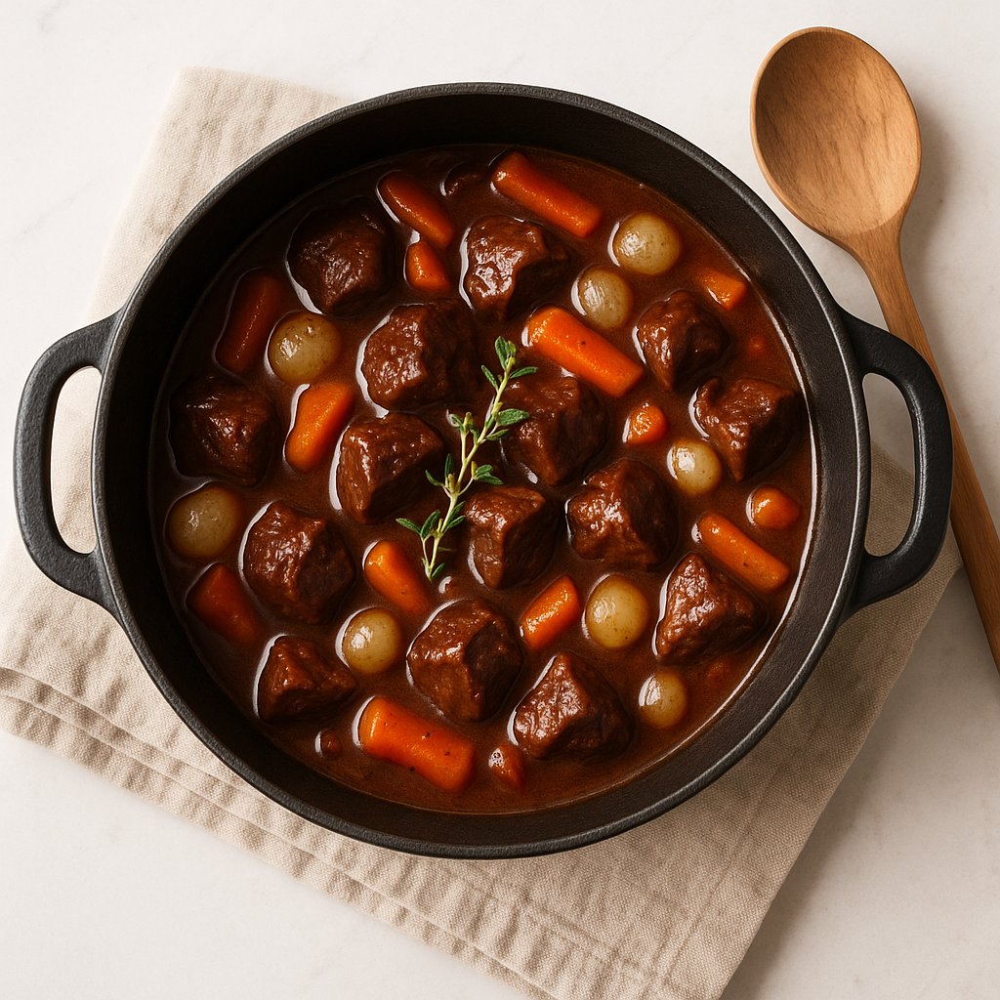
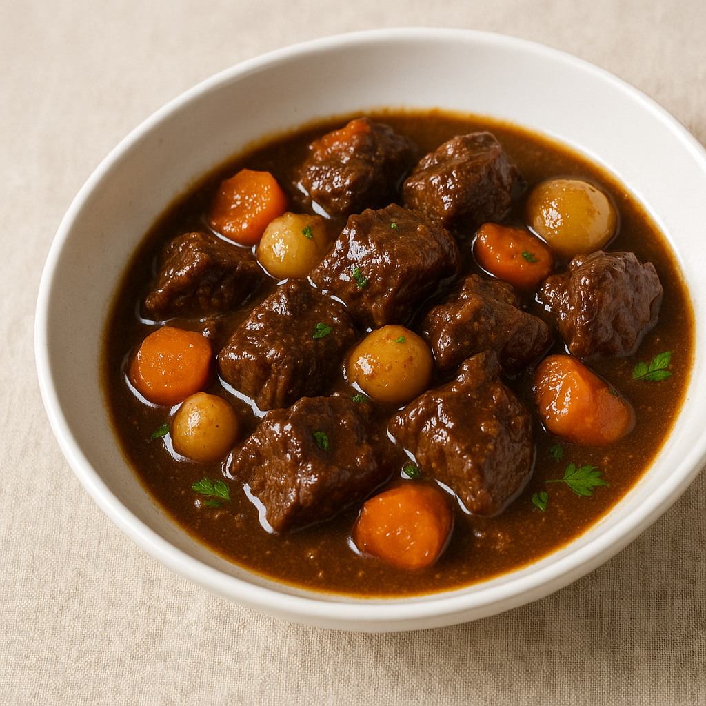

# Bœuf Bourguignon (Conversion Collagène en Gélatine)

---

## Page 1 : Présentation + Science

**BŒUF BOURGUIGNON (CONVERSION COLLAGÈNE EN GÉLATINE)**

🔬 **LA SCIENCE**
Le bœuf bourguignon est une démonstration parfaite de la transformation du collagène en gélatine par cuisson longue à basse température. À partir de 60-70°C et pendant plusieurs heures, le collagène - tissu conjonctif élastique qui entoure les fibres musculaires - se dégrade progressivement en gélatine soluble, créant cette texture fondante caractéristique. Les morceaux de viande durs et riches en collagène (joue, paleron, macreuse) deviennent ainsi tendres et moelleux, tandis que la gélatine enrichit la sauce d'une onctuosité incomparable. Le mijotage à 80°C (température idéale) permet une conversion optimale : température suffisamment élevée pour dénaturer le collagène, mais assez basse pour éviter l'évaporation excessive et préserver les arômes du vin.

🌿 **ASSOCIATIONS CLÉS**
- Bœuf + Vin rouge → Tanins + anthocyanes (attendrissement et coloration)
- Bœuf + Lardons → Synergie glutamate fumé (amplification umami)
- Bœuf + Champignons → IMP + glutamate (synergie umami multiplicatrice)
- Carottes + Oignons → Composés aromatiques Maillard (fond de sauce complexe)

⏱️ **INFOS PRATIQUES**
Préparation : 30 min | Cuisson : 3h30-4h | Difficulté : ●●○ | Pour 6 personnes

---

## Page 2 : Recette + Variantes

🧑‍🍳 **INGRÉDIENTS**

**Viande et marinade :**
- 1,2 kg bœuf à braiser (joue, paleron ou macreuse, coupé en cubes de 5-6 cm)
- 750 ml vin rouge Bourgogne (Pinot Noir de préférence, tanins modérés)
- 2 carottes coupées en rondelles épaisses
- 2 oignons émincés grossièrement
- 1 bouquet garni (thym, laurier, persil)
- 4 gousses d'ail écrasées

**Cuisson :**
- 150 g lardons fumés (amplification umami)
- 300 g champignons de Paris émincés
- 20 g farine (liaison sauce)
- 30 ml cognac (flambage aromatique)
- 500 ml fond de veau ou bouillon de bœuf
- 30 ml huile neutre (saisie viande)
- 15 g beurre (finition onctuosité)
- 8 g sel, 3 g poivre noir
- 12 petits oignons grelots
- 1 cuillère à soupe concentré de tomate

🔥 **PRÉPARATION**

1. **Marinade (optionnelle, 12-24h)** : Placer les cubes de bœuf dans un grand récipient avec vin, carottes, oignons, ail, bouquet garni. Couvrir, réfrigérer. Cette étape attendrit la viande par l'action des tanins et acides du vin sur les protéines, tout en infusant les arômes.

2. **Préparation viande** : Égoutter la viande, sécher méticuleusement avec papier absorbant (crucial pour la réaction de Maillard). Séparer viande et légumes de la marinade. Réserver le vin de marinade.

3. **Saisie viande** : Dans une cocotte en fonte, chauffer l'huile à feu vif. Saisir les cubes de bœuf par petites quantités (ne pas surcharger) pendant 2-3 min par face jusqu'à coloration dorée Maillard profonde. Réserver la viande saisie. Cette étape génère des centaines de composés aromatiques essentiels.

4. **Saisie lardons et légumes** : Dans la même cocotte, faire revenir les lardons 3-4 min. Ajouter carottes et oignons de la marinade, faire dorer 5 min en remuant. Ajouter champignons, cuire 3 min supplémentaires.

5. **Déglaçage et flambage** : Remettre la viande dans la cocotte. Saupoudrer de farine, mélanger 1-2 min à feu moyen (cuisson du goût de farine crue). Verser le cognac, flamber en inclinant légèrement la cocotte (brûler l'alcool tout en préservant arômes). Ajouter le concentré de tomate.

6. **Mijotage** : Verser le vin de marinade et le fond de veau jusqu'à couvrir la viande aux 3/4. Ajouter bouquet garni, ail, sel, poivre. Porter à frémissement (85-90°C), puis couvrir et **réduire à feu très doux pour maintenir 80°C** (mijotage optimal pour conversion collagène). Cuire **3h30 à 4h** en remuant toutes les 45 min. La viande doit se défaire à la fourchette.

7. **Oignons grelots** : À 1h de la fin, glacer les petits oignons dans une poêle avec beurre et sucre (5 min) jusqu'à caramélisation dorée. Ajouter au bourguignon.

8. **Finition** : Retirer bouquet garni. Goûter, ajuster assaisonnement. Pour une sauce plus onctueuse, incorporer 15g de beurre froid en parcelles hors du feu (émulsion).

9. **Repos** : Idéalement, préparer la veille et laisser reposer au réfrigérateur. Réchauffer doucement le lendemain (les saveurs se sont mariées, la sauce a réduit naturellement).

---

## 🧬 **SCIENCE DE LA CONVERSION COLLAGÈNE → GÉLATINE**

| Température | Durée | Transformation | Texture |
|-------------|-------|----------------|---------|
| **60-70°C** | 4-6h | Début hydrolyse collagène, conversion lente | Viande commence à attendrir |
| **80°C** ⭐ | 3-4h | Conversion optimale collagène → gélatine | Viande fondante, sauce onctueuse |
| **95-100°C** | 2-3h | Conversion rapide mais évaporation forte | Viande tendre mais sauce réduite, risque assèchement |
| **> 100°C** | <2h | ⚠️ Conversion trop rapide | Viande peut devenir fibreuse, perte arômes |

⭐ **Température recommandée** : **80°C** offre le meilleur équilibre entre temps de cuisson raisonnable et qualité de texture.

**Astuce four** : Pour une température constante, cuire au four à 140-150°C (équivalent mijotage 80°C liquide) plutôt qu'à la plaque (contrôle difficile).

---

🔄 **VARIANTES**

**Version Bourgogne Traditionnelle Enrichie**
- **Couenne de porc** : 100g ajoutée au mijotage (enrichit gélatine naturelle, onctuosité maximale)
- **Pieds de veau** : 1 pied coupé en morceaux (collagène additionnel, texture veloutée)
- **Vin Chambertin** : Vin de Bourgogne grand cru (arômes plus complexes)
- **Justification** : Les sources additionnelles de collagène (couenne, pieds) augmentent la teneur en gélatine de la sauce, créant une texture veloutée incomparable.

**Version Moderne Réductionniste**
- **Vin concentré** : Réduire 750ml de vin à 400ml avant incorporation (concentration tanins et arômes, temps cuisson réduit)
- **Fond de veau réduit** : Utiliser demi-glace (fond réduit à 1/4) pour puissance umami
- **Épices** : 2 étoiles de badiane, 3 baies de genièvre (notes épicées modernes)
- **Cuisson sous-vide** : 72h à 65°C en sachet (conversion collagène maximale, jutosité préservée)

**Version Sans Alcool**
- **Jus de raisin noir** : 500ml + 50ml vinaigre balsamique (acidité et tanins du vin simulés)
- **Fond de bœuf réduit** : 800ml très concentré (compensation profondeur aromatique)
- **Pâte de tomate** : 30g (acidité et umami additionnels)
- **Cuisson identique** : 80°C, 3h30-4h (conversion collagène indépendante de l'alcool)

---

💡 **ASTUCE SCIENCE**
Pour maximiser l'onctuosité de la sauce, **préparez le bourguignon la veille**. Durant le repos au réfrigérateur, trois phénomènes se produisent : (1) les arômes se marient par diffusion moléculaire, (2) la gélatine formée épaissit naturellement la sauce en refroidissant (formation de réseau tridimensionnel), (3) les graisses figent en surface permettant de les retirer facilement (allègement sans perte de saveur). Réchauffez doucement le lendemain à 70-80°C pour préserver la structure gélatineuse.

---

## 📚 Schémas Scientifiques

Pour mieux comprendre la conversion collagène-gélatine :

