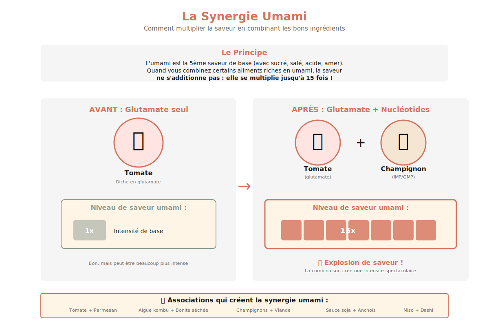

# Bouillon de Volaille Umami

---

## Page 1 : Présentation + Science

**BOUILLON DE VOLAILLE UMAMI**

🔬 **LA SCIENCE**
Ce bouillon exploite deux mécanismes scientifiques fondamentaux : l'**extraction aromatique** par cuisson lente et la **synergie umami**. Lorsque vous maintenez le liquide entre 85-95°C (jamais à ébullition), vous extrayez progressivement le glutamate des légumes et des os, ainsi que l'inosinate (IMP) des cartilages de volaille. Cette combinaison glutamate + IMP crée une amplification de la saveur umami jusqu'à **15 fois** plus intense qu'un ingrédient seul, selon le mécanisme de synergie documenté par les récepteurs gustatifs T1R1/T1R3.

🌿 **ASSOCIATIONS CLÉS**
- **Carcasse de volaille** + **Champignons shiitake** → Glutamate + IMP (explosion umami)
- **Tomates** + **Os de volaille** → Glutamate végétal + Inosinate animal (synergie)
- **Oignon caramélisé** + **Kombu** → Glutamate concentré + Glutamate algue (amplification)

⏱️ **INFOS PRATIQUES**
Préparation : 15 min | Cuisson : 3h | Difficulté : ●○○ | Pour 1,5L de bouillon

---

## Page 2 : Recette + Variantes

🧑‍🍳 **INGRÉDIENTS**
- 1 carcasse de poulet (environ 500g, os et cartilages)
- 2 L d'eau froide filtrée
- 1 oignon jaune (150g, coupé en deux, pelure conservée)
- 2 carottes (150g, coupées en tronçons)
- 2 branches de céleri (100g, avec feuilles)
- 3 champignons shiitake séchés (15g, réhydratés)
- 2 tomates mûres (200g, coupées en quartiers)
- 5g d'algue kombu séchée (facultatif, boost umami)
- 3 gousses d'ail (non pelées, écrasées)
- 1 feuille de laurier
- 5 grains de poivre noir
- Sel (à ajuster en fin de cuisson)

🔥 **PRÉPARATION**

1. **Préparation de la carcasse** : Rincer la carcasse de volaille à l'eau froide. Si vous avez rôti un poulet, conserver les os et cartilages riches en collagène qui libéreront l'inosinate (IMP), clé de la synergie umami.

2. **Départ à froid** : Placer la carcasse dans une grande marmite et couvrir de 2L d'eau froide. Le départ à froid permet une extraction progressive des protéines et arômes sans coaguler brutalement les protéines en surface.

3. **Montée en température contrôlée** : Porter doucement à frémissement (85-90°C). **Ne jamais faire bouillir** : l'ébullition trouble le bouillon et détruit certaines molécules aromatiques volatiles. Écumer la mousse qui se forme en surface (protéines coagulées).

4. **Ajout aromatiques** : Après 30 min, ajouter oignon (avec pelure pour la couleur dorée), carottes, céleri, champignons shiitake réhydratés (sources de GMP), tomates (glutamate), kombu, ail, laurier et poivre. Ces ingrédients apportent le glutamate végétal qui s'associera à l'IMP animal.

5. **Cuisson lente** : Maintenir un frémissement doux (85-95°C) pendant 2h30 à 3h. Cette température optimale permet l'extraction maximale du collagène (qui se transforme en gélatine) et des composés aromatiques sans dénaturer les molécules sensibles.

6. **Filtrage et assaisonnement** : Filtrer le bouillon à travers une passoire fine ou un chinois. Goûter et ajuster le sel. Le bouillon doit avoir une saveur profonde, ronde et savoureuse caractéristique de l'umami synergique.

7. **Conservation** : Laisser refroidir puis réfrigérer (3-4 jours) ou congeler en portions (3 mois). Une fine couche de gras solidifié en surface protège le bouillon et peut être retirée avant usage.

🔄 **VARIANTES**

- **Version Express (1h30)** : Utiliser une cocotte-minute pour réduire le temps de cuisson. Cuire 45 min sous pression après sifflement. L'extraction est plus rapide mais légèrement moins complexe en arômes.

- **Boost Umami Végétarien** : Remplacer la carcasse de volaille par 200g de champignons shiitake + miso blanc (30g) + sauce soja (15ml). Vous obtenez une synergie glutamate (miso/soja) + GMP (champignons) 100% végétale.

- **Version Asiatique** : Ajouter gingembre frais (20g), citronnelle (1 tige) et coriandre (graines et tiges). Torréfier légèrement les épices à sec avant ajout pour libérer leurs huiles essentielles par réaction de Maillard.

💡 **ASTUCE SCIENCE**

La **température de cuisson** est cruciale : entre 85-95°C, vous extrayez les composés aromatiques et le collagène se transforme en gélatine (texture soyeuse), tout en préservant les molécules volatiles sensibles. Au-delà de 100°C (ébullition), l'agitation émulsionne les graisses et trouble le bouillon, et les arômes délicats s'évaporent. Pour un bouillon cristallin et aromatiquement complexe, la patience à température maîtrisée est votre meilleure alliée.

L'**effet synergique umami** est maximal lorsque le ratio glutamate/nucléotides approche 1:1. Si votre bouillon manque de profondeur, ajoutez une pincée de kombu ou quelques champignons séchés pour amplifier l'umami naturellement.

---

## Sources Documentaires

- **McGee, Harold** (2004). *On Food and Cooking: The Science and Lore of the Kitchen*. Extraction aromatique et transformation du collagène en gélatine, p. 588-595.

- **Zhang et al.** (2008). "Molecular mechanism for the umami taste synergism". *Proceedings of the National Academy of Sciences (PNAS)*. Mécanisme de synergie glutamate/IMP via récepteurs T1R1/T1R3.

- **Sugimoto** (2024). "Academic paper on umami synergy - Dried Shiitake". Rôle du GMP fongique dans la stabilisation de la liaison glutamate.

- **This, Hervé & Gagnaire, Pierre** (2000-2025). Travaux INRAE sur la gastronomie moléculaire. Études physico-chimiques des bouillons et fonds.

---

**Fin de la recette**