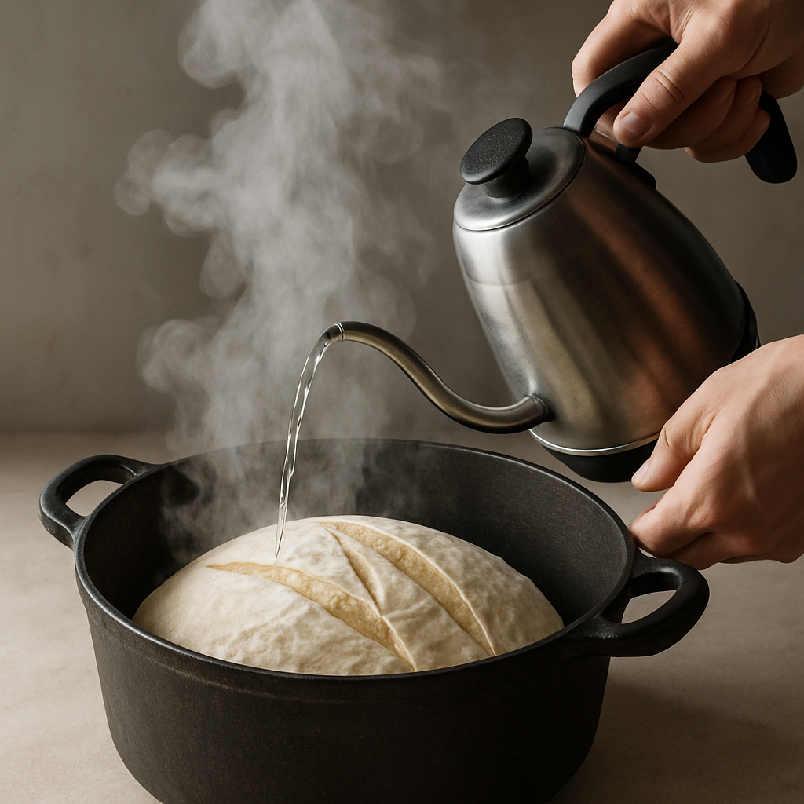
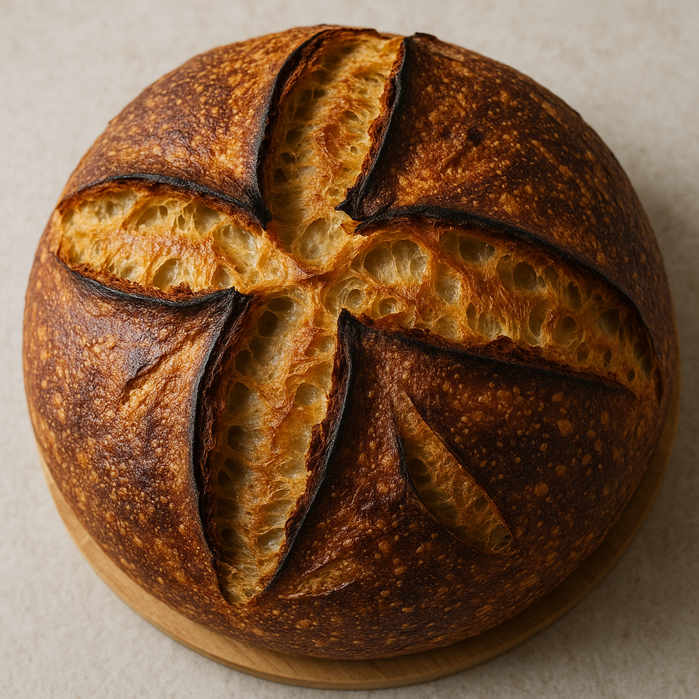

# Brioche Moelleuse (Réseau de Gluten Enrichi)

---

## Page 1 : Présentation + Science

**BRIOCHE MOELLEUSE — RÉSEAU DE GLUTEN ENRICHI**

🔬 **LA SCIENCE**

La texture moelleuse et aérienne de la brioche résulte d'un **réseau de gluten enrichi et optimisé**. Le pétrissage long (10-15 min) développe les liaisons disulfure entre gliadine et gluténine, formant un réseau élastique tridimensionnel. L'ajout de **beurre** (30-40% du poids de farine) et d'œufs crée une pâte enrichie qui limite la formation excessive de gluten (effet "shortening"), rendant la mie plus tendre tout en maintenant structure et volume. La fermentation lente permet aux levures de produire CO₂ qui gonfle le réseau de gluten, créant l'alvéolage fin caractéristique. La température de cuisson (180°C) gélatinise l'amidon et coagule les protéines sans dessécher la mie.

🌿 **ASSOCIATIONS CLÉS**
- Farine + Eau + Pétrissage → Réseau de gluten (gliadine + gluténine, liaisons disulfure)
- Beurre + Œufs → Lipides + Lécithine (émulsifiant, moelleux, limitation gluten)
- Levure + Sucre + Fermentation → CO₂ + Éthanol (volume, arômes)
- Croûte dorée + Réaction de Maillard → Composés aromatiques (arômes beurrés, caramélisés)

⏱️ **INFOS PRATIQUES**
Préparation : 25 min | Pétrissage : 15 min | Fermentation : 3-4h | Cuisson : 30 min | Difficulté : ●●○ | Pour 1 brioche (600g)

---

## Page 2 : Recette + Variantes

🧑‍🍳 **INGRÉDIENTS**

- 250 g de farine T45 ou T55 (farine à brioche)
- 3 œufs moyens (environ 150g)
- 125 g de beurre doux pommade (température ambiante)
- 30 g de sucre en poudre
- 5 g de sel fin
- 7 g de levure boulangère fraîche (ou 3g de levure sèche instantanée)
- 30 ml de lait tiède (optionnel, pour ajuster hydratation)

**Pour la dorure** :
- 1 jaune d'œuf + 10ml de lait

🔥 **PRÉPARATION**

1. **Activation levure** : Dans un petit bol, délayer la levure fraîche dans 30ml lait tiède (30°C) avec 1 cuillère à café de sucre. Laisser mousser 5-10 min.

2. **Mélange de base** : Dans la cuve d'un robot pâtissier (ou grand bol), mélanger 250g farine, 30g sucre, 5g sel. Ajouter 3 œufs et la levure activée. Pétrir au crochet vitesse lente 5 min jusqu'à obtenir une pâte homogène qui se décolle des parois (la pâte sera très collante au début).

3. **Incorporation du beurre** : Ajouter le beurre pommade en 3-4 fois, en attendant chaque incorporation complète avant d'ajouter la suivante. Pétrir à vitesse moyenne 10-12 min jusqu'à ce que la pâte devienne lisse, brillante et élastique. Elle doit se détacher complètement de la cuve et former un ruban. **Test de la membrane** : prélever un petit morceau de pâte, l'étirer doucement ; il doit former une fine membrane translucide sans se déchirer (signe d'un gluten bien développé).

4. **Première fermentation (pointage)** : Former une boule avec la pâte, la placer dans un bol huilé, couvrir d'un film alimentaire. Laisser lever 1h30-2h à température ambiante (24-26°C) jusqu'à ce qu'elle double de volume.

5. **Dégazage et repos au froid** : Dégazer délicatement la pâte en la repliant sur elle-même. Couvrir et placer au réfrigérateur (4°C) pendant 1-2h (ou toute une nuit). Le froid raffermit le beurre et facilite le façonnage.

6. **Façonnage** : Sortir la pâte du réfrigérateur. Pour une brioche tressée classique : diviser en 3 boudinets égaux de 35-40cm, les tresser sans trop serrer. Pour une brioche à tête (Parisienne) : former une grosse boule (500g) et une petite (100g), enfoncer la petite dans la grosse. Placer dans un moule à brioche beurré.

7. **Seconde fermentation (apprêt)** : Laisser lever 1h30-2h à température ambiante, couvert d'un linge. La pâte doit doubler de volume et remplir les 3/4 du moule.

8. **Dorure et cuisson** : Préchauffer le four à 180°C chaleur tournante. Badigeonner délicatement la surface avec le mélange jaune d'œuf + lait (2 couches espacées de 5 min pour une dorure brillante). Cuire 25-30 min jusqu'à obtenir une croûte dorée. La brioche doit sonner creux quand on tapote le dessous. Laisser refroidir 15 min avant de démouler.

🔄 **VARIANTES**

- **Brioche aux pépites de chocolat** : Incorporer 100g de pépites de chocolat noir à l'étape 5 après le dégazage. Répartir uniformément dans la pâte.
- **Brioche pralinée** : Ajouter 50g de praliné en grains à la fin du pétrissage (après incorporation du beurre). Arôme noisette-caramel prononcé.
- **Brioche au levain** : Remplacer 50g de farine par 100g de levain actif. Réduire la levure à 3g. La fermentation sera plus longue (4-6h pointage) mais les arômes seront plus complexes.

💡 **ASTUCE SCIENCE**

**L'importance du pétrissage long** : Le pétrissage transforme mécaniquement les protéines gliadine et gluténine en gluten. Les liaisons disulfure (-S-S-) entre molécules de gluténine créent un réseau tridimensionnel élastique et extensible. L'ajout progressif de beurre est crucial : ajouté trop tôt, il enrobe les protéines et empêche la formation du gluten. Ajouté après développement initial du réseau, il lubrifie les fibres de gluten sans les détruire, créant une texture moelleuse mais structurée. La lécithine présente dans les jaunes d'œufs agit comme émulsifiant, stabilisant l'émulsion eau-matière grasse et prolongeant la fraîcheur. Le repos au froid durcit le beurre, ce qui facilite le façonnage et ralentit la fermentation pour développer plus d'arômes. Température interne idéale à cœur : 88-92°C.

---