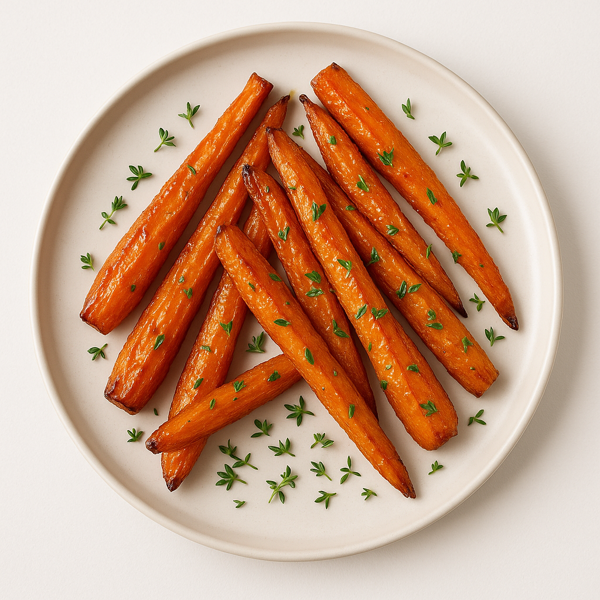

# Carottes Rôties Caramélisées

---

## Page 1 : Présentation + Science

**CAROTTES RÔTIES CARAMÉLISÉES**

🔬 **LA SCIENCE**
La caramélisation des sucres naturels dans la carotte commence dès 110°C et s’intensifie à partir de 160-180°C selon le type de sucre. Sous l’effet de la chaleur sèche du four (190-220°C), les sucres (fructose, glucose, saccharose) se décomposent et se recombinent pour former des composés aromatiques bruns, responsables du goût marqué, de la couleur et de la texture croustillante en surface[16][19].

🌿 **ASSOCIATIONS CLÉS**
- Carotte + huile d’olive → furfural, maltol (caramel, arôme grillé)
- Carotte + thym → terpènes (fraîcheur, complexité)

⏱️ **INFOS PRATIQUES**
Préparation : 12 min | Cuisson : 35 min | Difficulté : ●○○ | Pour 4 personnes

---

## Page 2 : Recette + Variantes

🧑‍🍳 **INGRÉDIENTS**
- 800g carottes (bio, jeunes si possible)
- 2 c. à soupe huile d’olive
- 1 c. à café thym frais
- 1 c. à soupe miel doux
- Sel, poivre du moulin

🔥 **PRÉPARATION**
1. Préchauffer le four à 200°C (air brassé).
2. Peler et couper les carottes en bâtonnets épais.
3. Mélanger avec l’huile, miel, thym, sel et poivre.
4. Répartir sur plaque recouverte de papier cuisson.
5. Rôtir 35 min, retourner à mi-cuisson − surveiller coloration.
6. Laisser tiédir (accent creep caramélisation), dresser en assiette.
7. Saupoudrer d’une pincée de fleur de sel avant service.

🔄 **VARIANTES**
- **Version épicée** : Ajouter cumin ou paprika lors du mélange initial.
- **Boost acidulé** : Arroser d’un trait de jus d’orange 10 min avant la fin.

💡 **ASTUCE SCIENCE**
Plus les carottes sont espacées sur la plaque, plus l’humidité s’évapore rapidement : la caramélisation est intensifiée ! Privilégier la chaleur tournante pour une caramélisation uniforme.

---

## Notes
- Difficulté : ●○○ (simple)
- Images obligatoires : hero.png, final.png, process-01.png
- Respect charte visuelle : top-down, lumière naturelle, fond marbre blanc

---

> Rédigé sur base documentation scientifique et web spécialisée (2025).