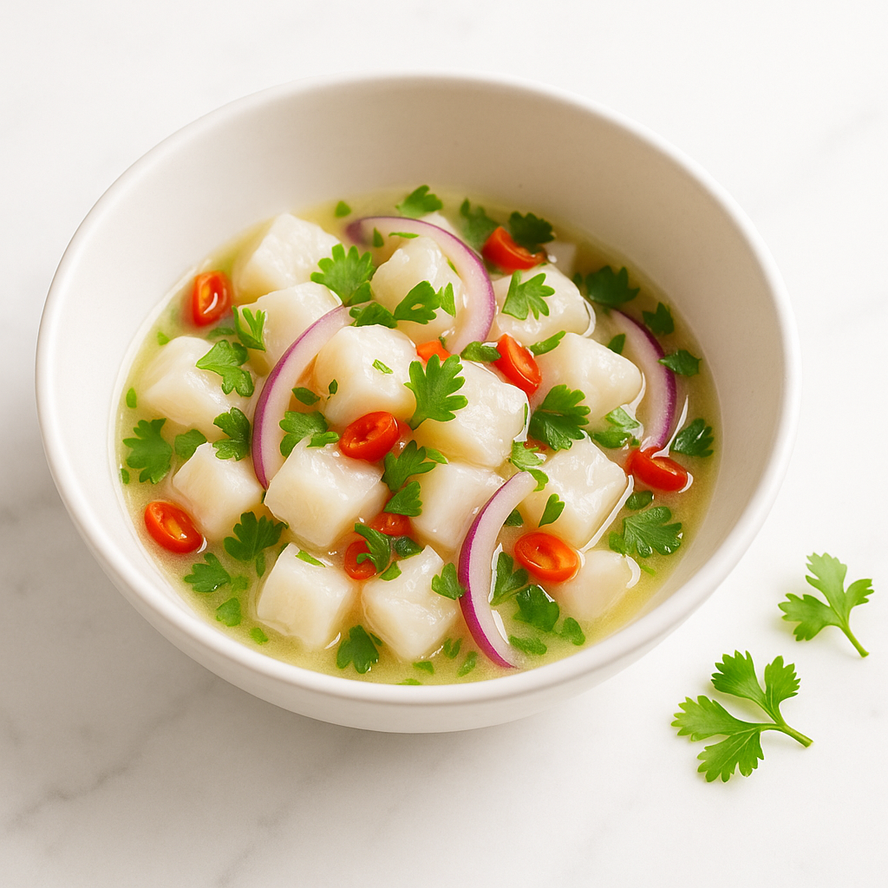
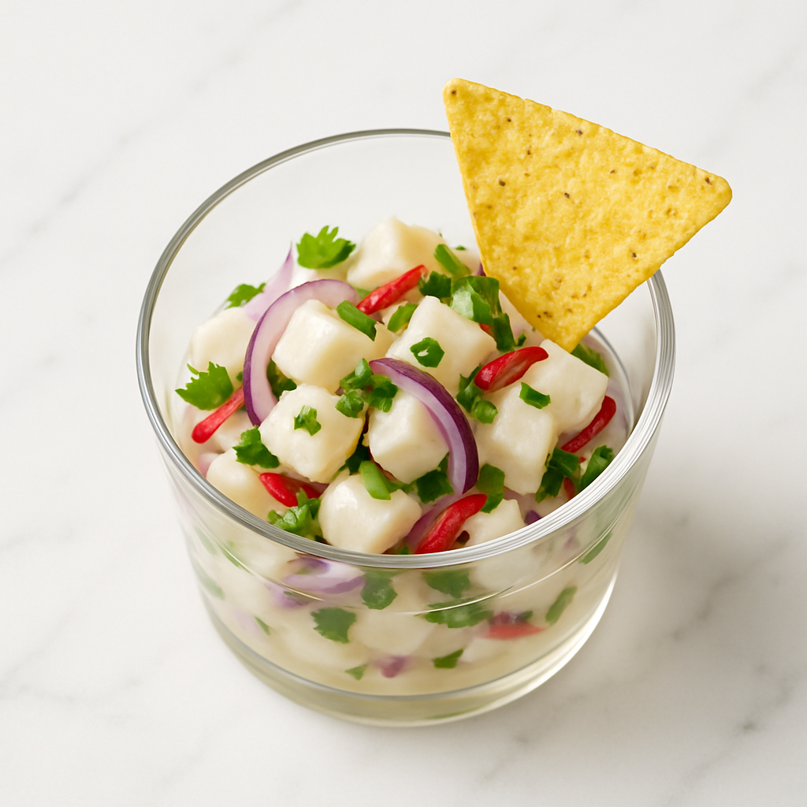

# Ceviche (Marinade Acide)

---

## Page 1 : Présentation + Science

**CEVICHE (MARINADE ACIDE)**

🔬 **LA SCIENCE**

Le ceviche repose sur une "cuisson chimique" fascinante : l'acide citrique du citron vert dénature les protéines du poisson exactement comme le ferait la chaleur, mais sans chaleur. En abaissant le pH du milieu (de 7 à 3), les ions H+ rompent les liaisons hydrogène qui maintiennent la structure tridimensionnelle des protéines myofibrillaires. Résultat : la chair devient opaque, ferme et cuite en apparence, tout en restant crue thermiquement. Ce phénomène de dénaturation acide préserve les arômes délicats du poisson que la chaleur détruirait.

🌿 **ASSOCIATIONS CLÉS**

- Citron vert + Poisson → Acide citrique + protéines (dénaturation chimique)
- Oignon rouge + Acide → Anthocyanes + pH acide (atténuation piquant)
- Coriandre + Poisson → Terpiniques + iodés (synergie fraîcheur)

⏱️ **INFOS PRATIQUES**

Préparation : 20 min | Marinade : 15 min | Difficulté : ●○○ | Pour 4 personnes

---

## Page 2 : Recette + Variantes

🧑‍🍳 **INGRÉDIENTS**

- 400g de poisson blanc ultra-frais (bar, daurade - qualité sushi)
- 6 citrons verts (150ml de jus fraîchement pressé)
- 1 oignon rouge (finement émincé)
- 1 piment rouge frais (jalapeño, épépiné)
- 1 bouquet de coriandre fraîche
- 1 maïs doux en grains (100g)
- 2 cuillères à soupe huile d'olive
- Sel de mer et poivre noir

🔥 **PRÉPARATION**

1. **Poisson** : Vérifier fraîcheur absolue. Découper en cubes de 1cm réguliers.

2. **Oignon** : Émincer finement. Rincer à l'eau froide 1 minute pour éliminer composés soufrés.

3. **Jus citron** : Presser citrons verts juste avant usage. Filtrer. Mesurer 150ml.

4. **Marinade** : Dans bol verre, déposer poisson. Verser jus citron. Mélanger. Couvrir. Réfrigérer 15 minutes exactement.

5. **Surveillance** : Après 10 min, vérifier opacité. À 15 min, poisson blanc-opaque parfait.

6. **Assemblage** : Égoutter partiellement (garder 2-3 CS jus). Ajouter oignon, piment, coriandre, maïs, huile. Saler, poivrer. Mélanger.

7. **Service** : Servir immédiatement dans bols, bien frais (4-6C). Chips maïs en accompagnement.

🔄 **VARIANTES**

- **Péruvienne** : Ajouter patate douce cuite, maïs chulpi grillé, piment aji amarillo.
- **Boost Umami** : 1 cc sauce soja dans marinade pour profondeur.

💡 **ASTUCE SCIENCE**

Le timing 15 minutes est optimal pour cubes 1cm. Trop court (<10min) = cœur cru. Trop long (>20min) = texture caoutchouteuse. Adapter : cubes 1.5cm = 20min, cubes 0.5cm = 10min. Chrono indispensable.

---

## Notes

**Sécurité** : Ceviche ne cuit PAS thermiquement = pathogènes non détruits. EXIGER poisson qualité sushi (congelé -20C/7j). Jamais poisson standard.

**Poisson** : Bar, daurade, saint-pierre. Éviter gras (saumon, thon).

**Récipient** : Verre, céramique, plastique. Jamais métal (réaction acide).