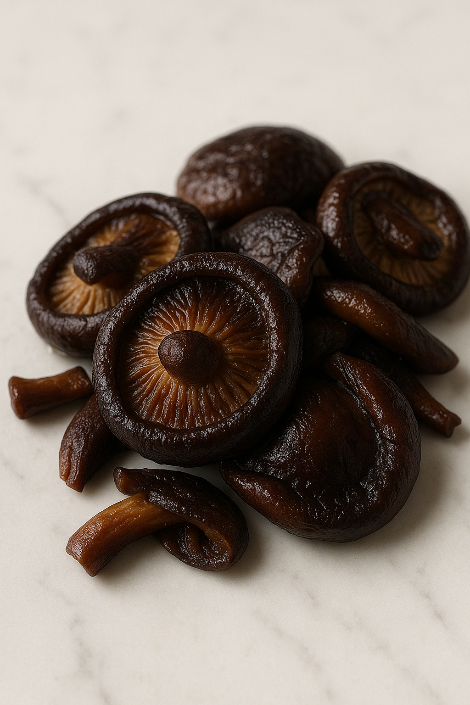
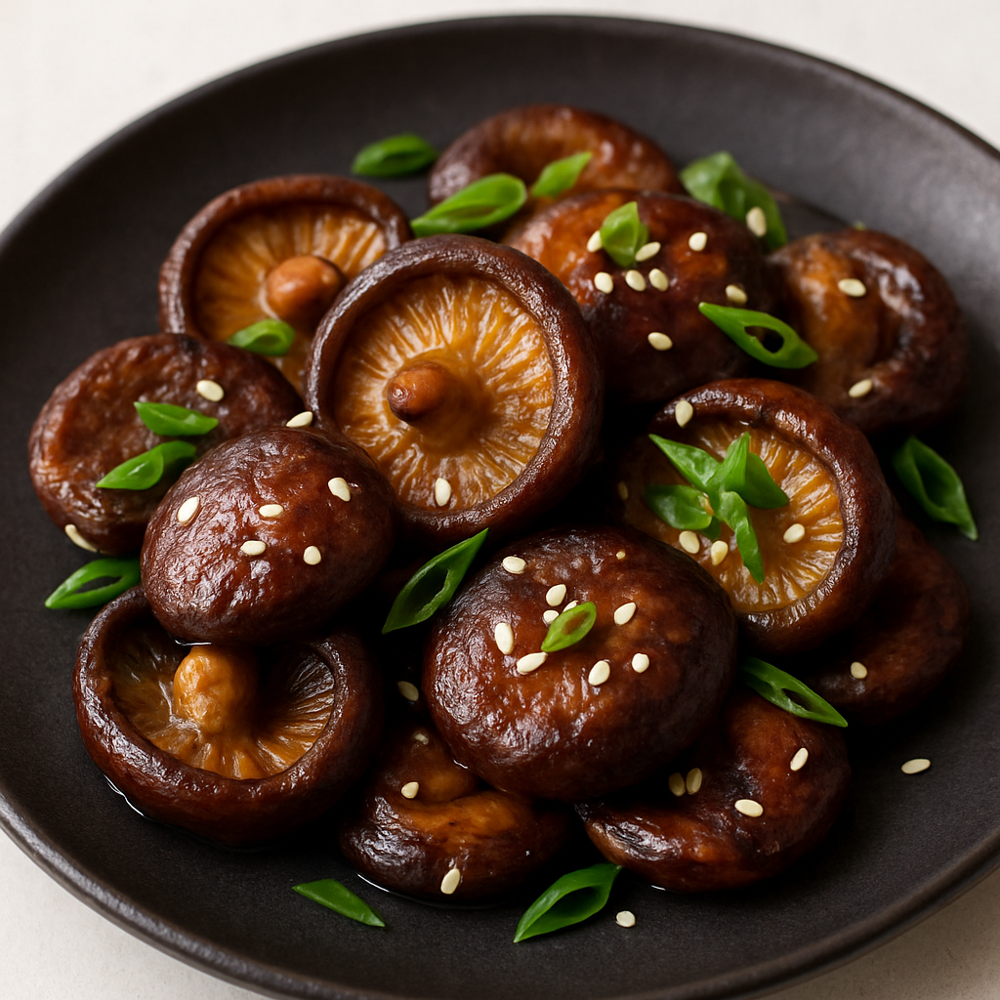

# Champignons Umami (Shiitake)

---

## Page 1 : Présentation + Science

**CHAMPIGNONS UMAMI (SHIITAKE)**

🔬 **LA SCIENCE**
Le shiitake séché concentre le glutamate (≈1060 mg/100g vs 70 mg/100g frais) et, lors de la réhydratation, libère du guanylate (GMP), un nucléotide umami unique. Associé à d’autres sources de glutamate/inosinate, il provoque une synergie d’intensité umami multipliée (x30)[12][13][15]. Les parois cellulaires éclatent en cuisson douce, libérant ces composés et renforçant la saveur.

🌿 **ASSOCIATIONS CLÉS**
- Shiitake séché + eau de réhydratation → glutamate, guanylate GMP (umami)
- Shiitake + sauce soja → glutamate, ferments (boost umami-salé)

⏱️ **INFOS PRATIQUES**
Préparation : 5 min | Cuisson : 12 min | Repos (réhydratation) : 30 min | Difficulté : ●○○ | Pour 4 personnes

---

## Page 2 : Recette + Variantes

🧑‍🍳 **INGRÉDIENTS**
- 40g shiitake séchés
- 400ml eau tiède (pour réhydratation)
- 1 c. à soupe sauce soja
- 1 c. à soupe huile de sésame toastée
- 1 oignon nouveau
- 1 cuillère à café graines de sésame
- Sel, poivre

🔥 **PRÉPARATION**
1. Faire tremper les shiitake dans 400ml eau tiède 30 min, puis égoutter (garder l’eau).
2. Trancher finement les shiitake et ciseler l’oignon nouveau.
3. Chauffer huile de sésame dans poêle, ajouter shiitake, dorer 5 min.
4. Ajouter un peu d’eau de trempage + sauce soja, mijoter 6-7 min jusqu’à réduction.
5. Rectifier l’assaisonnement, servir décoré de sésame et oignon frais.
6. Suggestion : ajouter la réduction dans un bouillon ou sur riz blanc.

🔄 **VARIANTES**
- **Booster umami** : Ajouter bonite séchée (inosinate), synergie japonaise.
- **Version vegan** : Remplacer sauce soja par miso blanc dilué.

💡 **ASTUCE SCIENCE**
Placer 1h au frais après cuisson décuple la perception umami via diffusion post-cuisson des nucléotides et glutamate restant.

---

## Notes
- Difficulté : ●○○ (simple)
- Images obligatoires : hero.png, final.png, process-01.png, detail-01.png
- Respect charte visuelle : 45°, macro, lumière naturelle

---

> Rédigé sur base littérature spécialisée (2025).