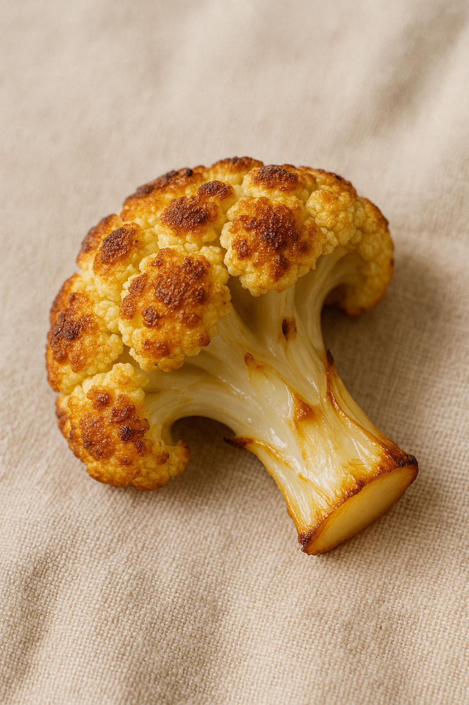

# Chou-Fleur Texturé

---

## Page 1 : Présentation + Science

**CHOU-FLEUR TEXTURÉ**

🔬 **LA SCIENCE**
La texture du chou-fleur dépend du mode de cuisson : vapeur (100°C, 8-10 min) pour une texture ferme, eau bouillante (12-15 min) pour du fondant, four (180-200°C, 25-35 min) pour un extérieur croustillant. Les parois cellulaires ramollissent, l’amidon gélatinise, et la Maillard/caramélisation développe saveurs nouvelles sur les pointes dorées[6][9].

🌿 **ASSOCIATIONS CLÉS**
- Chou-fleur + huile d’olive → lactones, aldéhydes (noisette, arôme grillé)
- Chou-fleur + curry → composés soufrés (effet umami, exhausteur)

⏱️ **INFOS PRATIQUES**
Préparation : 8 min | Cuisson : 30 min | Difficulté : ●○○ | Pour 4 personnes

---

## Page 2 : Recette + Variantes

🧑‍🍳 **INGRÉDIENTS**
- 1 gros chou-fleur (env. 1 kg)
- 2 c. à soupe huile d’olive
- 1 c. à soupe curry doux
- Sel, poivre du moulin

🔥 **PRÉPARATION**
1. Préchauffer le four à 190°C.
2. Détacher les bouquets de chou-fleur en morceaux moyens.
3. Mélanger dans saladier avec huile, curry, sel et poivre.
4. Placer sur plaque recouverte de papier cuisson, bien espacer.
5. Rôtir 30 min, retourner à mi-cuisson pour dorure homogène.
6. Servir chaud, parsemer éventuellement de coriandre fraîche.

🔄 **VARIANTES**
- **Version lactofermentée** : Mariner les bouquets 24h dans saumure avant cuisson.
- **Crumble noisette** : Parsemer de noisettes torréfiées juste avant de servir pour la texture.

💡 **ASTUCE SCIENCE**
Un passage sous le grill en fin de cuisson accentue le gradient de texture entre cœur fondant et extrémités croustillantes, parfait pour explorer la chimie cuisson-légume.

---

## Notes
- Difficulté : ●○○ (simple)
- Images obligatoires : hero.png, final.png, process-01.png, detail-01.png
- Respect charte visuelle : 45°, macro, lumière naturelle

---

> Rédigé sur base documentation scientifique et web spécialisée (2025).