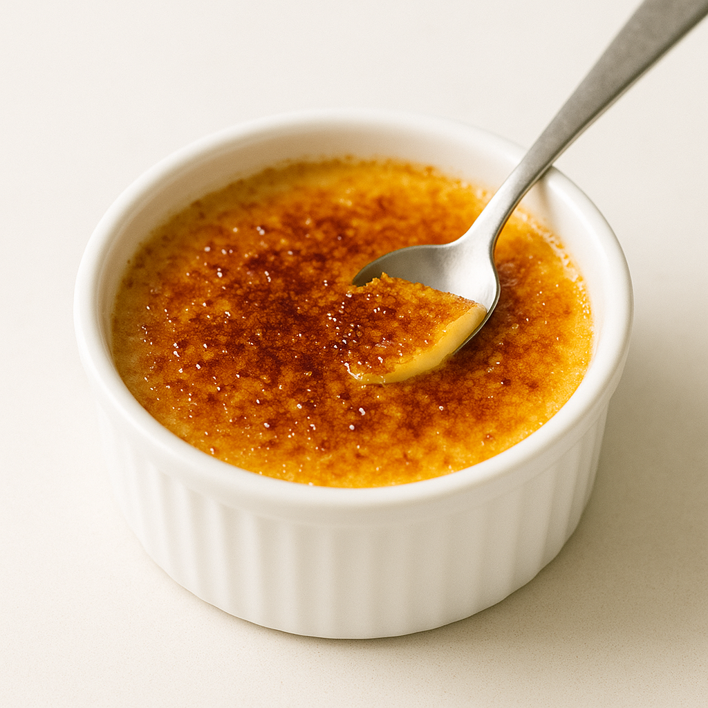
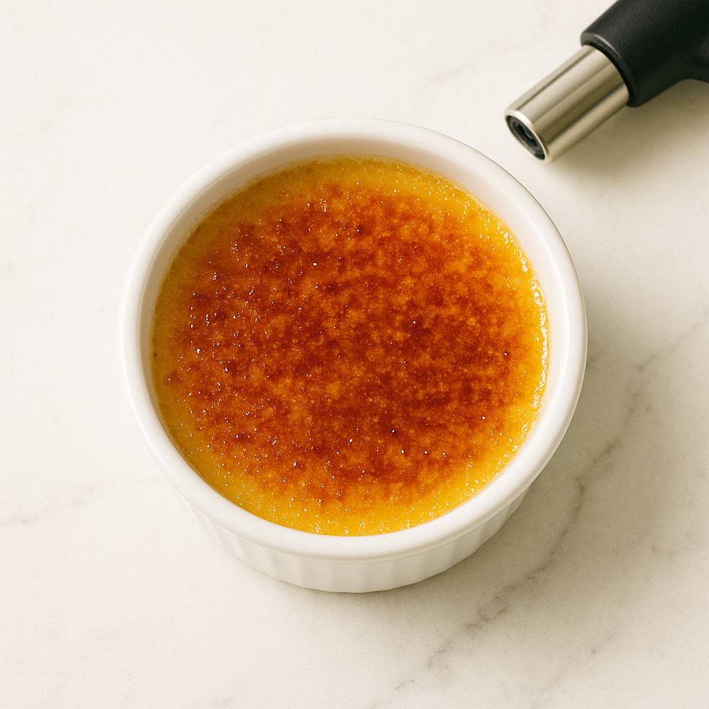

# Crème Brûlée Caramélisée

---

## Page 1 : Présentation + Science

**CRÈME BRÛLÉE CARAMÉLISÉE**

🔬 **LA SCIENCE**
La crème brûlée combine deux processus scientifiques distincts. La coagulation des protéines du jaune d’œuf (LDL et HDL) intervient à 82°C en raison de la dilution importante dans la crème et de la présence de sucre et matières grasses. Une cuisson douce au bain-marie (95-100°C) permet une coagulation progressive, créant une texture onctueuse sans granulation. La caramélisation du sucre en surface (fusion à 160°C, caramélisation à 180-200°C) crée une croûte craquante par décomposition thermique du saccharose.

🌿 **ASSOCIATIONS CLÉS**
- Jaunes d’œuf + Crème-sucre + Chaleur 82°C → Coagulation protéines LDL/HDL (texture crémeuse)
- Crème 35% MG + Jaunes → Émulsion stable (onctuosité veloutée)
- Sucre en surface + Chalumeau 180-200°C → Caramélisation (croûte craquante)

⏱️ **INFOS PRATIQUES**
Préparation : 15 min | Cuisson : 40 min | Repos : 4h | Difficulté : ●●○ | Pour 4 personnes

---

## Page 2 : Recette + Variantes

🧑‍🍳 **INGRÉDIENTS**
- 6 jaunes d’œufs extra-frais
- 500 ml de crème liquide entière 35% MG
- 50 g de sucre en poudre (pour la crème)
- 1 gousse de vanille (ou 1 cuillère à café d’extrait)
- 4 cuillères à soupe de sucre roux ou cassonade (pour la caramélisation)

🔥 **PRÉPARATION**
1. **Préchauffer le four** : Régler le four à 95°C (chaleur tournante) ou 100°C (chaleur traditionnelle). Préparer un grand plat allant au four pouvant accueillir 4 ramequins.
2. **Infuser la vanille** : Fendre la gousse de vanille et gratter les graines. Dans une casserole, porter la crème à frémissement doux avec la gousse et les graines. Retirer du feu et laisser infuser 10 minutes. Retirer la gousse.
3. **Fouetter jaunes et sucre** : Dans un saladier, fouetter vigoureusement les jaunes d’œuf avec le sucre (50 g) jusqu’à obtention d’un mélange pâle et mousseux (technique du ruban, environ 2-3 minutes).
4. **Tempérage** : Verser la crème chaude (mais non bouillante) en filet très lent sur le mélange jaunes-sucre, en fouettant constamment pour éviter la coagulation prématurée des œufs. Mélanger jusqu’à homogénéité parfaite.
5. **Filtrer** : Passer la préparation au tamis fin ou chinois pour éliminer tout grumeau ou impureté, garantissant une texture soyeuse.
6. **Répartir et cuisson bain-marie** : Verser la préparation dans 4 ramequins. Placer les ramequins dans le grand plat. Verser de l’eau chaude (non bouillante) dans le plat jusqu’à mi-hauteur des ramequins. Enfourner et cuire 35-40 minutes (ramequins larges) ou 50-60 minutes (ramequins profonds). La crème est cuite à 82°C à cœur : elle doit être prise mais légèrement tremblotante au centre.
7. **Refroidissement** : Sortir les ramequins du bain-marie. Laisser refroidir à température ambiante 30 minutes, puis placer au réfrigérateur minimum 4 heures (idéalement une nuit).
8. **Caramélisation** : Juste avant de servir, saupoudrer uniformément chaque crème d’une fine couche de sucre roux (1 cuillère à soupe par ramequin). Utiliser un chalumeau de cuisine en maintenant la flamme à 5 cm de la surface, mouvements circulaires, jusqu’à obtention d’une caramélisation uniforme dorée (180-200°C). Laisser durcir 1-2 minutes avant de servir.

🔄 **VARIANTES**
- **Version café-chicorée** : Infuser 2 cuillères à soupe de café moulu dans la crème pour une saveur profonde et complexe, parfaite pour adultes.
- **Version agrumes** : Remplacer la vanille par les zestes de 2 oranges ou 1 citron, infusés 15 minutes dans la crème pour une note acidulée rafraîchissante.

💡 **ASTUCE SCIENCE**
La cuisson basse température (95-100°C) est critique : au-delà de 85°C, les protéines se contractent trop et expulsent l’eau, créant une texture granuleuse. Le bain-marie maintient une température constante autour de 100°C (point d’ébullition de l’eau), évitant les pics thermiques. Un thermomètre de précision permettant de vérifier 82°C à cœur garantit la texture parfaite. Pour la caramélisation, le sucre roux apporte des notes complexes (mélasse) supérieures au sucre blanc.

---