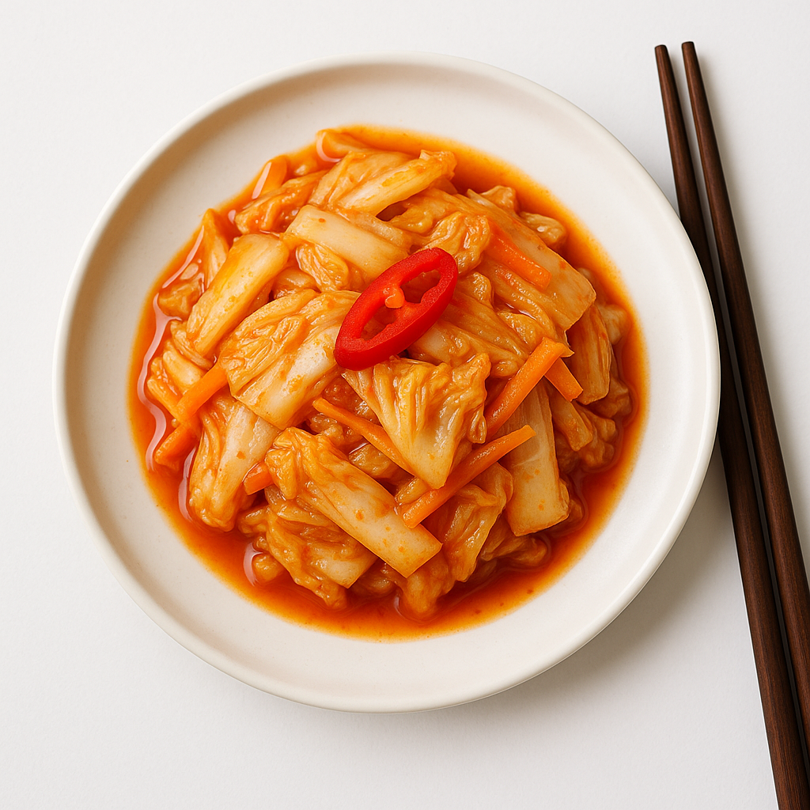

# Kimchi Express (Fermentation Lactique)

---

## Page 1 : Présentation + Science

**KIMCHI EXPRESS (FERMENTATION LACTIQUE)**

🔬 **LA SCIENCE**
Le kimchi est le fruit d’une fermentation lactique : les bactéries lactiques (Leuconostoc, Lactobacillus, Weissella) transforment les sucres du chou en acide lactique et composés organoleptiques, abaissant le pH à ~4.2[7][17][20]. Ce processus contrôle la croissance microbienne, enrichit la saveur et améliore la conservation. La température influe sur la diversité bactérienne : plus frais (5°C), la fermentation est lente et complexe ; à température ambiante (18-22°C), elle est beaucoup plus rapide.

🌿 **ASSOCIATIONS CLÉS**
- Chou chinois + radis blanc → Leuconostoc citreum (notes acidulées)
- Gingembre + ail → composés soufrés, aldéhydes (complexité aromatique)

⏱️ **INFOS PRATIQUES**
Préparation : 30 min | Fermentation : 2-5 jours | Difficulté : ●●○ | Pour 1 bocal (env. 1 L)

---

## Page 2 : Recette + Variantes

🧑‍🍳 **INGRÉDIENTS**
- 1 petit chou chinois (env. 500g)
- 1/2 radis blanc (daikon)
- 2 carottes
- 3 oignons nouveaux
- 2 c. à soupe gros sel
- 20g gingembre frais
- 3 gousses d’ail
- 2 c. à soupe piment coréen (gochugaru)
- 2 c. à soupe sauce poisson

🔥 **PRÉPARATION**
1. Émincer le chou, tailler le radis et carottes en bâtonnets.
2. Mélanger légumes avec le sel, masser, laisser dégorger 20 min. Égoutter sans rincer.
3. Préparer la pâte : mixer gingembre, ail, gochugaru, sauce poisson, ajouter aux légumes.
4. Bien mélanger (gants recommandés).
5. Tasser dans un bocal stérilisé en éliminant les bulles d’air, fermer sans trop serrer.
6. Laisser fermenter à température ambiante 2 à 3 jours (ou 5-7j à 5°C). Goûter régulièrement.
7. Stocker au frais une fois acidité et croquant idéaux.

🔄 **VARIANTES**
- **Version Vegan** : Remplacer sauce poisson par sauce soja + algue kombu.
- **Express** : Fermenter 24h à 24°C pour résultat plus doux.

💡 **ASTUCE SCIENCE**
Plus la température est basse, plus la proportion de bactéries Leuconostoc reste élevée et complexe les arômes : le kimchi garde croquant et acidité fine.

---

## Notes
- Difficulté : ●●○ (intermédiaire)
- Images obligatoires : hero.png, final.png, process-01.png, detail-01.png
- Respect charte visuelle : top-down, macro, lumière naturelle

---

> Rédigé sur base littérature scientifique, food blogs et synthèse projets (2025).