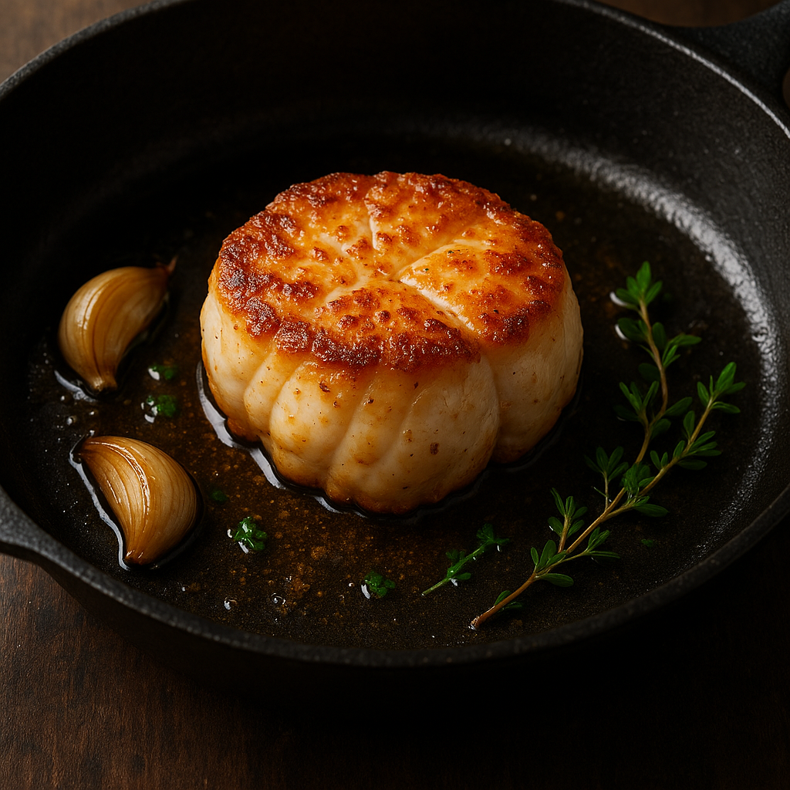
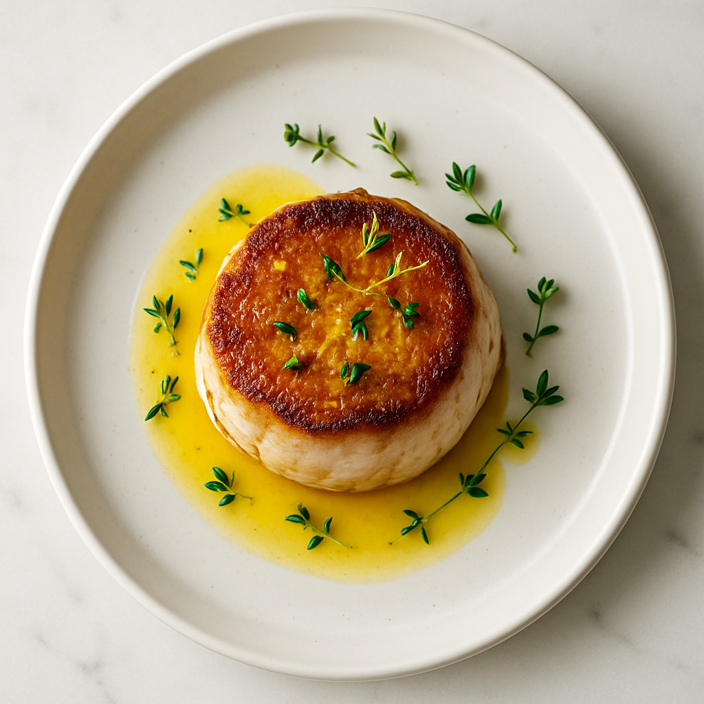

# Lotte Rôtie (Texture Ferme)

---

## Page 1 : Présentation + Science

**LOTTE RÔTIE (TEXTURE FERME)**

🔬 **LA SCIENCE**

La lotte possède une structure protéique unique parmi les poissons : sa chair dense et ferme contient davantage de collagène que la plupart des poissons, la rapprochant de la texture de la viande. La cuisson à haute température (180-200C) combine deux mécanismes scientifiques : la dénaturation contrôlée des protéines myofibrillaires qui raffermit la chair, et une réaction de Maillard en surface créant une croûte aromatique dorée. Le collagène, contrairement aux poissons maigres, reste stable jusqu'à 65C puis se transforme progressivement en gélatine, apportant cette onctuosité caractéristique. Cette double cuisson (saisie + rôtissage) maximise le contraste textural : croûte Maillard croquante vs cœur fondant.

🌿 **ASSOCIATIONS CLÉS**

- Lotte + Beurre haute temp → Protéines + lipides + chaleur (Maillard, croûte dorée)
- Ail + Thym + Chaleur → Allicine + thymol (arômes volatils amplifiés)
- Citron + Collagène cuit → Acide citrique + gélatine (brillance, exhausteur)

⏱️ **INFOS PRATIQUES**

Préparation : 15 min | Cuisson : 18 min | Difficulté : ●●● | Pour 2 personnes

---

## Page 2 : Recette + Variantes

🧑‍🍳 **INGRÉDIENTS**

- 2 médaillons de lotte (200g chacun, épais 4cm)
- 40g de beurre clarifie (ou ghee)
- 3 gousses ail (en chemise, écrasées)
- 4 branches thym frais
- 1 citron (jus + zeste)
- 2 cuillères à soupe huile pépins raisin (haute temp)
- Sel fin et poivre blanc
- Thermomètre sonde

🔥 **PRÉPARATION**

1. **Préparation lotte** : Sécher médaillons soigneusement papier absorbant (humidité = ennemi Maillard). Tempérer 20 min temp ambiante. Saler généreusement (3g/médaillon), poivrer.

2. **Préchauffage four** : Préchauffer four à 180C (chaleur tournante). Préparer plat allant au four.

3. **Saisie haute température** : Chauffer poêle fonte à feu très vif avec huile pépins raisin (point fumée 230C). Atteindre 200C (huile légèrement fumante). Déposer médaillons côté le plus plat. Saisir 2 minutes sans bouger (Maillard démarre à 140C, optimal 160-180C).

4. **Retourner et colorer** : Retourner délicatement. Saisir face opposée 2 minutes. Ajouter beurre clarifié, ail en chemise, thym. Incliner poêle, arroser lotte avec beurre mousseux (basting) 1 minute.

5. **Rôtissage au four** : Transférer poêle ou médaillons en plat four avec ail, thym, beurre. Enfourner 12 minutes. Arroser mi-cuisson avec jus.

6. **Contrôle temp interne** : Insérer sonde au cœur : 60-62C = parfait (chair ferme mais juteuse, collagène partiellement gélifié). 65C = limite max. Au-delà = sec.

7. **Repos et finition** : Retirer du four. Laisser reposer 3 minutes couvert papier alu (redistribution jus). Arroser jus cuisson, zeste citron râpé, jus citron. Servir immédiatement.

🔄 **VARIANTES**

- **Version Méditerranéenne** : Enrober médaillons de tapenade noire (olives) avant saisie. La tapenade caractérise en croûte umami puissante.
- **Boost Maillard** : Badigeonner légèrement de miel (1cc/médaillon) avant saisie. Sucres réducteurs accélèrent Maillard = croûte intense en 90 secondes au lieu de 2 min.

💡 **ASTUCE SCIENCE**

La lotte est le seul poisson qui tolère (et bénéficie) une cuisson haute température grâce à son collagène abondant. Contrairement au saumon ou cabillaud (poissons maigres) qui sèchent au-delà de 55C, la lotte reste juteuse jusqu'à 62C car le collagène se gélifie en retenant l'eau. La saisie initiale à 200C est critique : elle crée une barrière Maillard qui empêche la fuite des jus pendant le rôtissage. Sans saisie préalable, les jus s'échappent et la chair devient sèche. La lotte est scientifiquement plus proche d'un blanc de poulet que d'un poisson classique en termes de cuisson.

---

## Notes

**Choix lotte** : Queue de lotte (partie noble). Chair blanche, ferme, sans membrane rose (retirer si présente). Fraîcheur essentielle.

**Matériel** : Poêle fonte obligatoire (rétention chaleur pour Maillard). Thermomètre sonde indispensable (2C de différence = texture radicalement différente).

**Beurre clarifié** : Point fumée 250C (vs 150C beurre classique). Permet haute temp sans brûler. Alternative : ghee.