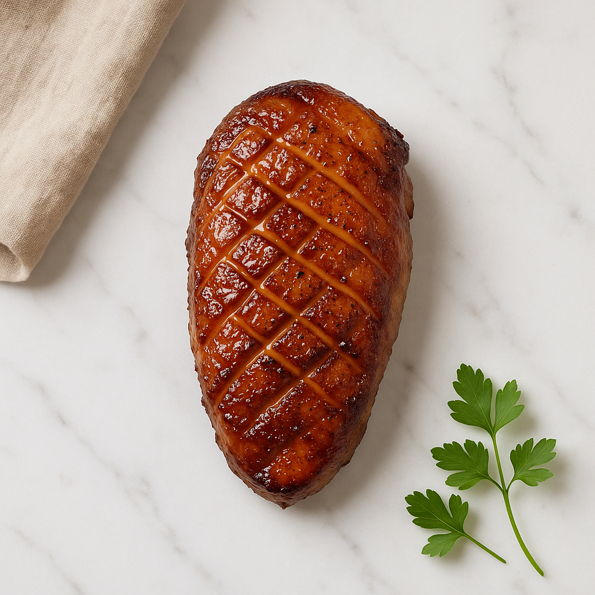
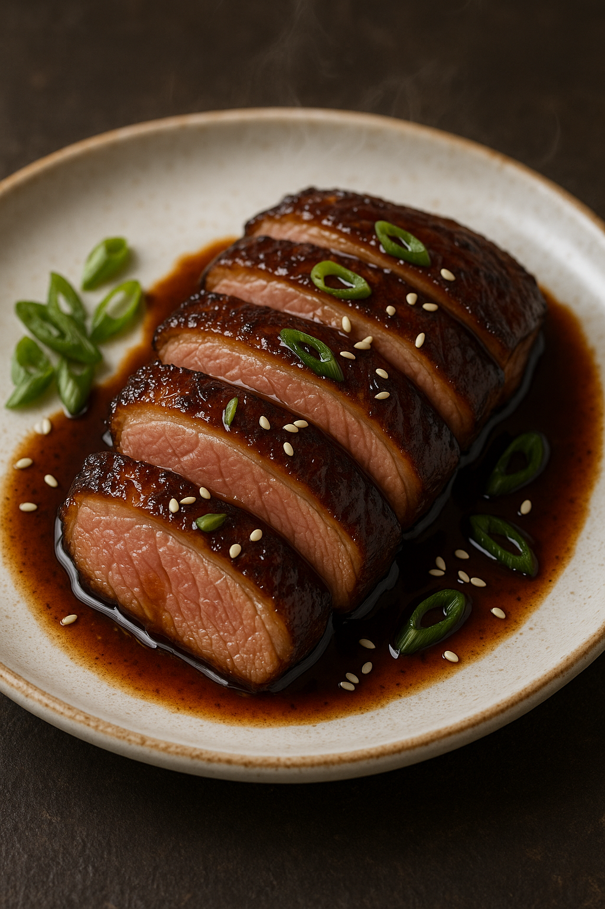

# Magret de Canard Laqué (Maillard + Caramélisation)

---

## Page 1 : Présentation + Science

**MAGRET DE CANARD LAQUÉ (MAILLARD + CARAMÉLISATION)**

🔬 **LA SCIENCE**
Le magret de canard laqué combine deux réactions chimiques complémentaires : la réaction de Maillard (protéines + sucres réducteurs à 140-180°C) sur la chair, et la caramélisation des sucres (miel/sauce) à partir de 160°C sur la peau. La cuisson en deux temps - fonte du gras à basse température (120-140°C) suivie d'un glaçage à haute température (180-220°C) - permet d'obtenir une peau parfaitement croustillante et caramélisée tout en préservant une chair rosée et juteuse à cœur (55-60°C). Le quadrillage de la peau facilite l'évacuation de la graisse sous-cutanée abondante (jusqu'à 40% du poids) tout en créant une surface texturée qui retient la laque. La combinaison miel-sauce soja apporte les sucres nécessaires à la caramélisation tout en amplifiant l'umami naturel du canard par synergie glutamate.

🌿 **ASSOCIATIONS CLÉS**
- Canard + Miel → Caramélisation sucres (croûte laquée dorée)
- Canard + Sauce soja → Glutamate + IMP (synergie umami multiplicatrice)
- Canard + Cinq-épices → Composés terpéniques (anis étoilé, cannelle - notes épicées)
- Canard + Vinaigre balsamique → Acide acétique (équilibre sucre-acidité)

⏱️ **INFOS PRATIQUES**
Préparation : 10 min + 2h marinade | Cuisson : 18 min | Difficulté : ●●○ | Pour 2 personnes

---

## Page 2 : Recette + Variantes

🧑‍🍳 **INGRÉDIENTS**

**Magret :**
- 1 magret de canard IGP (350-400g, peau bien épaisse)
- 3 g sel fin
- 2 g poivre noir concassé

**Laque :**
- 50 g miel d'acacia (sucres pour caramélisation)
- 50 ml sauce soja (glutamate 200-400mg/100g)
- 20 ml vinaigre balsamique (acidité équilibrante)
- 5 g cinq-épices chinois (anis étoilé, cannelle, clou girofle, fenouil, poivre Sichuan)
- 5 g maïzena (épaississement laque)

🔥 **PRÉPARATION**

1. **Préparation magret** : Retirer l'excès de gras sur les bords et la fine membrane argentée sur la chair. Avec un couteau très aiguisé, **quadriller la peau** en profondeur (espacement 1cm, croisillons) sans entamer la chair (crucial pour évacuation graisse). Saler et poivrer uniquement côté chair.

2. **Préparation laque** : Dans une petite casserole, mélanger miel, sauce soja, vinaigre balsamique, cinq-épices, maïzena. Porter à ébullition en remuant constamment. Laisser réduire 5 min à frémissement jusqu'à consistance sirupeuse (température ~110-115°C, début caramélisation). Réserver 1/3 de la laque pour service, utiliser 2/3 pour marinade.

3. **Marinade** : Placer magret dans un sac de congélation avec les 2/3 de la laque. Masser pour bien enrober, chasser l'air. Réfrigérer **minimum 2h** (optimal 4-6h) pour infusion aromatique et attendrissement enzymatique léger par acides.

4. **Cuisson première phase (fonte graisse)** : Sortir magret 30 min avant cuisson (tempérage). Essuyer l'excès de marinade. Dans une poêle froide, déposer magret **peau vers le bas**. Allumer feu **très doux à moyen-doux** (120-140°C). Cuire **6-8 min** en retirant régulièrement la graisse fondue à la cuillère (réserver pour usage ultérieur). La peau doit devenir dorée et commencer à crisper. Ne pas retourner.

5. **Caramélisation peau** : Augmenter feu à **vif** (180-220°C). Badigeonner peau généreusement avec marinade réservée. Cuire **1-2 min** en surveillant de près : le miel caramélise rapidement et peut brûler. La peau doit former une croûte laquée brillante brun-noir. Retourner le magret.

6. **Cuisson chair** : Badigeonner côté chair de marinade. Cuire **1-2 min** maximum pour saisie Maillard légère. Pour magret rosé optimal (55-60°C à cœur), la chair doit rester rouge vif au centre.

7. **Finition four (optionnelle)** : Pour cuisson plus uniforme, après caramélisation poêle, transférer magret sur grille dans plat, **peau vers le bas**. Badigeonner de marinade. Enfourner à 180°C pendant **8-10 min**, en badigeonnant toutes les 3 min. Vérifier température interne avec thermomètre (cible 55-58°C pour rosé).

8. **Repos crucial** : Envelopper magret lâchement dans papier aluminium. Laisser reposer **5 min** (relaxation fibres, redistribution jus). La température interne montera de 2-3°C (cuisson résiduelle).

9. **Service** : Trancher magret en biais (angle 45°) en tranches de 5-7mm d'épaisseur. Disposer en éventail sur assiette. Arroser de laque réservée et du jus de repos. La chair doit être uniformément rosée avec une peau croustillante brillante.

---

## 🌡️ **TEMPÉRATURES ET CUISSONS**

| Température Cœur | Aspect | Texture | Notes |
|------------------|--------|---------|-------|
| **52-54°C** | Rouge vif | Très tendre, très juteux | Bleu, pour amateurs |
| **55-58°C** ⭐ | Rouge rosé | Tendre, juteux, optimal | Rosé parfait (recommandé) |
| **60-62°C** | Rose uniforme | Ferme, encore juteux | À point |
| **> 65°C** | Rose pâle à gris | Ferme, sec | ⚠️ Surcoction, perte jutosité |

⭐ **Cuisson recommandée** : **55-58°C** offre le meilleur équilibre tendreté/saveur pour le magret de canard.

**Note** : Le magret continue de cuire après sortie de poêle/four (cuisson résiduelle +2-3°C). Anticiper en retirant 2°C avant température cible.

---

🔄 **VARIANTES**

**Version Orange Sanguine (Classique Réinventé)**
- **Jus d'orange sanguine** : 100ml réduit à 30ml (remplace vinaigre balsamique)
- **Zeste d'orange** : 1 cuillère à café râpé fin dans laque
- **Grand Marnier** : 15ml flambé en fin de cuisson poêle
- **Justification** : L'acide citrique de l'orange équilibre le sucre, les composés limonène s'associent au canard. Anthocyanes de l'orange sanguine apportent couleur rubis profonde.

**Version Épices Japonaises (Fusion)**
- **Miso rouge** : 20g mélangé à la laque (remplace 1/3 sauce soja)
- **Mirin** : 30ml (remplace miel, alcool de riz sucré)
- **Yuzu** : Jus + zeste (remplace vinaigre balsamique)
- **Sansho** : 2g poivre japonais (remplace cinq-épices)
- **Gingembre** : 10g râpé frais dans marinade
- **Justification** : Miso rouge (400-700mg glutamate/100g) amplifie l'umami. Sansho apporte notes citronnées-poivrées uniques. Yuzu (acide citrique + composés terpéniques) équilibre richesse du canard.

**Version Sans Miel (Caramélisation Alternative)**
- **Sirop d'érable Grade A** : 60ml (remplace miel, profil aromatique boisé)
- **Cassonade** : 15g additionnels pour caramélisation intense
- **Vinaigre de riz** : 25ml (remplace balsamique, acidité plus douce)
- **Justification** : Sirop d'érable caramélise à température similaire (160-170°C), apporte notes de vanille et caramel. Cassonade (saccharose) caramélise efficacement dès 160°C.

---

💡 **ASTUCE SCIENCE**
Le secret d'une peau parfaitement croustillante : **cuire impérativement peau vers le bas en premier** et à feu doux prolongé (6-8 min). Cette technique permet l'évacuation maximale de la graisse sous-cutanée qui, si elle reste emprisonnée, rend la peau molle et caoutchouteuse. Le quadrillage profond crée des canaux d'évacuation efficaces. Retirez régulièrement la graisse fondue : elle doit être translucide et liquide, signe d'une fonte complète du tissu adipeux. Une fois la peau crispée et dorée, le feu vif final caramélise le miel en 1-2 min seulement - surveillez pour éviter carbonisation.

---

## 📚 Schémas Scientifiques

Pour mieux comprendre les réactions de Maillard et caramélisation :

