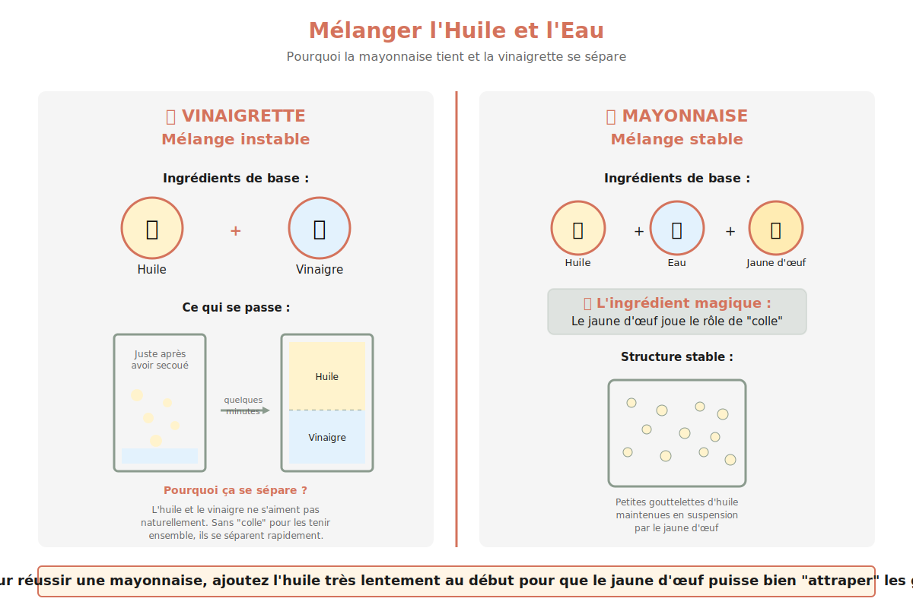

# Mayonnaise Stable

---

## Page 1 : Présentation + Science

**MAYONNAISE STABLE – L'ART DE L'ÉMULSION**

🔬 **LA SCIENCE**

La mayonnaise est une émulsion **huile dans eau** (phase huileuse dispersée dans phase aqueuse) stabilisée par la **lécithine** du jaune d'œuf. Cette molécule amphiphile possède une tête hydrophile (qui aime l'eau) et une queue lipophile (qui aime l'huile), permettant d'enrober les microgouttelettes d'huile et de les maintenir en suspension stable dans la phase aqueuse. Un seul jaune d'œuf contient suffisamment de lécithine pour émulsionner jusqu'à 250 ml d'huile. Le fouettage vigoureux fractionne l'huile en gouttelettes microscopiques (2-10 μm) qui restent dispersées grâce au film protecteur de lécithine, empêchant leur coalescence et la séparation des phases.

🌿 **ASSOCIATIONS MOLÉCULAIRES CLÉS**

- **Jaune d'œuf** + **Huile** → Lécithine (phospholipide émulsifiant) + Microgouttelettes stabilisées
- **Moutarde** + **Émulsion** → Mucilage polysaccharidique (stabilisation supplémentaire) + Viscosité accrue  
- **Vinaigre/Citron** + **Phase aqueuse** → Acidité pH 3,5-4,5 (conservation antimicrobienne) + Renforcement goût

⏱️ **INFOS PRATIQUES**

Préparation : 10 min | Cuisson : 0 min | Difficulté : ●●○ | Pour 250 ml (env. 8-10 portions)

---

## Page 2 : Recette + Variantes

🧑‍🍳 **INGRÉDIENTS**

- 1 jaune d'œuf (calibre large, température ambiante 20-22°C)
- 250 ml huile neutre (tournesol, colza, pépins de raisin)
- 1 c. à soupe (15 ml) moutarde de Dijon
- 1 c. à soupe (15 ml) vinaigre de vin blanc ou jus de citron frais
- 1 pincée de sel fin
- Poivre blanc fraîchement moulu (optionnel)

🔥 **PRÉPARATION**

1. **Préparation de la phase aqueuse (2 min)** : Dans un bol à fond rond stable, placer le jaune d'œuf à température ambiante (crucial pour viscosité optimale). Ajouter la moutarde, le sel et la moitié du vinaigre (7,5 ml). Fouetter vigoureusement pendant 30 secondes jusqu'à homogénéité complète et légère mousse.

2. **Début d'émulsion – Phase critique (3 min)** : Ajouter l'huile **goutte à goutte** (environ 5-10 gouttes par ajout) en fouettant **sans interruption** dans le même sens circulaire. Cette étape est cruciale : chaque goutte d'huile doit être complètement émulsionnée avant l'ajout suivant. Les premières 30-50 ml sont déterminantes pour créer une émulsion stable.

3. **Accélération progressive (3 min)** : Une fois l'émulsion initiée (mélange devient épais et brillant), augmenter progressivement le débit d'ajout d'huile en un **mince filet continu** tout en maintenant le fouettage constant. La mayonnaise épaissit visiblement et prend une texture crémeuse homogène.

4. **Ajustement final (1 min)** : Lorsque toute l'huile est incorporée (texture épaisse et stable), ajouter le reste du vinaigre (7,5 ml) pour ajuster l'acidité et alléger légèrement la texture. Fouetter 15 secondes. Goûter et rectifier l'assaisonnement (sel, poivre).

5. **Contrôle qualité** : La mayonnaise réussie forme des "rubans" lorsqu'on soulève le fouet, tient en pic mou, et présente une surface lisse et brillante sans séparation de phase. Conservation : 3-4 jours au réfrigérateur dans un contenant hermétique.

🔄 **VARIANTES SCIENTIFIQUES**

- **Mayonnaise à l'ail (Aïoli)** : Ajouter 2-3 gousses d'ail écrasées à l'étape 1. L'allicine de l'ail (composé soufré, formée par réaction enzymatique après écrasement) renforce les propriétés antimicrobiennes et apporte des notes piquantes caractéristiques.

- **Mayonnaise végane (sans œuf)** : Remplacer le jaune d'œuf par 20 g de lécithine de soja + 30 ml de lait végétal (soja). La lécithine pure émulsionne efficacement l'huile (même mécanisme moléculaire amphiphile), créant une émulsion 100% végétale stable.

- **Boost stabilité extrême** : Ajouter 1 c. à café (5 ml) de sirop de glucose à l'étape 1. Le glucose augmente la viscosité de la phase aqueuse et réduit l'activité de l'eau (aw), retardant la coalescence et permet une conservation prolongée **de 1 à 2 jours supplémentaires**.

💡 **ASTUCE SCIENCE – Rattrapage d'émulsion cassée**

Si la mayonnaise "tourne" (séparation huile/eau visible), ne paniquez pas ! Dans un nouveau bol propre, placer 1 c. à café (5 ml) d'eau froide ou 1 jaune d'œuf frais. Incorporer **très lentement** la mayonnaise cassée goutte à goutte en fouettant vigoureusement, comme pour une mayonnaise initiale. L'émulsion se reforme progressivement grâce au nouvel apport d'émulsifiant et à la réduction du ratio huile/phase aqueuse sous le seuil critique d'environ **80-85% d'huile maximum** (stabilité optimale).

---

## 📚 Sources Scientifiques

- **McGee, H. (2004)**. *On Food and Cooking: The Science and Lore of the Kitchen*. Scribner. Chapitre sur les émulsions et sauces.
- **Curiokids (2021)**. La chimie qui fait prendre la mayonnaise. Explication pédagogique lécithine et micelles.
- **Ricardo Cuisine (2018)**. Quand la mayonnaise prend! Ratio optimal jaune/huile et techniques de stabilisation.
- **Daily Science (2022)**. De la mayonnaise cosmique. Émulsion cinétiquement stable vs instable (vinaigrette).
- **Podcast Science (2021)**. Tous les ingrédients doivent être à température ambiante. Étude expérimentale température et stabilité émulsion.

**Création** : 2025-11-11  
**Rédacteur-Scientifique** : IA  
**Chapitre** : 1 - Bases Fondamentales  
**Concept clé** : Émulsion huile dans eau
