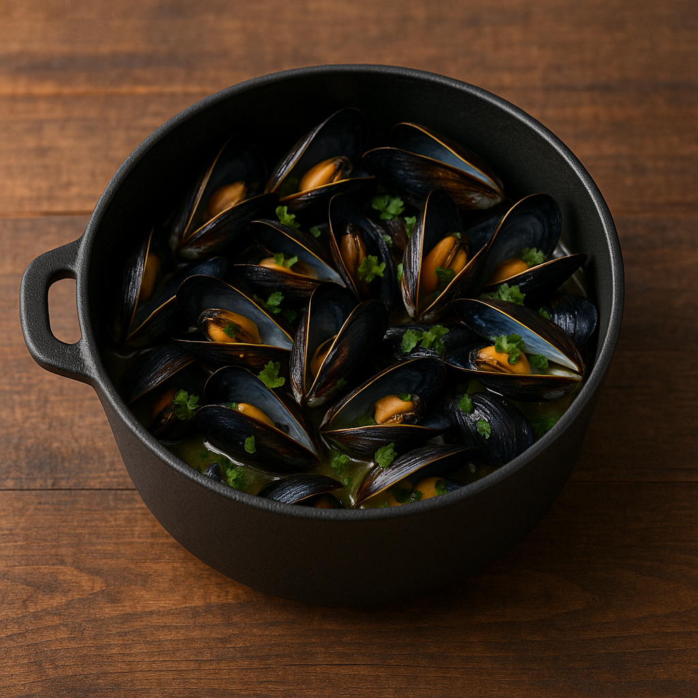
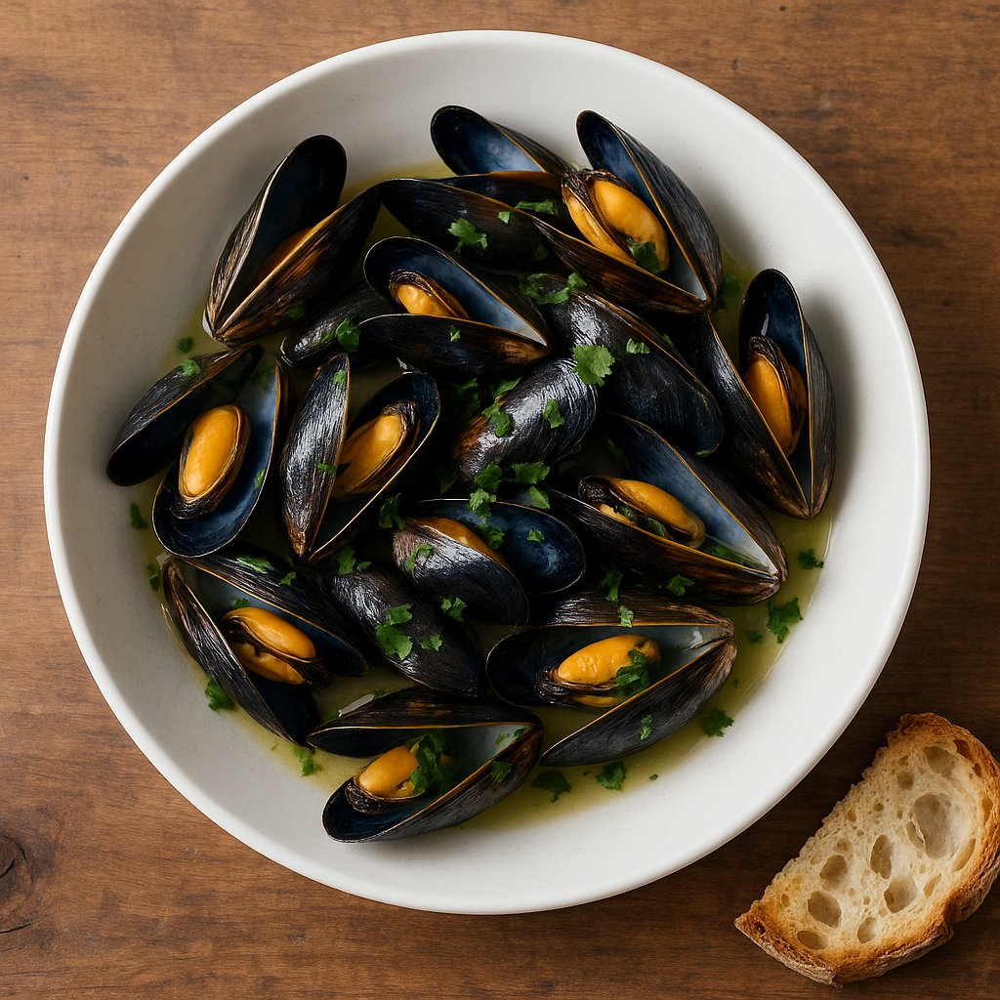

# Moules Marinières (Extraction Aromatique)

---

## Page 1 : Présentation + Science

**MOULES MARINIÈRES (EXTRACTION AROMATIQUE)**

🔬 **LA SCIENCE**

Les moules marinières illustrent deux phénomènes scientifiques simultanés : l'extraction aromatique et la synergie umami iodée. Le vin blanc chauffé extrait par solvabilité les composés aromatiques volatils de l'échalote (disulfures allyliques) et du persil (apiol), créant une base aromatique riche. Parallèlement, l'ouverture thermique des moules (55-60C) libère leur jus naturel concentré en glutamate libre et nucléotides (IMP), qui se combine au vin pour générer une synergie umami puissante (effet multiplicateur x8 selon recherches Zhang 2008). Le résultat est un bouillon complexe où terre et mer s'unissent moléculairement.

🌿 **ASSOCIATIONS CLÉS**

- Moules + Vin blanc → Glutamate + alcool éthylique (extraction aromatique, umami)
- Échalote + Chaleur → Disulfures allyliques (arôme base, piquant atténué)
- Persil + Bouillon → Apiol + composés iodés (fraîcheur herbacée)

⏱️ **INFOS PRATIQUES**

Préparation : 15 min | Cuisson : 8 min | Difficulté : ●●○ | Pour 2 personnes

---

## Page 2 : Recette + Variantes

🧑‍🍳 **INGRÉDIENTS**

- 1kg de moules de bouchot (fraîches, vivantes)
- 200ml de vin blanc sec (Muscadet ou Entre-Deux-Mers)
- 2 échalotes (finement ciselées)
- 2 gousses d'ail (écrasées)
- 30g de beurre demi-sel
- 1 bouquet de persil plat frais (ciselé)
- 1 feuille de laurier
- Poivre noir fraîchement moulu
- Pas de sel (moules naturellement salées)

🔥 **PRÉPARATION**

1. **Nettoyage moules** : Gratter coquilles sous eau froide. Retirer filaments (byssus). Éliminer moules ouvertes qui ne se ferment pas au toucher (mortes = toxiques). Rincer 3 fois.

2. **Préparation aromatiques** : Ciseler finement échalotes (2mm). Écraser gousses ail avec plat couteau. Ciseler persil (réserver pour finition).

3. **Suée aromatiques** : Dans grande cocotte (5L minimum), faire fondre 20g beurre à feu moyen. Ajouter échalotes, ail, laurier. Suer 2 minutes sans coloration (temp 80-90C). Les composés soufrés se volatilisent et imprègnent le beurre.

4. **Déglazage vin** : Verser vin blanc d'un coup. Porter à ébullition vive (100C). Laisser réduire 1 minute pour évaporer alcool éthylique (point ébullition 78C) tout en gardant arômes.

5. **Cuisson moules** : Ajouter toutes les moules. Couvrir hermétiquement. Monter feu au maximum. Cuire exactement 4-5 minutes en secouant cocotte 2 fois. Les moules s'ouvrent à 55-60C, libérant glutamate dans bouillon.

6. **Vérification** : Toutes moules doivent être ouvertes. Éliminer celles fermées (non comestibles). Chair doit être charnue, légèrement nacrée.

7. **Finition** : Retirer du feu. Ajouter 10g beurre froid coupé en morceaux (monte le bouillon par émulsion). Parsemer généreusement de persil. Poivrer. Servir immédiatement avec bouillon.

🔄 **VARIANTES**

- **Version Normande** : Remplacer vin blanc par 150ml cidre brut + 50ml crème fraîche épaisse en fin de cuisson. La crème émulsifie avec glutamate pour texture veloutée.
- **Boost Umami** : Ajouter 5g de poudre d'algue kombu dans le vin blanc avant cuisson. Le kombu apporte glutamate supplémentaire (synergie x10 avec moules).

💡 **ASTUCE SCIENCE**

La clé de la synergie umami réside dans le timing : les moules doivent cuire rapidement (4-5min max) pour libérer leur glutamate sans le dénaturer par surchauffe. Une cuisson trop longue (>7min) coagule excessivement les protéines, expulse l'eau interstitielle et rend la chair caoutchouteuse. Le volume de la cocotte est critique : trop petite, les moules cuisent à l'étouffe sans vapeur ; trop grande, la vapeur s'échappe. Ratio idéal : 1kg moules pour 5L cocotte.

---

## Notes

**Sécurité** : Moules vivantes obligatoires. Test : tapoter coquille ouverte, elle doit se fermer. Après cuisson, éliminer moules fermées.

**Choix moules** : Privilégier bouchot (label AOP Mont-Saint-Michel). Fraîcheur maximum (achat jour-même).

**Vin** : Blanc sec minimaliste (Muscadet, Picpoul). Éviter vins boisés qui masquent arômes délicats.