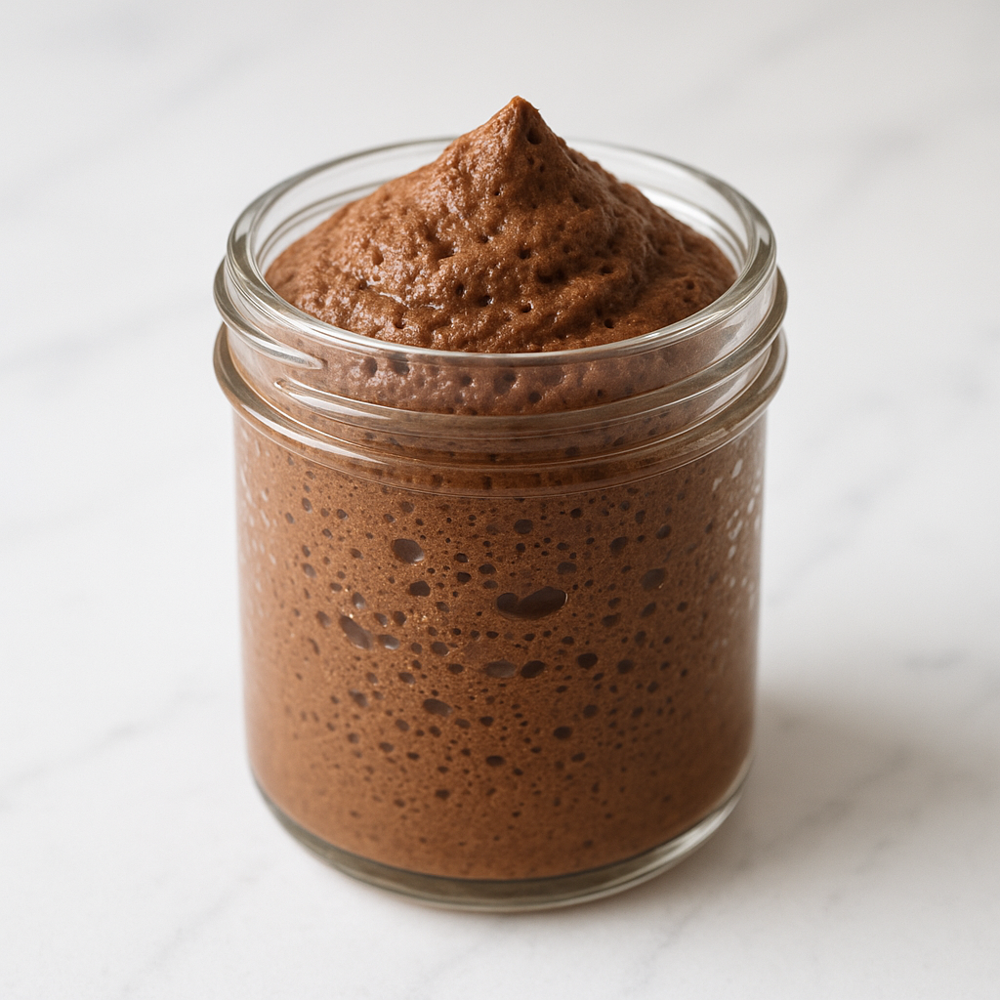
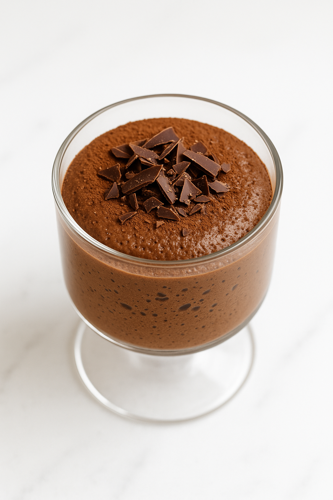

# Mousse au Chocolat Aérienne

---

## Page 1 : Présentation + Science

**MOUSSE AU CHOCOLAT AÉRIENNE**

🔬 **LA SCIENCE**
Le foisonnement des blancs d’œufs repose sur la dénaturation et l’organisation des protéines d’albumine. Sous l’action mécanique du fouet, les protéines se déplient et forment un réseau tridimensionnel capable de piéger l’air en micro-bulles. Ce réseau stabilise la mousse en retenant jusqu’à 7 fois le volume initial du blanc. Les lécithines du jaune agissent comme émulsifiants naturels, stabilisant le mélange entre la phase aqueuse (blancs) et la phase grasse (chocolat), créant une texture aérienne et onctueuse.

🌿 **ASSOCIATIONS CLÉS**
- Blancs d’œuf + Fouettage mécanique → Dénaturation albumine (réseau tridimensionnel air)
- Jaunes d’œuf + Sucre → Émulsion (technique du ruban, texture crémeuse)
- Chocolat noir + Lécithines jaune → Stabilisation émulsion (phase grasse/aqueuse)

⏱️ **INFOS PRATIQUES**
Préparation : 20 min | Repos : 2h | Difficulté : ●○○ | Pour 6 personnes

---

## Page 2 : Recette + Variantes

🧑‍🍳 **INGRÉDIENTS**
- 6 œufs extra-frais (blancs et jaunes séparés)
- 200 g de chocolat noir 70% cacao (pâtissier)
- 40 g de sucre en poudre
- 1 pincée de sel
- 1 sachet de sucre vanillé (optionnel)

🔥 **PRÉPARATION**
1. **Fondre le chocolat** : Casser le chocolat en morceaux et le faire fondre au bain-marie (40-50°C maximum). Ne jamais dépasser 55°C pour éviter la séparation du beurre de cacao. Laisser tiédir.
2. **Monter les blancs en neige** : Dans un saladier parfaitement propre et sec, ajouter une pincée de sel aux blancs d’œuf. Battre au fouet électrique vitesse moyenne jusqu’à formation de pics mous. Continuer à vitesse rapide jusqu’à obtention de blancs fermes et brillants (pics rigides). Placer au réfrigérateur.
3. **Technique du ruban** : Dans un autre saladier, fouetter vigoureusement les jaunes avec le sucre (et sucre vanillé si utilisé) jusqu’à obtention d’une texture pâle, crémeuse et volumineuse formant un ruban en retombant du fouet (environ 3-4 minutes).
4. **Incorporer le chocolat** : Verser le chocolat fondu tiède sur le mélange jaunes-sucre. Mélanger énergiquement au fouet jusqu’à homogénéité complète.
5. **Incorporation délicate des blancs** : Prélever 1/3 des blancs en neige et les incorporer au mélange chocolat-jaunes en fouettant pour alléger la préparation. Ajouter le reste des blancs en 2 fois en soulevant délicatement avec une maryse (mouvement du bas vers le haut) pour préserver les bulles d’air.
6. **Répartition et repos** : Répartir la mousse dans 6 verrines ou ramequins. Placer au réfrigérateur minimum 2 heures (idéalement 4 heures) pour stabilisation complète de la structure.
7. **Service** : Servir frais, éventuellement décoré de copeaux de chocolat, chantilly ou fruits rouges.

🔄 **VARIANTES**
- **Version protéinée** : Ajouter 30 g de protéine whey arôme chocolat au mélange jaunes-sucre pour augmenter la teneur en protéines tout en conservant la texture aérienne.
- **Boost intensité** : Ajouter 1 cuillère à café de café soluble au chocolat fondu pour rehausser les arômes cacaotés et créer une légère amertume.

💡 **ASTUCE SCIENCE**
La fraîcheur des œufs est critique : les protéines d’albumine fraîches ont une meilleure capacité de foisonnement et créent un réseau plus stable. Un saladier en inox refroidi au réfrigérateur facilite le montage des blancs car les protéines froides se stabilisent mieux. Éviter absolument toute trace de jaune dans les blancs : les lipides du jaune empêchent la formation du réseau protéique et les blancs ne monteront pas.

---