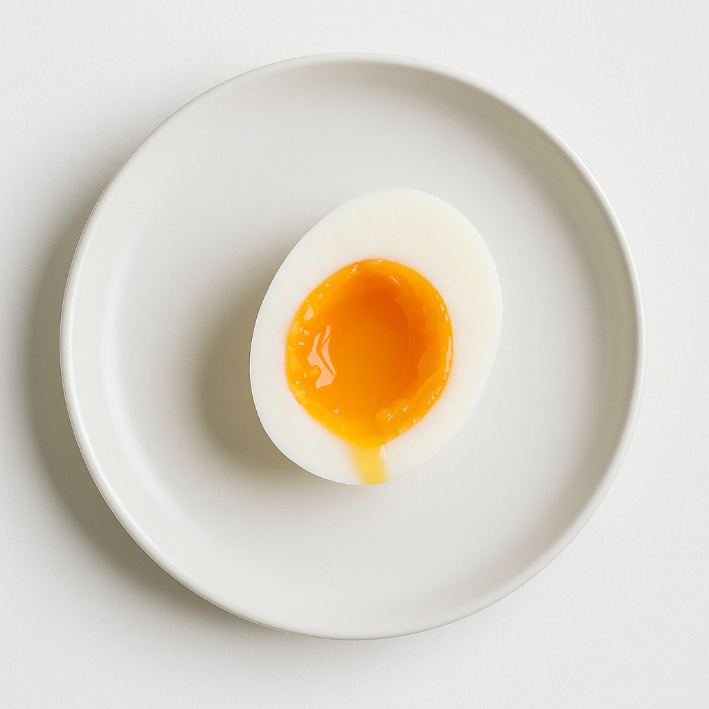
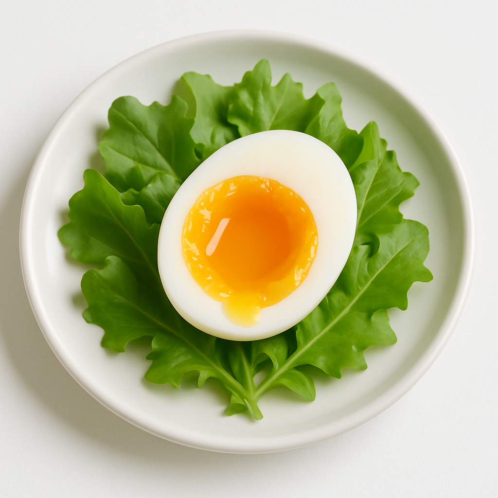

# Œuf Mollet Parfait (6 min 30)

---

## Page 1 : Présentation + Science

**ŒUF MOLLET PARFAIT (6 MIN 30)**

🔬 **LA SCIENCE**
La coagulation des protéines d’œuf est un processus thermique précis qui débute dès 62°C. Le blanc d’œuf (albumine) coagule entre 62-65°C, tandis que le jaune (vitelline) nécessite 65-70°C. Une cuisson de 6 minutes 30 secondes dans une eau bouillante (100°C) permet une coagulation complète du blanc tout en maintenant le jaune crémeux et coulant. Le choc thermique final dans l’eau glacée stoppe instantanément la cuisson résiduelle et facilite l’écalage.

🌿 **ASSOCIATIONS CLÉS**
- Blanc d’œuf + Chaleur 100°C → Dénaturation albumine (texture ferme)
- Jaune d’œuf + Cuisson partielle → Vitelline partiellement coagulée (texture crémeuse coulante)
- Vinaigre blanc + Eau de cuisson → Coagulation accélérée (prévention fissures)

⏱️ **INFOS PRATIQUES**
Préparation : 5 min | Cuisson : 6 min 30 | Difficulté : ●○○ | Pour 4 personnes

---

## Page 2 : Recette + Variantes

🧑‍🍳 **INGRÉDIENTS**
- 4 œufs extra-frais (calibre M, température ambiante)
- 2 litres d’eau
- 1 cuillère à soupe de vinaigre blanc
- 1 cuillère à café de sel
- Eau glacée (1 litre + glaçons)

🔥 **PRÉPARATION**
1. **Tempérer les œufs** : Sortir les œufs du réfrigérateur 30 minutes avant cuisson pour éviter le choc thermique brutal qui pourrait fissurer les coquilles.
2. **Préparer l’eau glacée** : Dans un saladier, verser 1 litre d’eau froide et ajouter une dizaine de glaçons. Réserver.
3. **Porter l’eau à ébullition** : Dans une grande casserole, porter 2 litres d’eau à ébullition franche (100°C). Ajouter le sel et le vinaigre blanc.
4. **Plonger les œufs** : À l’aide d’une écumoire, plonger délicatement les œufs un par un dans l’eau bouillante. Déclencher immédiatement le chronomètre.
5. **Cuire précisément 6 min 30** : Maintenir une ébullition douce et régulière. La précision est critique : 6 minutes = blanc ferme mais jaune trop coulant, 7 minutes = jaune trop cuit.
6. **Choc thermique** : Après exactement 6 min 30, retirer immédiatement les œufs avec l’écumoire et les plonger dans l’eau glacée pendant 2-3 minutes.
7. **Écaler et servir** : Écaler délicatement sous un filet d’eau froide. Servir tiède ou à température ambiante sur une salade, asperges, ou riz.

🔄 **VARIANTES**
- **Version basse température** : Cuisson sous-vide à 64°C pendant 45-50 minutes pour une texture ultra-précise et homogène (blanc et jaune à texture identique crémeuse).
- **Boost umami** : Mariner les œufs écalés 24h dans une sauce soja-mirin (ajitsuke tamago japonais) pour une saveur profonde et une texture ferme.

💡 **ASTUCE SCIENCE**
Le vinaigre blanc (pH 2.5) abaisse le pH de l’eau de cuisson, accélérant la coagulation des protéines du blanc en cas de fissure de coquille. Cela crée une barrière instantanée qui évite la fuite du blanc dans l’eau. Le choc thermique brutal (100°C → 0°C) contracte la membrane sous la coquille, facilitant un écalage parfait sans abîmer le blanc délicat.

---