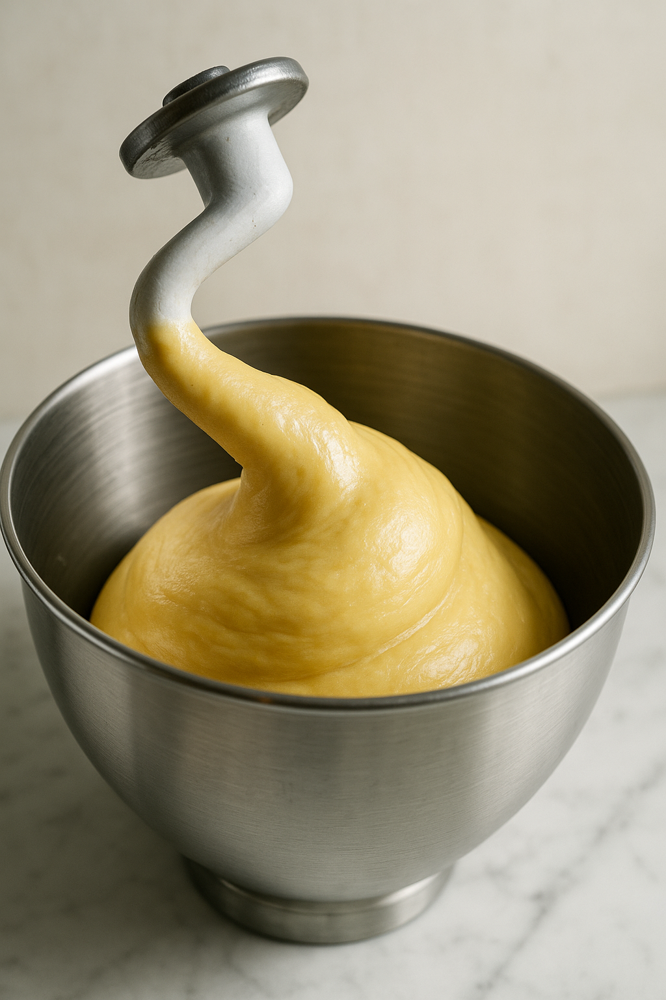
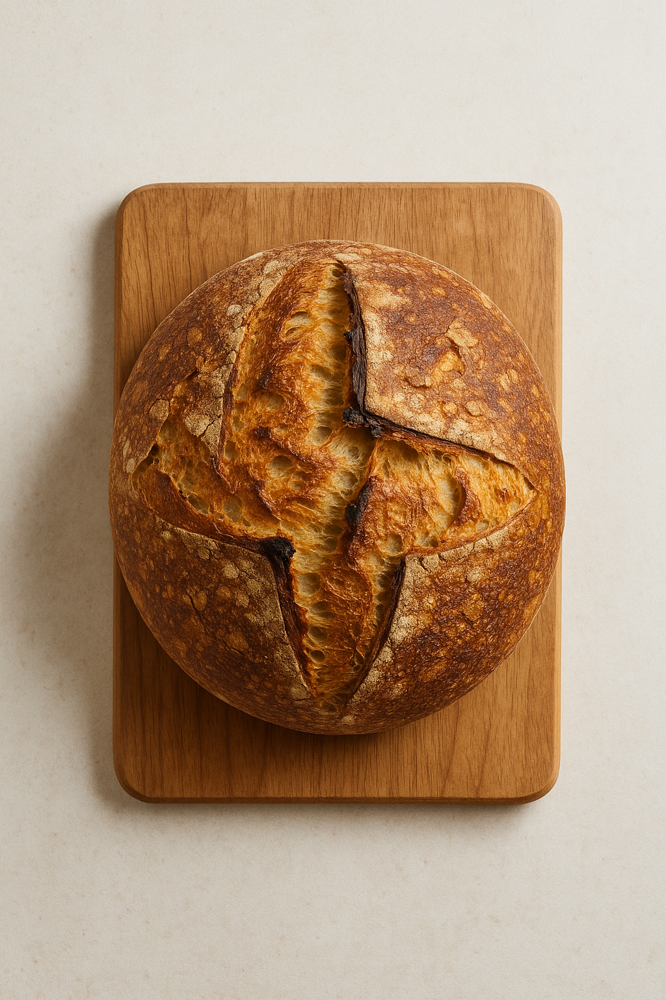

# Pain Croûte Maillard (Croute Croustillante Scientifique)

---

## Page 1 : Présentation + Science

**PAIN CROÛTE MAILLARD — CROÛTE CROUSTILLANTE SCIENTIFIQUE**

🔬 **LA SCIENCE**

La croûte croustillante et dorée du pain résulte de la combinaison de **trois phénomènes scientifiques simultanés** lors de la cuisson haute température (240-250°C) : la **réaction de Maillard** entre acides aminés et sucres réducteurs produisant pyrazines et furanones (arômes grillés, noix), la **caramelisation** des sucres libérés par l'hydrolyse de l'amidon, et la **déshydratation rapide** de la surface créant une structure rigide et croquante. L'injection de **vapeur** en début de cuisson retarde la formation de croûte, permettant une expansion maximale du pain (oven spring), puis la vapeur accélère la gélatinisation de l'amidon en surface favorisant la réaction de Maillard. La température critique pour la Maillard dans le pain est >140°C.

🌿 **ASSOCIATIONS CLÉS**
- Acides aminés + Sucres réducteurs + Chaleur (>140°C) → Mélanoïdines + Pyrazines + Furanones (croûte dorée, arômes grillés)
- Amidon de surface + Vapeur → Gélatinisation (accélération Maillard)
- Chaleur intense (240-250°C) + Déshydratation → Texture croustillante rigide
- Sucres libérés + Température >160°C → Caramelisation (arômes caramélisés)

⏱️ **INFOS PRATIQUES**
Préparation : 20 min | Fermentation : 14-18h | Cuisson : 40 min | Difficulté : ●●● | Pour 1 pain (750g)

---

## Page 2 : Recette + Variantes

🧑‍🍳 **INGRÉDIENTS**

- 500 g de farine T65 (ou mélange T65/T80 pour plus de caractère)
- 375 ml d'eau tiède (75% d'hydratation pour alvéolage ouvert)
- 10 g de sel fin
- 3 g de levure boulangère sèche instantanée (ou 9g fraîche)
- 5 g de malt diastasique (optionnel, améliore croûte et arômes)

**Pour la cuisson** :
- Eau pour injection de vapeur

🔥 **PRÉPARATION**

1. **Autolyse** : Mélanger 500g farine + 375ml eau dans un grand bol. Mélanger juste jusqu'à incorporation (pâte grossière). Couvrir, laisser reposer 1h à température ambiante. L'autolyse permet l'hydratation complète du gluten et facilite le pétrissage.

2. **Incorporation sel et levure** : Dissoudre 10g sel + 3g levure dans 20ml d'eau tiède. Verser sur la pâte autolysée. Pétrir 8-10 min à la main (replier, étirer, tourner) jusqu'à obtenir une pâte lisse et élastique. Test de la membrane : la pâte doit former une fine membrane translucide sans se déchirer.

3. **Première fermentation avec rabats** : Placer la pâte dans un bol huilé, couvrir. Laisser fermenter 3-4h à 24-26°C. Effectuer 4 séries de rabats toutes les 30-45 min pendant les 2 premières heures (replier la pâte sur elle-même en 4 directions). Les rabats renforcent le réseau de gluten sans pétrissage intensif. La pâte doit gonfler de 50-70%.

4. **Préfaçonnage** : Renverser délicatement la pâte sur plan fariné. Dégazer légèrement, former une boule tendue. Laisser reposer 20 min sous un linge (détente du gluten).

5. **Façonnage final** : Façonner en boule ou bâtard en tendant bien la surface pour créer une tension maximale (clé pour une belle ouverture de grigne). Placer dans un banneton fariné, soudure vers le haut.

6. **Seconde fermentation froide** : Couvrir le banneton d'un linge, placer au réfrigérateur (4°C) pendant 12-16h. La fermentation froide développe des arômes complexes et facilite la scarification.

7. **Préparation cuisson avec vapeur** : 45 min avant cuisson, préchauffer le four à 250°C chaleur statique avec une cocotte en fonte vide dedans (ou pierre à pain + plaque métallique en bas du four). Préparer 50ml d'eau bouillante dans une tasse.

8. **Scarification et cuisson** : Sortir le pain du réfrigérateur. Renverser délicatement dans la cocotte brûlante. Scarifier rapidement la surface avec une lame de rasoir ou lame à grigne (1 entaille profonde de 1cm ou motif complexe). **CRUCIAL** : Verser immédiatement les 50ml d'eau bouillante sur les parois de la cocotte (création instantanée de vapeur), couvrir aussitôt. Cuire 25 min couvert (vapeur + oven spring), puis retirer le couvercle et cuire 15-20 min à 240°C jusqu'à obtenir une croûte très dorée, presque brun-orangé. Le pain doit sonner creux quand on tapote le dessous. Laisser refroidir complètement (1-2h) pour que la croûte se rigidifie et devienne ultra-croustillante.

🔄 **VARIANTES**

- **Pain noir croûte intense** : Ajouter 10g de malt diastasique + 5g de miel (augmente sucres réducteurs, renforce Maillard). Cuire 5 min supplémentaires pour croûte presque brûlée.
- **Pain de campagne croûte épaisse** : Remplacer 150g T65 par 150g farine de seigle. La farine de seigle contient plus de pentosanes qui retiennent l'eau, créant une croûte plus épaisse.
- **Pain aux graines croustillant** : Après scarification, badigeonner légèrement la surface avec eau, saupoudrer graines de sésame, pavot ou lin. Les graines caramelisent en surface.

💡 **ASTUCE SCIENCE**

**Optimisation de la réaction de Maillard** : Trois facteurs critiques maximisent la Maillard et la croute : **1) Hydratation élevée (75%)** crée une mie humide et une surface riche en amidon gélatinisé qui brunit mieux. **2) Vapeur initiale** retarde la formation de croûte, permettant expansion maximale, puis accélère la gélatinisation de surface (amidon + eau + chaleur → gel translucide favorisant Maillard). **3) Température élevée (240-250°C)** : la Maillard s'active vraiment >140°C en surface, avec optimum 160-180°C. Le pH légèrement acide de la pâte (fermentation) favorise aussi la réaction. Le malt diastasique contient des enzymes (amylases) qui hydrolysent l'amidon en sucres simples pendant la cuisson, augmentant les substrats pour Maillard et caramelisation. Température interne optimale à cœur : 96-98°C (cuisson complète, mie structurée).

---