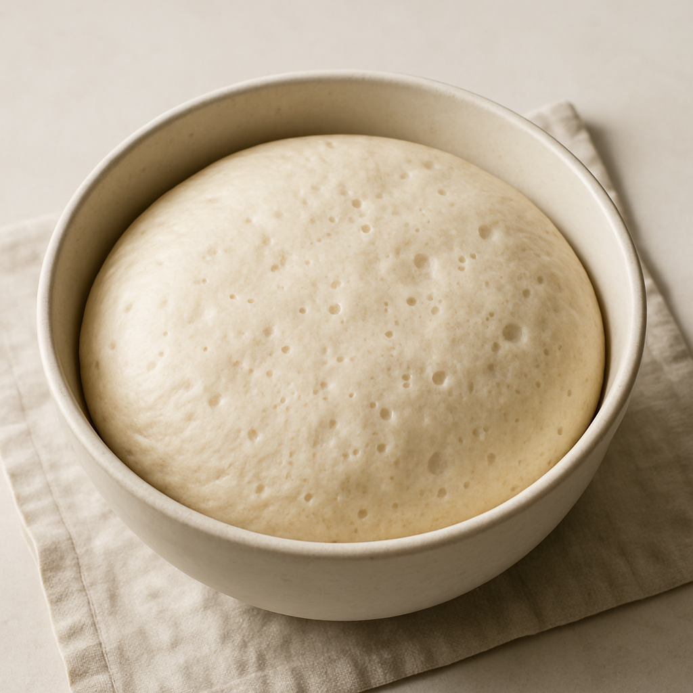
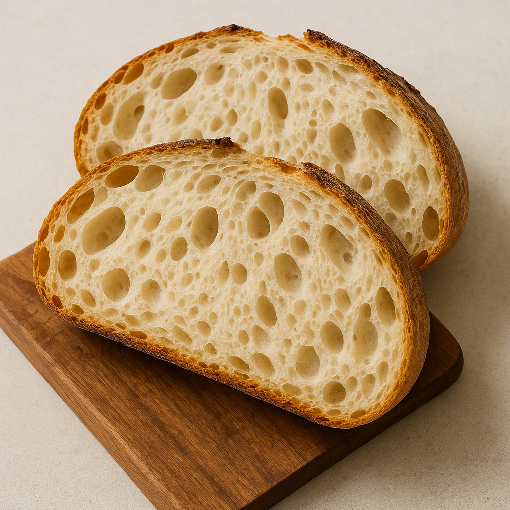

# Pain au Levain (Fermentation Naturelle)

---

## Page 1 : Présentation + Science

**PAIN AU LEVAIN — FERMENTATION NATURELLE**

🔬 **LA SCIENCE**

La fermentation du levain combine l'action symbiotique de **levures sauvages** (Saccharomyces) et de **bactéries lactiques** (Lactobacillus plantarum, L. paracasei). Les levures convertissent les sucres en CO₂ et éthanol, créant l'alvéolage et les arômes. Les bactéries lactiques produisent l'acide lactique et acétique qui donnent l'acidité caractéristique (pH 3.8-4.5), améliorent la conservation et développent les arômes complexes. La fermentation longue (12-24h) permet aussi la dégradation partielle des phytates, améliorant la biodisponibilité des minéraux.

🌿 **ASSOCIATIONS CLÉS**
- Farine + Eau + Levain → CO₂ + Acide lactique + Acide acétique (acidité, arômes, conservation)
- Gluten + Pétrissage + Fermentation → Réseau élastique (structure alvéolée)
- Croûte chaude + Réaction de Maillard → Composés aromatiques (arômes caramélisés, noix)

⏱️ **INFOS PRATIQUES**
Préparation : 30 min | Fermentation : 18-24h | Cuisson : 45 min | Difficulté : ●●○ | Pour 1 pain (800g)

---

## Page 2 : Recette + Variantes

🧑‍🍳 **INGRÉDIENTS**

**Pour le pain** :
- 500 g de farine T65 (ou T80 pour plus de caractère)
- 350 ml d'eau tiède (70% d'hydratation)
- 150 g de levain actif (nourri 4-6h avant)
- 10 g de sel fin

**Pour le levain actif** (si vous n'en avez pas) :
- 50 g de levain chef
- 50 g de farine T65
- 50 ml d'eau

🔥 **PRÉPARATION**

1. **Activation du levain** : 4-6h avant, nourrir votre levain chef avec 50g farine + 50ml eau. Il doit doubler de volume et être bien actif (bulles, odeur acidulée).

2. **Autolyse** : Mélanger 500g farine + 350ml eau dans un grand bol. Laisser reposer 30 min à température ambiante (cette phase permet l'hydratation optimale du gluten sans pétrissage).

3. **Incorporation levain** : Ajouter 150g levain actif à la pâte autolysée. Pétrir 5 min à la main jusqu'à incorporation complète. La pâte doit être collante mais cohérente.

4. **Ajout du sel** : Dissoudre 10g sel dans 10ml d'eau tiède, incorporer à la pâte. Pétrir 5-8 min jusqu'à ce que la pâte devienne lisse et élastique (test de la membrane : étirer un petit morceau, il doit former une fine membrane translucide).

5. **Première fermentation (pointage)** : Placer la pâte dans un bol huilé, couvrir d'un linge humide. Laisser fermenter 4-6h à 24-26°C. Effectuer 3 séries de rabats (replier la pâte sur elle-même) toutes les 45 min pendant les 2 premières heures. La pâte doit gonfler de 50-80%.

6. **Façonnage** : Sur plan fariné, dégazer légèrement la pâte. Façonner en boule ou bâtard en tendant bien la surface. Placer dans un banneton fariné (ou bol tapissé d'un linge fariné), soudure vers le haut.

7. **Seconde fermentation (apprêt)** : Couvrir et laisser lever 12-16h au réfrigérateur (4°C) OU 2-3h à température ambiante. La fermentation froide développe plus d'arômes complexes.

8. **Cuisson** : Préchauffer le four à 250°C avec une cocotte en fonte dedans pendant 30 min. Renverser délicatement le pain dans la cocotte brûlante, scarifier la surface (entailles au cutter), couvrir. Cuire 30 min couvert (vapeur interne), puis 15 min découvert à 220°C (croûte dorée). Laisser refroidir 1h minimum avant de trancher.

🔄 **VARIANTES**

- **Pain complet** : Remplacer 200g de T65 par de la farine complète T110 ou T150. Ajouter 20-30ml d'eau supplémentaire (les farines complètes absorbent plus).
- **Pain aux graines** : Incorporer 80g de graines (tournesol, lin, sésame) toastées à l'étape 4. Les graines apportent texture et nutriments.
- **Pain de seigle** : Utiliser 200g farine de seigle + 300g T65. Réduire l'hydratation à 320ml (le seigle a moins de gluten, la pâte sera plus dense).

💡 **ASTUCE SCIENCE**

**Contrôle de la fermentation** : La température est cruciale. À 24-26°C, les lactobacilles et levures travaillent en synergie optimale. En dessous de 20°C, la fermentation est trop lente (risque de sous-fermentation). Au-dessus de 28°C, l'acidité devient excessive et le réseau de gluten s'affaiblit. La fermentation froide finale (12-16h à 4°C) ralentit les levures mais maintient l'activité des bactéries lactiques, créant un profil aromatique plus complexe et une meilleure digestibilité. Le test de flottaison permet de vérifier la maturité du levain : prélevez une cuillère de levain actif, déposez-la dans un verre d'eau ; s'il flotte, il est prêt (saturation en CO₂).

---