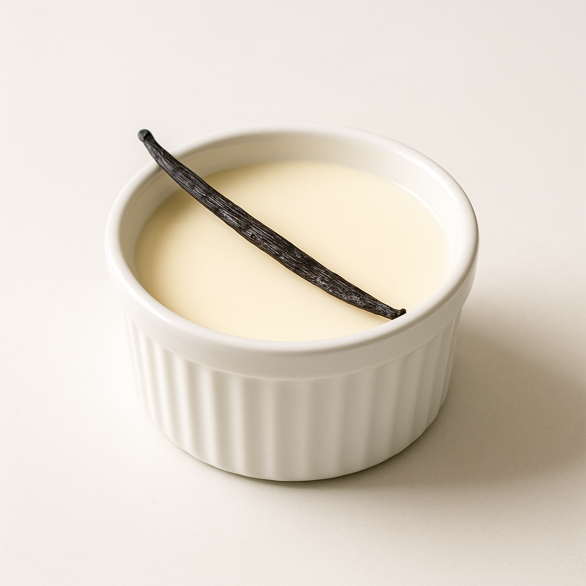
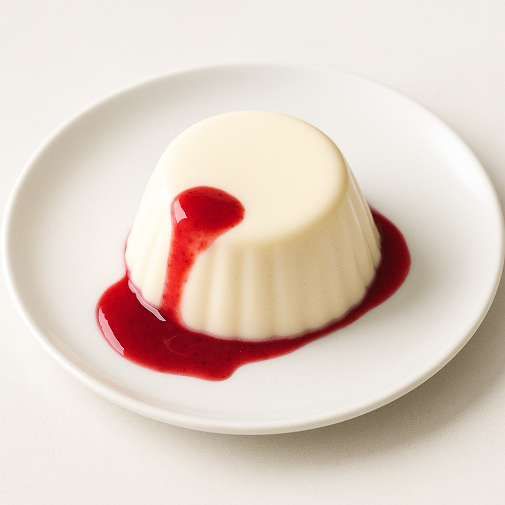

# Panna Cotta Gélification

---

## Page 1 : Présentation + Science

**PANNA COTTA GÉLIFICATION**

🔬 **LA SCIENCE**
La gélification de la panna cotta repose sur les propriétés uniques de la gélatine, un hydrocolloïde extrait du collamène animal. Les molécules de gélatine (chaînes protéiques) se déroulent entre 40-60°C, puis forment un réseau tridimensionnel en refroidissant, piégeant l’eau et les graisses de la crème. Le dosage est critique : 1 g de gélatine (200 blooms) pour 100 ml de liquide crée un gel ferme mais fondant. Un refroidissement progressif évite la formation de grumeaux et garantit une texture soyeuse.

🌿 **ASSOCIATIONS CLÉS**
- Gélatine + Hydratation eau froide → Gonflement chaînes protéiques (masse gélatine)
- Gélatine + Chaleur 40-60°C → Déroulement molécules (dissolution)
- Crème-lait + Gélatine + Refroidissement → Réseau tridimensionnel (gel stable)

⏱️ **INFOS PRATIQUES**
Préparation : 15 min | Cuisson : 10 min | Repos : 4h | Difficulté : ●○○ | Pour 6 personnes

---

## Page 2 : Recette + Variantes

🧑‍🍳 **INGRÉDIENTS**
- 400 ml de crème liquide entière 35% MG
- 200 ml de lait entier
- 60 g de sucre en poudre
- 1 gousse de vanille (ou 1 cuillère à café d’extrait de vanille)
- 6 g de gélatine en feuilles (200 blooms) ou 6 g de gélatine en poudre

🔥 **PRÉPARATION**
1. **Hydrater la gélatine** : Si feuilles, les plonger dans un grand volume d’eau froide pendant 10 minutes minimum. Si poudre, la saupoudrer dans 40 ml d’eau froide (6-7 fois son poids) et laisser gonfler 10 minutes.
2. **Infuser la vanille** : Fendre la gousse de vanille en deux et gratter les graines. Dans une casserole, verser la crème, le lait, le sucre, la gousse et les graines de vanille. Porter à frémissement doux (environ 80°C) en remuant régulièrement. Ne pas faire bouillir.
3. **Retirer du feu** : Dès le frémissement, retirer la casserole du feu et laisser infuser 5 minutes. Retirer la gousse de vanille.
4. **Dissoudre la gélatine** : Essorer la gélatine en feuilles (ou récupérer la masse gélatine si poudre). Ajouter la gélatine à la préparation chaude (entre 40-60°C) et fouetter vigoureusement jusqu’à dissolution complète. Ne jamais faire bouillir la gélatine (perte de pouvoir gélifiant).
5. **Refroidissement progressif** : Laisser la préparation refroidir à température ambiante pendant 30-45 minutes en remuant de temps en temps pour éviter la formation d’une peau en surface.
6. **Mouler** : Verser délicatement la préparation tiède dans 6 ramequins ou verrines. Placer au réfrigérateur minimum 4 heures (idéalement 12 heures pour prise maximale).
7. **Démoulage et service** : Pour démouler, plonger rapidement le fond du ramequin dans de l’eau chaude (5 secondes), passer un couteau fin sur les bords, retourner sur une assiette. Servir avec coulis de fruits rouges ou caramel.

🔄 **VARIANTES**
- **Version café** : Remplacer la vanille par 2 cuillères à soupe de café soluble dissous dans la crème chaude pour une panna cotta au café intense.
- **Version fruits** : Ajouter 100 g de purée de fruits (fraise, framboise, mangue) à la préparation refroidie avant moulage. Ajuster la gélatine à 7-8 g pour compenser l’humidité supplémentaire.

💡 **ASTUCE SCIENCE**
La force de la gélatine (blooms) détermine sa capacité gélifiante. Gélatine 200 blooms est standard (qualité or). Si vous utilisez une gélatine 150 blooms, augmentez le dosage à 8 g. Conversion : Quantité nécessaire = (Blooms recette / Blooms disponible) × Quantité recette. Toujours ajouter la préparation froide à la gélatine chaude (jamais l’inverse) en petites quantités pour éviter les grumeaux et la synthèse.

---