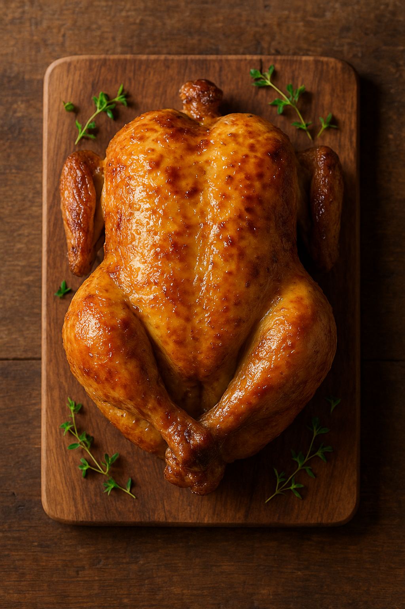
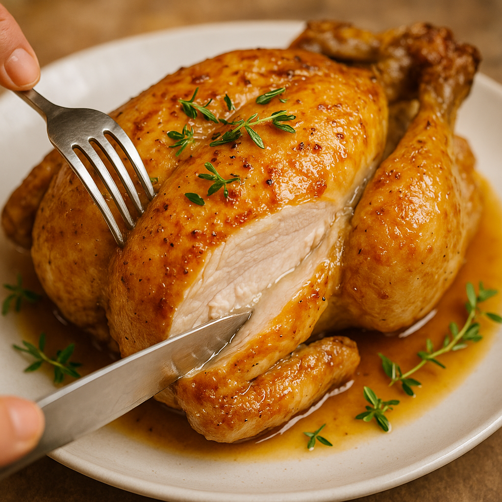

# Poulet Rôti Juteux (65°C)

---

## Page 1 : Présentation + Science

**POULET RÔTI JUTEUX (65°C)**

🔬 **LA SCIENCE**
La cuisson du poulet à basse température (62–66°C à cœur) permet d’obtenir une viande extraordinairement juteuse et tendre : les protéines principales (myosine, actine) se dénaturent entre 55°C et 68°C, entraînant la coagulation des fibres tout en limitant l’expulsion des sucs. Au-dessus de 70°C, la viande perd rapidement son jus. Cuire à 65°C, puis dorer à haute température, offre la double promesse de sécurité alimentaire et de moelleux absolu, avec une peau croustillante (réaction de Maillard en finition).

🌿 **ASSOCIATIONS CLÉS**
- Poulet + Citron → Composés aldéhydes (fraîcheur zestée)
- Poulet + Beurre → Lactones et aldéhydes (notes grillées, crémeuses)
- Poulet + Ail + Herbes (thym, romarin) → Terpéniques, arômes volatils

⏱️ **INFOS PRATIQUES**
Préparation : 25 min | Cuisson : 2h10 | Difficulté : ●●○ | Pour 4 personnes

---

## Page 2 : Recette + Variantes

🧑‍🍳 **INGRÉDIENTS**
- 1 poulet fermier (1,5–1,8 kg)
- 40 g beurre demi-sel
- 1 citron non traité
- 4 gousses d’ail
- 2 branches de thym
- 2 branches de romarin
- 10 g sel fin
- 2 g poivre noir

🔥 **PRÉPARATION**
1. **Préchauffage** : Préchauffer le four à 80°C (chaleur tournante). Sortez le poulet du réfrigérateur 30 min avant.
2. **Préparation volaille** : Séchez complètement la peau. Frottez le poulet avec le sel, le poivre, le zeste râpé du citron. Farcissez la cavité avec le citron coupé en deux, l’ail en chemise, le thym et le romarin.
3. **Cuisson basse température** : Déposez le poulet sur une grille placée sur une lèchefrite. Enfournez 2h à 80°C. Surveillez la température à cœur : elle doit atteindre très progressivement 65°C (placer sonde dans la partie la plus épaisse de la cuisse, sans toucher l’os).
4. **Repos** : Sortez le poulet quand la température atteint 65°C, recouvrez d’aluminium et laissez reposer 10 min (redistribution des sucs).
5. **Finition Maillard** : Préchauffez le four à 250°C ou utilisez un chalumeau de cuisine. Badigeonnez le poulet de beurre fondu. Remettez au four 8–10 minutes ou dorez au chalumeau jusqu’à peau parfaitement dorée et croustillante.
6. **Découpe & service** : Découpez, arrosez du jus de cuisson filtré, servez bien chaud avec accompagnements au choix.

🔄 **VARIANTES**
- **Herbes alternatives** : Sauge, estragon (proposent profils aromatiques plus anisés).
- **Farce aromatique** : Remplacez citron par orange ou mélange d’herbes fraîches (persil, coriandre, basilic).
- **Épices exotiques** : Mélange raz-el-hanout dans le beurre – notes orientales.

💡 **ASTUCE SCIENCE**
Toujours insérer la sonde dans la partie la plus épaisse (cuisse) sans toucher l'os pour une lecture précise : l’os conduit différemment la chaleur et fausse la valeur obtenue.

---

### Notes de Remplissage

- 🔬 Sécurité alimentaire vérifiée à 65°C pendant 10 min (études BCCDC 2024, IAM 2023).
- ⚠️ Pour dorer : débuter sur une viande bien sèche sinon la peau grille mal.
- Réaction de Maillard obtenue grâce à finition haute température.

