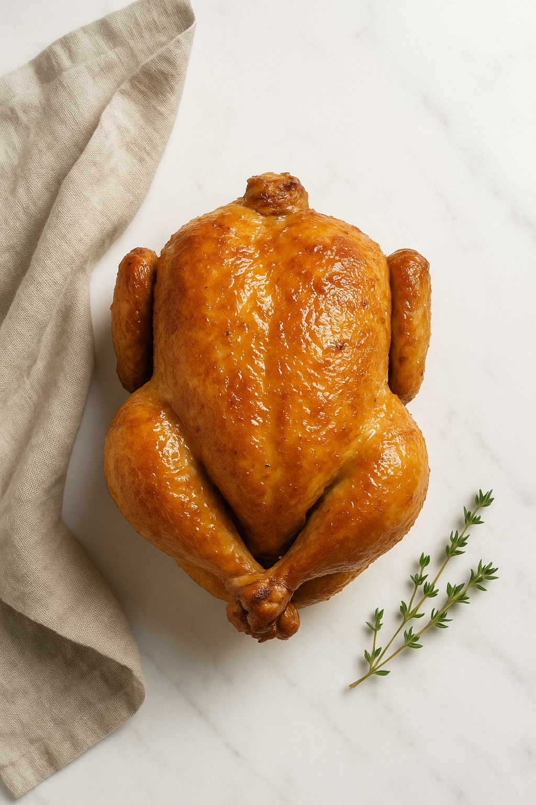
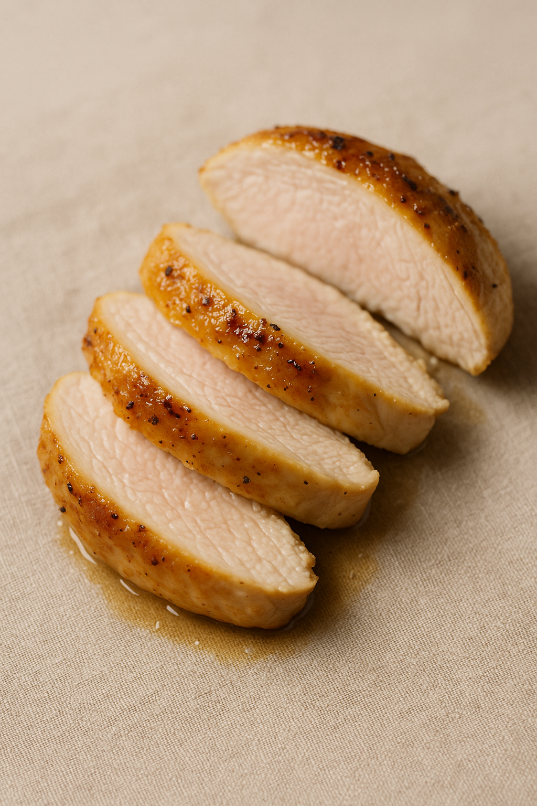

# Poulet Rôti Juteux (Cuisson Basse Température)

---

## Page 1 : Présentation + Science

**POULET RÔTI JUTEUX (CUISSON BASSE TEMPÉRATURE)**

🔬 **LA SCIENCE**
La cuisson basse température du poulet entre 65 et 75°C préserve la jutosité et la tendreté de la viande en minimisant la perte d'eau. À ces températures, les protéines musculaires (myosine et actine) se dénaturent progressivement sans se contracter brutalement, conservant ainsi jusqu'à 30% de jus en plus qu'une cuisson traditionnelle à haute température. La myosine se dénature dès 40-60°C (pic à 55°C) tandis que l'actine nécessite 66-80°C, permettant une cuisson précise selon la texture désirée. Cette méthode garantit une sécurité alimentaire optimale tout en offrant une chair rosée et fondante, particulièrement dans les blancs souvent secs en cuisson classique.

🌿 **ASSOCIATIONS CLÉS**
- Poulet + Thym → Composés terpéniques (thymol, carvacrol - notes herbacées)
- Poulet + Citron → Acide citrique + limonène (fraîcheur, équilibre gras)
- Poulet + Ail → Composés soufrés allicine (profondeur aromatique)

⏱️ **INFOS PRATIQUES**
Préparation : 15 min | Cuisson : 3h15 | Difficulté : ●○○ | Pour 4 personnes

---

## Page 2 : Recette + Variantes

🧑‍🍳 **INGRÉDIENTS**
- 1 poulet fermier entier (1,2-1,4 kg, très frais)
- 30 ml huile d'olive extra-vierge
- 8 g sel fin (assaisonnement optimal)
- 3 g poivre noir fraîchement moulu
- 4 branches de thym frais
- 1 citron bio (zestes + jus)
- 4 gousses d'ail en chemise
- 30 g beurre demi-sel (finition dorée)

🔥 **PRÉPARATION**
1. **Préparation poulet** : Sortir le poulet du réfrigérateur 1h avant cuisson (tempérage). Rincer l'intérieur et l'extérieur sous eau froide, sécher méticuleusement avec papier absorbant (élimination totale humidité superficielle).
2. **Assaisonnement** : Mélanger huile d'olive, sel, poivre, zestes de citron. Badigeonner généreusement le poulet intérieur et extérieur. Glisser thym, ail et demi-citron dans la cavité abdominale. Ficeler les cuisses ensemble pour maintenir forme compacte.
3. **Saisie initiale (optionnelle)** : Dans une cocotte en fonte, saisir le poulet 2-3 min par face à feu vif pour amorcer une légère coloration Maillard. Cette étape active les arômes mais n'est pas obligatoire en cuisson basse température pure.
4. **Cuisson basse température** : Préchauffer four à 210°C. Placer poulet dans un plat allant au four avec thermomètre à sonde inséré dans la partie la plus épaisse du blanc (sans toucher l'os). Enfourner, puis **réduire immédiatement à 90°C**. Cuire 3h15 jusqu'à température à cœur de **72°C** (cuisson sécuritaire optimale).
5. **Finition dorée** : À 10 min de la fin, badigeonner le poulet de beurre fondu et passer sous grill du four à 220°C pendant 5-7 min pour obtenir une peau croustillante et dorée (réaction de Maillard superficielle).
6. **Repos** : Sortir le poulet, couvrir lâchement de papier aluminium, laisser reposer 10 min. Cette étape permet la redistribution des jus dans les fibres musculaires détendues.
7. **Service** : Découper le poulet, arroser du jus de cuisson récupéré dans le plat. La chair doit être rosée mais parfaitement cuite (72°C garantit sécurité sanitaire).

---

## 🌡️ **TEMPÉRATURES DE CUISSON ET TEXTURES**

La maîtrise de la température interne est cruciale pour la sécurité et la texture du poulet.

| Température Cœur | Texture | Sécurité | Notes Scientifiques |
|------------------|---------|----------|---------------------|
| **63-65°C** | Très juteux, rosé | ⚠️ Pasteurisation lente (20-40 min) | Dénaturation myosine complète, actine intacte. Chair rosée normale. |
| **70-72°C** ⭐ | Juteux, légèrement rosé | ✅ Sécuritaire immédiat | Dénaturation actine partielle. Équilibre optimal jutosité/sécurité. |
| **75-80°C** | Tendre, blanc | ✅ Sur-pasteurisé | Dénaturation complète actine. Perte jus modérée (10-15%). |
| **> 85°C** | Sec, fibreux | ✅ Surité totale | ⚠️ Surcoction. Perte jus >30%, texture cartonneuse. |

⭐ **Température recommandée** : **72°C** offre le meilleur compromis entre sécurité microbiologique et préservation de la jutosité.

**Note sécurité** : La viande de poulet peut rester rosée même cuite à 72°C en raison de la myoglobine non totalement dénaturée. La température interne, non la couleur, garantit la sécurité.

---

🔄 **VARIANTES**

**Version Herbes Méditerranéennes**
- **Romarin** : 4 branches (remplace le thym) pour notes résineuses
- **Origan** : 2 cuillères à café séchées
- **Paprika fumé** : 5 g (notes fumées sans cuisson haute température)
- **Justification** : Composés terpéniques du romarin (cinéole, camphre) et origan (carvacrol) résistent bien à la cuisson longue et enrichissent les arômes sans brûler.

**Boost Umami (Sauce Soja/Miso)**
- **Sauce soja** : 20 ml (badigeonner avant cuisson)
- **Pâte miso blanc** : 15 g mélangée à l'huile d'olive
- **Gingembre frais** : 10 g râpé
- **Justification scientifique** : Sauce soja (200-400 mg glutamate/100g) et miso (400-700 mg/100g) amplifient l'umami naturel du poulet par synergie avec l'inosinate monophosphate (IMP) présent dans la volaille.

**Poulet Épicé (Cinq-Épices)**
- **Mélange cinq-épices** : 8 g (anis étoilé, cannelle, clou de girofle, fenouil, poivre Sichuan)
- **Miel** : 20 ml (pour finition laquée en grill)
- **Piment d'Espelette** : 3 g
- **Timing** : Saupoudrer épices avant cuisson, badigeonner miel à mi-cuisson pour caramélisation contrôlée en finition.

---

💡 **ASTUCE SCIENCE**
Le secret d'une cuisson basse température réussie : **investir dans un thermomètre à sonde fiable**. La différence entre 70°C et 75°C peut sembler minime, mais représente une perte de 10-15% de jutosité. Insérez la sonde au centre de la partie la plus épaisse du blanc, parallèlement à l'os de la poitrine, sans toucher l'os qui fausserait la lecture. Un poulet de poids différent nécessite un ajustement : **+10 min par 100g supplémentaires, -10 min par 100g en moins**.

---

## 📚 Schémas Scientifiques

Pour mieux comprendre la dénaturation des protéines :

