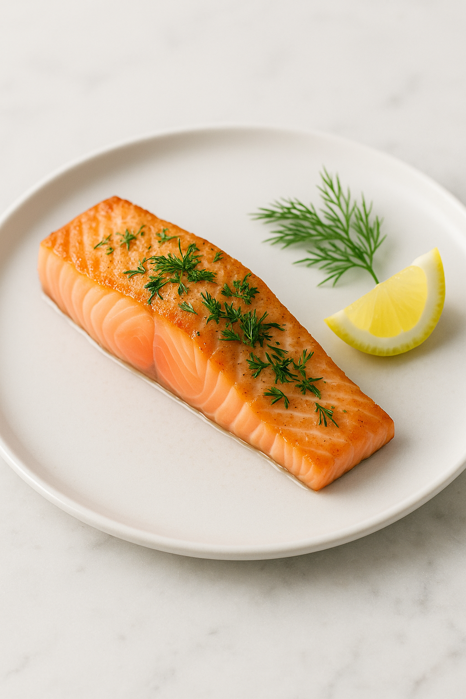

# Saumon Mi-Cuit (55°C)

---

## Page 1 : Présentation + Science

**SAUMON MI-CUIT (55°C)**

🔬 **LA SCIENCE**

La cuisson basse température du saumon à 55°C préserve une texture fondante exceptionnelle grâce à une dénaturation protéique contrôlée. À cette température précise, les protéines myofibrillaires coagulent progressivement sans se contracter brutalement, évitant l'expulsion des jus et maintenant une chair tendre. Le collagène reste intact (il ne se transforme en gélatine qu'à partir de 52-60°C sur de longues durées), préservant la structure naturelle du poisson. Cette technique scientifique garantit une cuisson homogène de cœur à croûte, sans risque de surcuisson.

🌿 **ASSOCIATIONS CLÉS**

- Saumon + Beurre → Acides gras oméga-3 + lipides laitiers (onctuosité renforcée)
- Citron + Chair cuite → Acide citrique + protéines dénaturées (contraste acidulé, exhausteur)
- Aneth + Saumon → Carvone + composés iodés (synergie aromatique nordique)

⏱️ **INFOS PRATIQUES**

Préparation : 10 min | Cuisson : 25 min | Difficulté : ●●○ | Pour 2 personnes

---

## Page 2 : Recette + Variantes

🧑‍🍳 **INGRÉDIENTS**

- 2 pavés de saumon (150g chacun, sans peau, épais)
- 1 cuillère à soupe d'huile d'olive
- 10g de beurre demi-sel
- 1 citron (jus + zeste)
- 4 brins d'aneth frais
- Sel fin et poivre blanc du moulin
- Thermomètre de cuisson (indispensable)

🔥 **PRÉPARATION**

1. **Tempérer le poisson** : Sortir les pavés de saumon du réfrigérateur 20 minutes avant cuisson pour atteindre température ambiante (~18-20°C). Sécher soigneusement avec papier absorbant.

2. **Assaisonner** : Saler légèrement les deux faces (2g de sel par pavé) et poivrer modérément. Laisser reposer 5 minutes pour que le sel pénètre en surface.

3. **Chauffer à température contrôlée** : Dans une poêle antiadhésive, chauffer l'huile d'olive à feu très doux. Utiliser un thermomètre infrarouge ou à sonde pour maintenir la température du fond de poêle entre 50-55°C (jamais au-delà de 60°C).

4. **Cuisson côté chair** : Déposer délicatement les pavés côté chair vers le bas. Cuire 12 minutes sans bouger, en surveillant constamment la température. La chair doit devenir opaque sur 2-3mm de profondeur.

5. **Retourner et terminer** : Retourner délicatement avec spatule large. Ajouter le beurre dans la poêle. Cuire 8 minutes supplémentaires en arrosant régulièrement avec le beurre fondu (technique du "basting").

6. **Vérifier la cuisson** : Insérer la sonde thermomètre au cœur du pavé : la température interne doit atteindre 52-55°C. La chair doit être translucide au centre, ferme mais fondante.

7. **Repos et finition** : Retirer de la poêle, déposer sur assiettes tièdes. Arroser du jus de cuisson, ajouter jus de citron frais, zeste râpé et aneth ciselé. Servir immédiatement.

🔄 **VARIANTES**

- **Version Asiatique** : Remplacer aneth par coriandre fraîche + gingembre râpé. Ajouter 1 cuillère à café de sauce soja en fin de cuisson pour une touche umami.
- **Boost Texture** : Saisir rapidement chaque face 30 secondes à feu vif avant la cuisson basse température pour créer une fine croûte Maillard contrastante (température interne maintenue à 55°C).

💡 **ASTUCE SCIENCE**

La température de 55°C est critique car elle se situe dans la zone de dénaturation optimale des protéines du saumon sans atteindre le seuil de contraction excessive (>60°C). À 55°C, l'actomyosine (complexe protéique principal) se stabilise sans expulser brutalement l'eau interstitielle, d'où une chair juteuse. Un degré de plus ou de moins change radicalement la texture : 50°C = trop cru, 60°C = sec. La précision thermométrique est donc non négociable pour réussir cette recette scientifique.

---

## Notes de Préparation

**Sécurité alimentaire** : Le saumon cuit à 55°C pendant 20+ minutes atteint un niveau de pasteurisation suffisant pour éliminer les pathogènes courants (selon études NIH 2025 sur cuisson sous-vide). Pour une sécurité maximale avec poisson de qualité standard, privilégier 60°C pendant 15 minutes ou acheter du saumon de qualité sushi.

**Choix du poisson** : Privilégier saumon norvégien ou écossais d'élevage contrôlé, ou saumon sauvage d'Alaska. Vérifier la fraîcheur : chair ferme, brillante, odeur marine légère.

**Matériel critique** : Thermomètre de cuisson précis (±0.5°C) indispensable. Sans contrôle thermique, cette recette devient aléatoire.