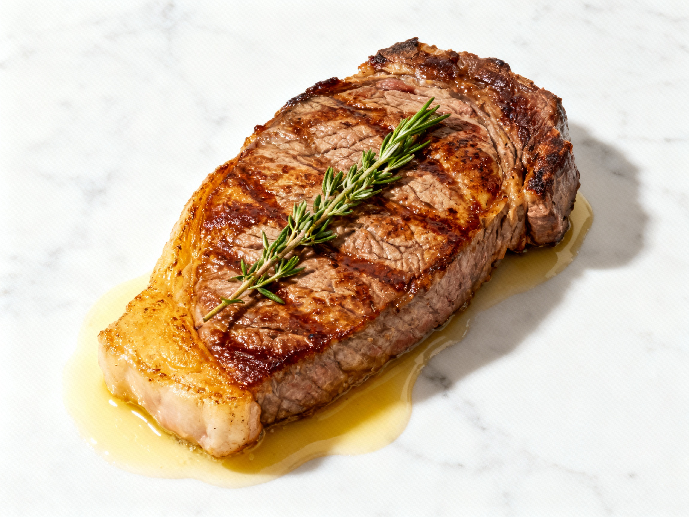
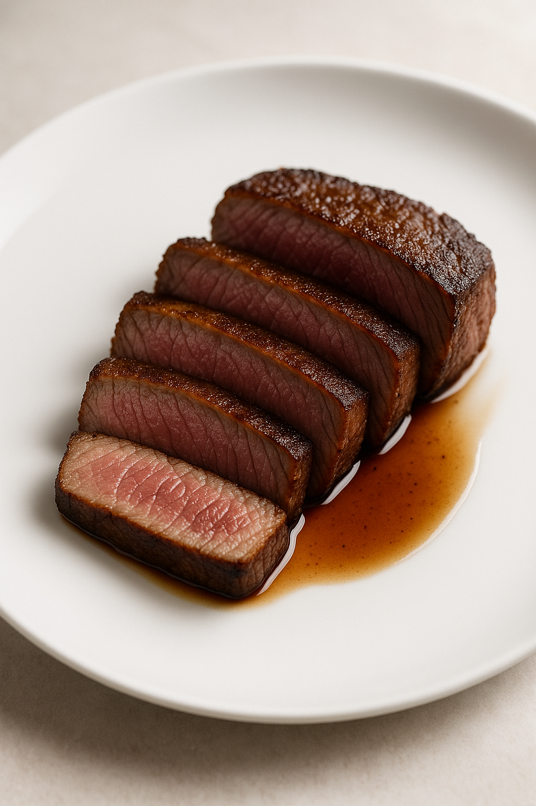
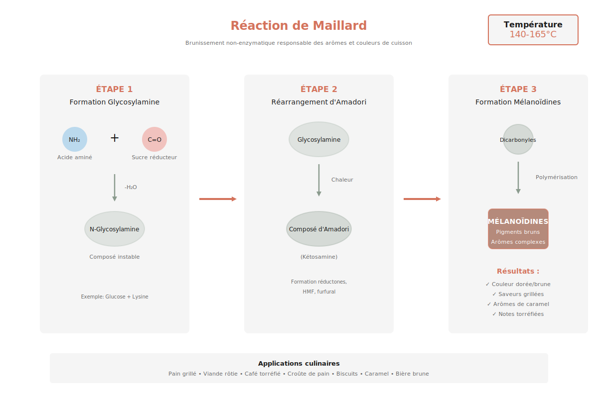

# Steak Parfait (Réaction de Maillard)

---

## Page 1 : Présentation + Science

**STEAK PARFAIT (RÉACTION DE MAILLARD)**

🔬 **LA SCIENCE**
La réaction de Maillard sublime le steak : entre 140 et 180 °C, les sucres réducteurs et les acides aminés de la viande interagissent pour créer des centaines de nouvelles molécules aromatiques. Cette transformation chimique complexe génère non seulement une croûte dorée et croustillante, mais aussi des saveurs profondes et complexes impossibles à obtenir à basse température. L'intensité de la réaction dépend de la température de surface, de la teneur en humidité et du temps d'exposition à la chaleur.

🌿 **ASSOCIATIONS CLÉS**
- Bœuf + Beurre → Composés lactones (notes beurrées et toastées)
- Bœuf + Champignons → Synergie glutamate (amplification umami naturelle)
- Bœuf + Thym → Composés terpéniques (complexité aromatique herbacée)

⏱️ **INFOS PRATIQUES**
Préparation : 10 min | Cuisson : 5 min | Difficulté : ●○○ | Pour 2 personnes

---

## Page 2 : Recette + Variantes

🧑‍🍳 **INGRÉDIENTS**
- 2 steaks de bœuf (180-200 g chacun, épaisseur 2-3 cm)
- 10 g beurre demi-sel (pour développement composés lactones)
- 4 g sel fin (assaisonnement optimal)
- 2 g poivre noir fraîchement moulu
- 1 branche de thym frais
- 1 gousse d'ail écrasée (aromatisation)

🔥 **PRÉPARATION**
1. **Tempérage** : Sortir les steaks du réfrigérateur 30 minutes avant cuisson pour éviter un choc thermique qui durcirait les fibres musculaires en périphérie.
2. **Préparation poêle** : Chauffer une poêle en acier ou fonte à feu vif jusqu'à ce qu'elle soit fumante (environ 200 °C). Ne jamais utiliser d'antiadhésif pour ce type de cuisson haute température.
3. **Première face** : Saler uniquement le côté pile du steak. Déposer le steak côté salé sur la poêle sèche (sans matière grasse). Saisir 90 secondes sans toucher pour permettre la formation de la croûte Maillard.
4. **Retournement et arrosage** : Tourner le steak délicatement, ajouter immédiatement le beurre, le thym et l'ail écrasé. Incliner la poêle et arroser continuellement le steak avec le beurre moussant pendant toute la cuisson.
5. **Cuisson selon préférence** : Cuire 1 minute (bleu), 2 minutes (saignant), 3 minutes (à point) de ce côté tout en arrosant.
6. **Repos crucial** : Déposer le steak sur une grille au-dessus d'une assiette, poivrer généreusement. Laisser reposer 3 à 5 minutes pour permettre la redistribution des sucs et la relaxation des fibres musculaires contractées par la chaleur.
7. **Service** : Trancher en biseau si désiré, arroser du jus de repos et du beurre aromatisé de la poêle.

---

## 🌡️ **DEGRÉS DE CUISSON ET TEMPÉRATURES À CŒUR**

La maîtrise de la température interne est essentielle pour obtenir la cuisson désirée. La dénaturation progressive des protéines musculaires transforme la texture et la couleur de la viande.

| Cuisson | Température à Cœur | Temps/Face | Science | Texture |
|---------|-------------------|------------|---------|----------|
| **Bleu** | 50-52°C | 60-75 sec | Dénaturation minimale de la myoglobine, protéines intactes. | Très tendre, fibres intactes, jus abondant |
| **Saignant** ⭐ | 52-55°C | 90 sec | Dénaturation partielle de la myosine (dès 40-60°C, pic 55°C), myoglobine partiellement dénaturée donnant la couleur rose-rouge caractéristique. | Tendre, juteux, centre rosé |
| **À Point** | 55-60°C | 2 min | Dénaturation progressive de l'actine (66-80°C), myoglobine transformée en hémichrome (rose-gris). | Ferme mais juteux, centre rosé pâle |
| **Bien Cuit** | 65-70°C | 3-4 min | Dénaturation quasi-totale actine (66-80°C) + myosine, expulsion maximale des jus. Myoglobine entièrement transformée (gris-brun). | Ferme, sec, gris-brun uniforme ⚠️ |

⭐ **Cuisson recommandée** : Le saignant offre le meilleur équilibre entre développement des saveurs Maillard en surface et conservation de la tendreté.

**Note importante** : Utilisez un thermomètre à sonde pour garantir la précision. Plantez-le au centre de la partie la plus épaisse du steak, horizontalement.

---

🔄 **VARIANTES**

**Version Végétale (Tofu/Portobello)**
- **Tofu ferme** : 200g (même poids que steak), pressé 30 minutes entre deux torchons
- **Portobello** : 2 gros champignons (150g chacun), tiges retirées
- **Huile végétale** : 15 ml (remplace les 10g de beurre)
- **Temps de saisie** : Tofu 2 min/face, Portobello 3 min/face
- **Température poêle** : 200°C (identique à la version viande)
- **Note scientifique** : Les protéines végétales (acides aminés) du tofu et les sucres réducteurs des champignons permettent une réaction de Maillard efficace, créant une croûte dorée similaire à celle de la viande.

**Boost Umami Maximum (Worcestershire/Parmesan)**
- **Sauce Worcestershire** : 10 ml (badigeonner avant saisie) [richesse en glutamate naturellement élevée grâce à la fermentation]
- **Parmesan** : 20g râpé finement (saupoudrer après repos)
- **Alternative** : Sauce soja 5 ml (glutamate naturel)
- **Timing** : Worcestershire avant cuisson pour créer une couche aromatique, Parmesan après repos pour préserver ses arômes
- **Justification scientifique** : Le parmesan contient 1200 mg de glutamate libre/100g, la sauce Worcestershire 200-400 mg/100g environ (valeurs issues de la fermentation du produit). Ces composés umami amplifient la saveur de la viande en stimulant les récepteurs gustatifs spécifiques.

**Aromates Alternatifs**
- **Romarin** : 2 branches (remplace le thym) pour des notes résineuses et camphrées
- **Sauge** : 6-8 feuilles fraîches pour un profil terreux et légèrement amer
- **Note** : Tous ces aromates contiennent des composés terpéniques qui se marient avec les molécules créées par Maillard

---

💡 **ASTUCE SCIENCE**
Le secret d'une croûte Maillard parfaite : **sécher méticuleusement la surface de la viande** avec du papier absorbant avant la cuisson. L'eau en surface doit d'abord s'évaporer avant que la température puisse monter au-dessus de 100 °C. Une surface humide retarde considérablement la réaction de Maillard et produit une viande bouillie en surface plutôt qu'une croûte dorée et savoureuse.

---

### 🔬 **DÉNATURATION DES PROTÉINES SELON LA TEMPÉRATURE**

La cuisson du steak implique la transformation de plusieurs protéines clés, chacune se dénaturant à des températures spécifiques, selon la littérature scientifique récente :

**Myoglobine** (pigment rouge)
- **Température de dénaturation** : 55-65°C
- **Effet** : Changement de couleur rouge → rose → gris-brun
- **Pertinence** : Principal indicateur visuel du degré de cuisson

**Myosine** (protéine fibre musculaire)
- **Température de dénaturation** : 40-60°C (dès 40°C dénaturation progressive, pic 55°C)
- **Effet** : Début contraction musculaire, expulsion eau progressive
- **Pertinence** : Responsable de la tendreté des cuissons à basse température

**Actine** (protéine fibre musculaire)
- **Température de dénaturation** : 66-80°C
- **Effet** : Raccourcissement fort des fibres, perte majeure de jus et fermeté accrue
- **Pertinence** : Texture très ferme, typique du bien cuit, effet visible après 70°C

**Collagène** (tissu conjonctif)
- **Température de dénaturation** : 60-70°C (conversion lente en gélatine, 160°C+ pour cuisson longue)
- **Effet** : Dissolution en gélatine (cuissons longues uniquement)
- **Pertinence** : Peu d’effet pour cuisson rapide steak

Cette compréhension permet de choisir consciemment la température cible selon la texture désirée.

---

## 📚 Schémas Scientifiques

Pour mieux comprendre la réaction de Maillard :

