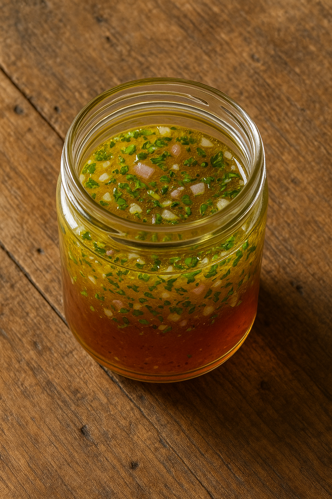
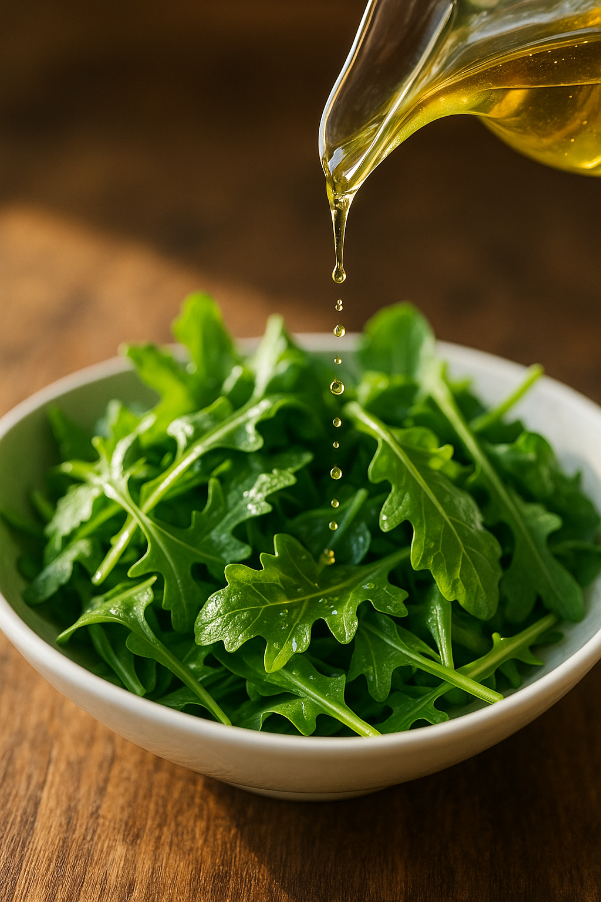

# Vinaigrette Classique (Émulsion Temporaire)

---

## Page 1 : Présentation + Science

**VINAIGRETTE CLASSIQUE (ÉMULSION TEMPORAIRE)**

🔬 **LA SCIENCE**
La vinaigrette illustre parfaitement une **émulsion temporaire** où deux liquides immiscibles (huile et vinaigre) se mélangent brièvement avant de se séparer naturellement. Contrairement à la mayonnaise, la vinaigrette ne possède pas d'émulsifiant fort comme la lécithine. La **moutarde**, souvent ajoutée, contient des mucilages qui agissent comme émulsifiant faible, ralentissant la séparation mais ne l'empêchant pas complètement. Le **ratio classique 1:3** (1 volume de vinaigre pour 3 volumes d'huile) équilibre acidité et onctuosité. Lors de l'agitation vigoureuse, l'huile se fractionne en microgouttelettes dispersées dans la phase aqueuse, créant temporairement une texture homogène. Mais sans barrière moléculaire stable, les gouttelettes coalescent rapidement (quelques minutes à quelques heures) sous l'effet de la **tension superficielle**, restaurant la séparation huile/vinaigre. C'est pourquoi il faut toujours ré-émulsionner une vinaigrette juste avant usage.

🌿 **ASSOCIATIONS MOLÉCULAIRES CLÉS**
- **Huile** + **Vinaigre** + **Moutarde** → Émulsion temporaire par mucilages (glucosinolates)
- **Acide acétique (vinaigre)** → Abaisse pH, exhale saveurs, conservation naturelle
- **Aromates (échalote, ail, herbes)** → Composés volatils (allicine, terpènes) enrichissent profil aromatique

⏱️ **INFOS PRATIQUES**
Préparation : 5 min | Cuisson : 0 min | Difficulté : ●○○ | Pour 150 ml

---

## Page 2 : Recette + Variantes

🧑‍🍳 **INGRÉDIENTS**
- 1 cuillère à soupe de vinaigre de vin rouge (15 ml)
- 3 cuillères à soupe d'huile de tournesol ou d'olive (45 ml)
- 1 cuillère à café de moutarde de Dijon (5g, émulsifiant faible)
- 1 pincee de sel fin (2g)
- Poivre noir fraîchement moulu (au goût)
- Optionnel : 1 petite échalote hachée finement, 1 gousse d'ail écrasée, herbes fraîches (persil, ciboulette, estragon)

🔥 **PRÉPARATION**

1. **Préparation base acide** : Dans un bol ou un bocal en verre, déposer la moutarde, le sel et le poivre. Ajouter le vinaigre et fouetter énergiquement pendant 10-15 secondes jusqu'à dissolution complète du sel. La moutarde libère ses mucilages qui commencent à épaissir légèrement le liquide. Si vous utilisez échalote ou ail, les incorporer à cette étape pour les "cuire" légèrement dans l'acidité du vinaigre.

2. **Ajout progressif de l'huile** : Commencer à verser l'huile en **filet très fin** tout en fouettant vigoureusement et continuellement. Cette agitation mécanique intense est **cruciale** pour fragmenter l'huile en microgouttelettes (10-50 μm) qui se dispersent dans la phase aqueuse. Même si l'émulsion est temporaire, un ajout progressif crée initialement une dispersion plus fine et uniforme.

3. **Émulsification vigoureuse** : Continuer à fouetter énergiquement pendant 30-45 secondes après avoir ajouté toute l'huile. La vinaigrette doit devenir légèrement opaque et épaissie, avec une texture homogène. Cette texture est due à la diffusion de la lumière par les microgouttelettes d'huile en suspension (effet Tyndall).

4. **Méthode alternative au bocal** : Pour une émulsification rapide et efficace, placer tous les ingrédients dans un bocal en verre avec couvercle hermétique. Fermer et **secouer vigoureusement** pendant 20-30 secondes. Le mouvement turbulent crée un cisaillement intense qui fractionne l'huile très efficacement. Cette méthode est idéale pour émulsionner juste avant le service.

5. **Assaisonnement et ajustement** : Goûter et ajuster sel, poivre et acidité. Si la vinaigrette est trop acide, ajouter 1-2 cuillères à soupe d'huile supplémentaire. Si elle manque de punch, ajouter quelques gouttes de vinaigre ou une pincee de sel. Pour enrichir, incorporer herbes fraîches ciselées (persil, ciboulette, estragon) qui apportent chlorophylles et composés aromatiques volatils.

6. **Utilisation immédiate** : **Point critique** : utiliser la vinaigrette dans les **5-15 minutes** suivant l'émulsification pour profiter de sa texture homogène. Passé ce délai, les gouttelettes d'huile coalescent progressivement et remontent à la surface (densité de l'huile < densité du vinaigre). La séparation est inévitable mais naturelle. Il suffit de ré-émulsionner par fouettage ou secouage juste avant d'assaisonner la salade.

7. **Conservation** : Si vous préparez la vinaigrette à l'avance, la conserver dans un bocal fermé au réfrigérateur jusqu'à **5-7 jours**. L'acidité (pH ~3) inhibe la croissance microbienne. Avant utilisation, laisser revenir à température ambiante (l'huile se fléuidifie) puis secouer énergiquement pour ré-émulsionner.

🔄 **VARIANTES**

- **Vinaigrette Balsamique** : Remplacer le vinaigre de vin rouge par du vinaigre balsamique (15 ml). Ajouter 1 cuillère à café de miel (5g) pour équilibrer l'acidité marquée du balsamique. Le miel apporte aussi des sucres qui augmentent légèrement la viscosité de la phase aqueuse, ralentissant la coalescence. Parfaite pour salades de roquette, tomates, mozzarella.

- **Vinaigrette Citron-Miel** : Remplacer le vinaigre par du jus de citron frais (15 ml, acide citrique) et ajouter 1 cuillère à café de miel (5g). L'acide citrique offre une acidité plus fruitee et délicate que l'acide acétique. Incorporer du zeste de citron pour des notes terpéniques (limónène). Idéale pour salades de fruits, salades d'été avec fruits rouges.

- **Vinaigrette Asiatique** : Utiliser 1 cuillère à soupe de vinaigre de riz (acidité douce, 15 ml), 2 cuillères à soupe d'huile de sésame grillé (30 ml, notes torréfiées), 1 cuillère à soupe de sauce soja (15 ml, umami glutamate), 1 cuillère à café de miel (5g), 1 cuillère à café de gingembre frais râpé (composés piquants gingeroler). Parfaite pour salades de chou, concombre, édamamé.

💡 **ASTUCE SCIENCE : CINÉTIQUE DE SÉPARATION**

La **vitesse de séparation** d'une émulsion temporaire dépend de plusieurs facteurs physiques :

- **Taille des gouttelettes** : Plus elles sont petites, plus la séparation est lente (loi de Stokes). Une agitation vigoureuse crée des gouttelettes plus fines qui restent en suspension plus longtemps.
- **Différence de densité** : L'huile (ρ ~ 0,92 g/cm³) est moins dense que le vinaigre (ρ ~ 1,01 g/cm³), donc elle remonte naturellement par flottaison.
- **Viscosité de la phase continue** : La moutarde augmente légèrement la viscosité de la phase aqueuse, ralentissant le mouvement des gouttelettes. Le miel a un effet similaire mais plus prononcé.
- **Température** : À température ambiante, l'huile est fluide et se sépare rapidement. Au réfrigérateur, l'huile se fige partiellement (surtout huile d'olive), ralentissant la coalescence.

**Comparaison émulsion temporaire vs stable** :
- **Vinaigrette** : Aucun émulsifiant fort → coalescence rapide (minutes-heures) → nécessite ré-émulsification
- **Mayonnaise** : Lécithine du jaune d'œuf → barrière moléculaire stable → émulsion durable (jours-semaines)

Cette différence fondamentale explique pourquoi la vinaigrette doit **toujours être émulsionnée juste avant le service** pour une texture optimale. La séparation n'est pas un défaut mais une caractéristique naturelle de ce type d'émulsion.

**Justifications techniques** :
- **Ratio 1:3** : Équilibre sensoriel entre acidité et gras. Ratio 1:2 = trop acide, 1:4 = trop grasse.
- **Agitation vigoureuse** : Crée cisaillement mécanique nécessaire pour fragmenter l'huile en microgouttelettes dispersables.
- **Moutarde** : Mucilages (polysaccharides) augmentent viscosité et créent légère répulsion stérique entre gouttelettes, ralentissant coalescence.
- **Incorporation lente de l'huile** : Même sans émulsifiant fort, ajout progressif facilite dispersion initiale uniforme et texture plus fine.

---

## Sources Documentaires

- **McGee, Harold** (2004). *On Food and Cooking: The Science and Lore of the Kitchen*, p. 632-634. Mécanismes de formation et stabilisation des émulsions alimentaires, différence émulsions temporaires vs stables.

- **Ruhlman, Michael** (2009). *Ratio: The Simple Codes Behind the Craft of Everyday Cooking*, p. 156-160. Ratio fondamental vinaigrette 1:3, variations et principes d'équilibre acide-gras.

- **This, Hervé** (2000-2025). *Les Secrets de la Casserole - Chimie Physique en Cuisine*, p. 234-237. Cinétique de séparation des émulsions temporaires, rôle des mucilages de la moutarde.

- **RSC Publishing** (2024). "Innovations and stability challenges in food emulsions". Recherches récentes sur stabilité émulsions, pratiques durables.

- **Interes Journals** (2024). "Improving Food Texture and Stability Through Emulsion Science". Facteurs influencant stabilité émulsions : type émulsifiant, pH, force ionique, nano-émulsions.

---

**Fin de la recette**