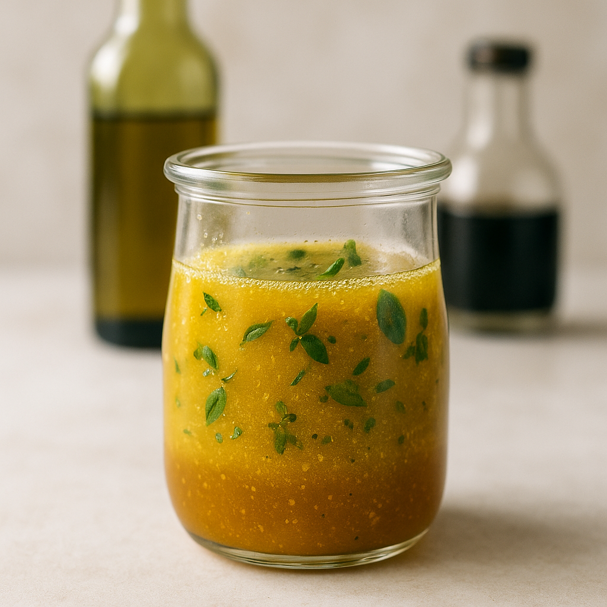
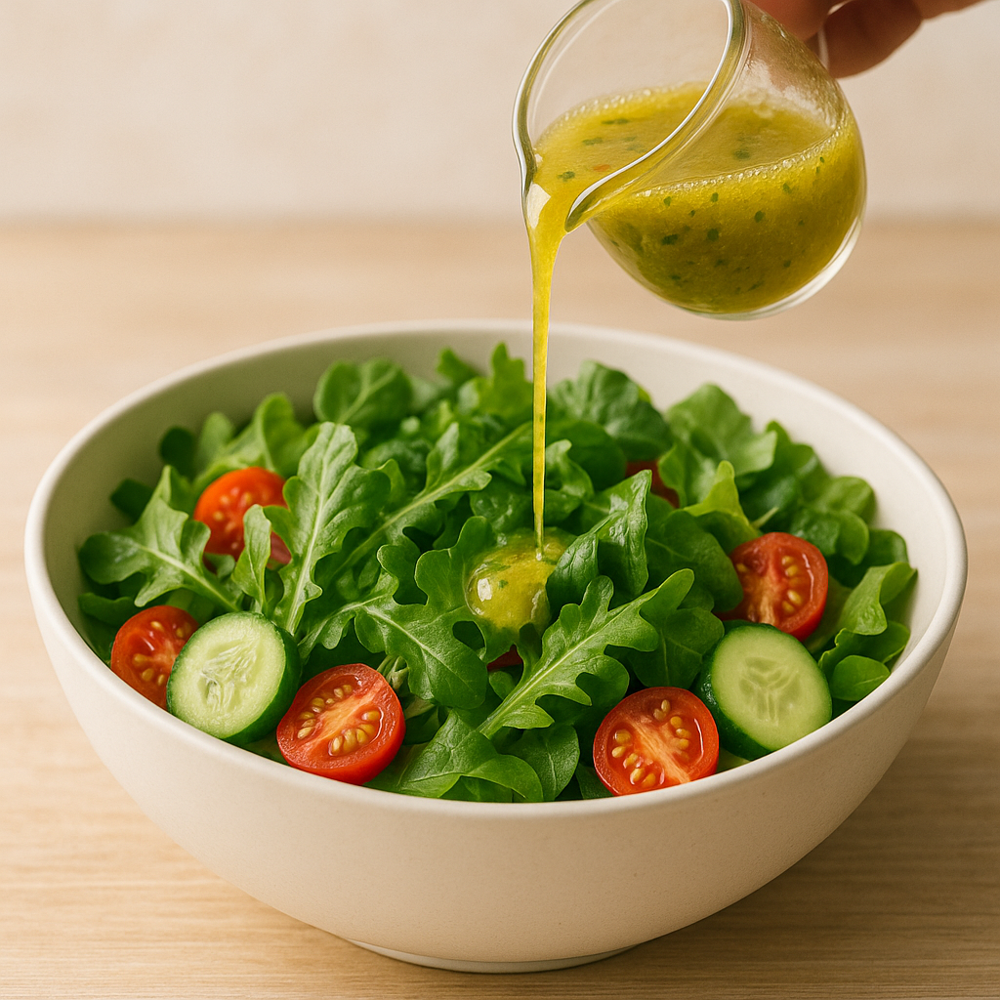

# Vinaigrette Équilibrée

---

## Page 1 : Présentation + Science

**VINAIGRETTE ÉQUILIBRÉE – L'ÉMULSION TEMPORAIRE**

🔬 **LA SCIENCE**

La vinaigrette est une **émulsion temporaire** huile dans vinaigre (phase lipidique dispersée dans phase aqueuse acide) **sans émulsifiant stable**. Contrairement à la mayonnaise où la lécithine du jaune d'œuf assure une stabilité durable, la vinaigrette se sépare naturellement en quelques minutes après agitation. L'énergie mécanique du fouettage fractionne temporairement l'huile en microgouttelettes (10-100 microns), mais sans film protecteur robuste, ces gouttelettes fusionnent rapidement (coalescence) sous l'effet de la tension interfaciale huile/eau. Le **ratio classique 1:3** (1 volume acide pour 3 volumes huile) crée un équilibre gustatif harmonieux où l'acidité du vinaigre (pH 2,5-3,5) tempère le gras de l'huile tout en exaltant les saveurs. La moutarde, souvent ajoutée, apporte un **mucilage polysaccharidique** qui ralentit légèrement la séparation (émulsion semi-stable 15-30 min) et ajoute une complexité aromatique.

🌿 **ASSOCIATIONS MOLÉCULAIRES CLÉS**

- **Huile** + **Vinaigre** → Émulsion temporaire (séparation rapide en 3-5 min) + Équilibre acide/gras
- **Moutarde** + **Mélange** → Mucilage polysaccharidique (stabilisation partielle) + Notes piquantes allyliques
- **Échalote** + **Vinaigre** → Composés soufrés (alliine) + Arômes complexes adoucis par acidité

⏱️ **INFOS PRATIQUES**

Préparation : 5 min | Cuisson : 0 min | Difficulté : ●○○ | Pour 150 ml (env. 6-8 portions)

---

## Page 2 : Recette + Variantes

🧑‍🍳 **INGRÉDIENTS**

- 30 ml (2 c. à soupe) vinaigre de vin rouge ou vinaigre de cidre
- 90 ml (6 c. à soupe) huile neutre (colza, tournesol) ou huile d'olive
- 1 c. à café (5 ml) moutarde de Dijon
- 1 échalote finement ciselée (optionnel, 15 g)
- 1 pincée de sel fin (2 g)
- Poivre noir fraîchement moulu (au goût)
- 1 c. à café (5 ml) miel ou sirop d'érable (optionnel, pour adoucir)

🔥 **PRÉPARATION**

1. **Préparation phase acide (1 min)** : Dans un bol ou un bocal hermétique, verser le vinaigre, ajouter le sel et fouetter 10 secondes jusqu'à dissolution complète. Le sel se dissout beaucoup mieux dans l'acide que dans l'huile – étape cruciale pour un assaisonnement homogène.

2. **Incorporation émulsifiant (1 min)** : Ajouter la moutarde de Dijon et fouetter vigoureusement 15 secondes jusqu'à mélange homogène crémeux. La moutarde libère des mucilages qui augmentent la viscosité et stabilisent partiellement l'émulsion (durée prolongée à 15-30 min avant séparation).

3. **Ajout aromates (1 min - optionnel)** : Incorporer l'échalote finement ciselée et le poivre fraîchement moulu. L'échalote macère dans l'acide, ses composés soufrés s'adoucissent et enrichissent le profil aromatique.

4. **Émulsion finale (2 min)** : Verser l'huile en **filet continu** tout en fouettant énergiquement et sans interruption dans le même sens. Si utilisation d'un bocal hermétique, fermer et secouer vigoureusement pendant 20-30 secondes. L'émulsion devient trouble et légèrement épaissie (microgouttelettes en suspension temporaire).

5. **Ajustement & service immédiat** : Goûter et rectifier l'assaisonnement (sel, acidité, douceur avec miel si nécessaire). **Utiliser immédiatement** ou secouer/fouetter vigoureusement juste avant emploi, car la séparation débute en 3-5 minutes. La vinaigrette doit être versée sur la salade juste avant dégustation pour éviter ramollissement des feuilles par osmose.

🔄 **VARIANTES SCIENTIFIQUES**

- **Vinaigrette citronnée** : Remplacer le vinaigre par 30 ml de jus de citron frais. L'acide citrique (pH 2,2-2,4, plus acide que vinaigre acétique pH 2,5-3,5) apporte fraîcheur et notes agrumes vives. Ajuster ratio à 1:3,5 ou 1:4 (huile) pour compenser acidité supérieure.

- **Vinaigrette asiatique umami** : Ajouter 1 c. à café (5 ml) sauce soja + 1 c. à café (5 ml) huile de sésame grillé + 1 gousse d'ail écrasée. Les nucléotides (IMP) et glutamate de la sauce soja créent synergie umami puissante, les pyrazines de l'huile de sésame grillé ajoutent notes toastées caractéristiques.

- **Boost stabilité extrême (24h)** : Ajouter 1 c. à café (5 g) de miel + ½ c. à café (2 ml) de lécithine de soja liquide. Le miel augmente viscosité phase aqueuse et réduit activité de l'eau (aw), la lécithine mime action émulsifiante du jaune d'œuf. Émulsion reste stable au réfrigérateur 24-48h (texture semi-mayonnaise).

💡 **ASTUCE SCIENCE – Ratio modulable selon usage**

Le ratio 1:3 (acide:huile) est un standard équilibré, mais il s'adapte selon vos préférences et l'usage final :

- **Ratio 1:2** (plus acide) : Pour salades amères (roquette, frisée, endive) ou fromages forts. L'acidité accrue contraste et équilibre l'amertume.
- **Ratio 1:4** (plus doux) : Pour salades délicates (laitue beurre, mâche) ou légumes sucrés (betterave, carotte). Le gras enrobe sans agresser.
- **Test empirique** : Trempez une feuille de salade dans la vinaigrette et goûtez. Ajustez instantanément avec quelques gouttes de vinaigre (plus d'acidité) ou d'huile (adoucir).

**Science derrière** : La perception gustative dépend du ratio acide/gras ET de l'aliment final. L'équilibre parfait est subjectif et contextuel – expérimentez !

---

## 📚 Sources Scientifiques

- **McGee, H. (2004)**. *On Food and Cooking: The Science and Lore of the Kitchen*. Scribner. Chapitre sur les émulsions temporaires vs stables.
- **Daily Science (2022)**. De la mayonnaise cosmique. Explication émulsion instable (vinaigrette) vs stable (mayonnaise).
- **Cuisine Saine (2023)**. Comment faire une vinaigrette et 6 variantes. Ratio classique 1:3 et variations.
- **Blog Degustabox (2025)**. 7 secrets de chef pour réussir vinaigrette. Ordre ingrédients et techniques émulsion.
- **Manger Bouger (2018)**. Vinaigrette équilibre. Valeurs nutritionnelles et compositions standards.
- **Nest&eacute; Goodness (2025)**. Recettes et astuces vinaigrette maison. Adaptations aromatiques et conservation.

**Création** : 2025-11-11  
**Rédacteur-Scientifique** : IA  
**Chapitre** : 1 - Bases Fondamentales  
**Concept clé** : Émulsion temporaire, équilibre acide/gras